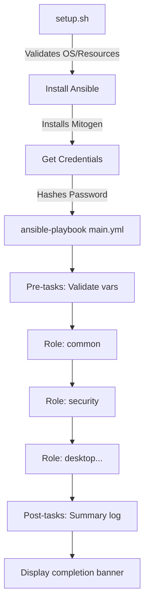

# AI Agent Guide - VPS RDP Workstation Automation

**Project**: Ansible-based VPS RDP Developer Workstation Automation
**Version**: 3.0.0
**Target**: Debian 13 (Trixie)
**Purpose**: Transform fresh VPS into fully-configured RDP workstation with KDE Plasma

---

## Table of Contents

1. [Code Style & Conventions](#1-code-style--conventions)
2. [Architecture](#2-architecture)
3. [Build and Test](#3-build-and-test)
4. [Project-Specific Patterns](#4-project-specific-patterns)
5. [Critical File References](#5-critical-file-references)
6. [Common Tasks](#6-common-tasks)

---

## 1. Code Style & Conventions

### 1.1 Ansible Playbook Structure

#### YAML Formatting Standards

```yaml
# ✅ CORRECT: Always use expanded syntax for readability
- name: Task description (imperative, describes action)
  ansible.builtin.module_name:
    parameter: value
    another_param: value
  tags: [tag1, tag2]
  when: condition

# ❌ INCORRECT: Avoid one-liner YAML
- name: Task description
  ansible.builtin.apt: name=package state=present
```

**Key Conventions:**

- **2-space indentation** (strictly enforced)
- **Always use `ansible.builtin.*` or `community.general.*`** for module FQCNs
- **Task names**: Imperative present tense ("Install package" not "Installing package")
- **Section headers**: Use comment blocks with `=` dividers

Example from [roles/common/tasks/main.yml](roles/common/tasks/main.yml):

```yaml
# =============================================================================
#  PHASE 1: System Foundation
# =============================================================================

- name: Update apt cache
  ansible.builtin.apt:
    update_cache: true
    cache_valid_time: 3600
  tags: [common, packages]
```

#### Role Structure Pattern

Every role follows this immutable structure:

```
roles/role-name/
├── defaults/
│   └── main.yml          # Default variables (optional)
├── files/                # Static files (configs, scripts)
├── handlers/
│   └── main.yml          # Service restart handlers
├── meta/
│   └── main.yml          # Role dependencies
├── tasks/
│   └── main.yml          # Primary task list
└── templates/            # Jinja2 templates (.j2)
    └── config.j2
```

#### Tagging Strategy

**Multi-level tagging** for granular playbook execution:

```yaml
- role: desktop
  tags: [desktop, kde, xrdp] # 3 levels: broad → specific → feature
```

**Tag Categories:**

- **Phase tags**: `foundation`, `security`, `visual`
- **Role tags**: `common`, `desktop`, `docker`
- **Feature tags**: `kde`, `xrdp`, `zsh-plugins`
- **Special tags**: `always` (never skippable)

**Usage:**

```bash
# Run only desktop-related tasks
ansible-playbook playbooks/main.yml --tags desktop

# Skip security hardening (testing only)
ansible-playbook playbooks/main.yml --skip-tags security
```

### 1.2 Jinja2 Templating Conventions

**File naming**: Always use `.j2` extension
**Location**: `roles/*/templates/`
**Variable references**: Use `{{ variable }}` with spaces

Example from [roles/desktop/templates/xrdp.ini.j2](roles/desktop/templates/xrdp.ini.j2):

```jinja2
; XRDP Configuration - Generated by Ansible
port={{ vps_xrdp_port | default(3389) }}
crypt_level={{ vps_xrdp_encryption | default('high') }}
security_layer={{ vps_xrdp_security_layer | default('tls') }}


ssl_protocols={{ vps_xrdp_ssl_protocols }}
tls_ciphers={{ vps_xrdp_tls_ciphers }}

```

**Best Practices:**

- Use `| default(value)` for all optional variables
- Add descriptive comments explaining non-obvious settings
- Validate templates with `ansible-playbook --syntax-check`

### 1.3 Python Callback Plugin Patterns

Located in [plugins/callback/](plugins/callback/)

#### Plugin Structure

```python
"""
Ansible Callback Plugin: Plugin Name
Description of what this plugin does.
"""

from __future__ import absolute_import, division, print_function
__metaclass__ = type

from ansible.plugins.callback import CallbackBase

DOCUMENTATION = """
    name: plugin_name
    type: stdout
    short_description: Brief description
    description:
        - Detailed description
    version_added: "3.0.0"
"""

class CallbackModule(CallbackBase):
    """Plugin implementation"""
    CALLBACK_VERSION = 2.0
    CALLBACK_TYPE = "stdout"
    CALLBACK_NAME = "plugin_name"
    CALLBACK_NEEDS_WHITELIST = False  # Set True for callback_whitelist

    def __init__(self):
        super().__init__()
        # Initialize state
```

#### Two Custom Callbacks

1. **[clean_progress.py](plugins/callback/clean_progress.py)**: Minimalist spinner output
2. **[rich_tui.py](plugins/callback/rich_tui.py)**: Full TUI with progress bars (requires `rich>=13.0.0`)

**Activation**:

```ini
# In ansible.cfg
callback_whitelist = profile_tasks, timer, ara_default
```

Or via environment:

```bash
export ANSIBLE_STDOUT_CALLBACK=clean_progress
ansible-playbook playbooks/main.yml
```

---

## 2. Architecture

### 2.1 Role Organization and Dependencies

#### Execution Order (Critical!)

Defined in [playbooks/main.yml](playbooks/main.yml) with strict phase ordering:

```yaml
roles:
  # PHASE 1: System Foundation
  - role: common # Essential packages, user creation

  # PHASE 2: Security (BEFORE services exposed)
  - role: security # Firewall, fail2ban, SSH hardening

  # PHASE 3: Visual Foundation
  - role: fonts # JetBrains Mono, Nerd Fonts
  - role: terminal # Zsh, Oh My Zsh
  - role: shell-styling # Starship, fastfetch

  # PHASE 4: Desktop
  - role: desktop # KDE Plasma + XRDP

  # PHASE 5: Development Languages
  - role: development # Node.js, Python, build tools

  # PHASE 6: Containerization
  - role: docker

  # PHASE 7: Editors
  - role: editors # VS Code, OpenCodeServer

  # PHASE 8: Development Tools
  - role: tui-tools # lazygit, lazydocker, btop
  - role: network-tools
  # ... (12 more tool roles)
```

**⚠️ Critical Rules:**

- **NEVER** move `security` before `common`
- **NEVER** expose services (XRDP) before `security` hardens SSH
- Tool roles are independent and can be reordered within Phase 8

#### Role Dependencies

Defined in `roles/*/meta/main.yml`:

```yaml
dependencies:
  - role: common
    when: dependency_condition
```

**Current Dependencies:**

- All roles implicitly depend on `common` (user creation)
- `desktop` depends on `fonts` (KDE needs fonts)
- Tool roles have no cross-dependencies (parallel-safe)

### 2.2 Plugin Architecture

**Directory**: [plugins/callback/](plugins/callback/)

**How Callbacks Work:**

1. Ansible discovers plugins via `ANSIBLE_CALLBACK_PLUGINS` or project structure
2. Plugins register with `CALLBACK_TYPE = "stdout"`
3. Hooks are called at playbook lifecycle events:
   - `v2_playbook_on_start(playbook)`
   - `v2_playbook_on_task_start(task, is_conditional)`
   - `v2_runner_on_ok(result)`
   - `v2_runner_on_failed(result, ignore_errors)`

**Custom Hooks Used:**

- `clean_progress.py`: Implements real-time spinner with Unicode symbols
- `rich_tui.py`: Uses Rich library for tables, panels, and live progress

### 2.3 Inventory and Variable Hierarchy

**Inventory Structure:**

```
inventory/
├── hosts.yml              # Host definitions
├── remote_hosts.yml       # Remote VPS targets (optional)
└── group_vars/
    └── all.yml            # Global variables (360 lines)
```

#### Variable Precedence (Lowest to Highest)

1. **Role defaults**: `roles/*/defaults/main.yml`
2. **Inventory group_vars**: `inventory/group_vars/all.yml`
3. **Playbook vars**: `playbooks/main.yml` (vars section)
4. **Extra vars**: `-e key=value` from CLI (highest priority)

**Example**: Setting username

```bash
# Method 1: Environment variable → setup.sh → extra vars (highest)
VPS_USERNAME=developer ./setup.sh

# Method 2: Direct CLI override
ansible-playbook -e "vps_username=admin" playbooks/main.yml
```

#### Critical Variables

**Must be defined** (validated in [playbooks/main.yml#L17-26](playbooks/main.yml)):

```yaml
pre_tasks:
  - name: Verify required variables
    ansible.builtin.assert:
      that:
        - vps_username is defined
        - vps_user_password_hash is defined # NEVER plain-text!
        - vps_progress_state_file is defined
        - vps_summary_log is defined
      fail_msg: "Required variables must be set"
    no_log: true # Prevent password hash logging
```

**Security Variables** ([inventory/group_vars/all.yml#L18-52](inventory/group_vars/all.yml)):

```yaml
vps_security_level: "standard" # standard | hardened | paranoid
vps_ssh_port: 22
vps_ssh_root_login: true # User explicitly requested
vps_firewall_enabled: true
vps_fail2ban_enabled: true
```

### 2.4 Task Execution Flow

**Entry Point**: [setup.sh](setup.sh) → [playbooks/main.yml](playbooks/main.yml)



**Progress Tracking** (JSON state file):

```json
{
  "version": "3.0.0",
  "started_at": "2024-01-15T10:30:00Z",
  "status": "in_progress",
  "completed_roles": ["common", "security"],
  "current_role": "desktop",
  "failed_roles": []
}
```

Location: `/var/lib/vps-setup/progress.json` (configurable via `vps_progress_state_file`)

---

## 3. Build and Test

### 3.1 Exact Commands for Agents

#### Setup Commands

```bash
# 1. Full installation (interactive)
./setup.sh

# 2. CI/CD mode (non-interactive)
VPS_USERNAME=developer VPS_SECRETS_FILE=/root/.secrets ./setup.sh --ci

# 3. Dry run (preview changes)
./setup.sh --dry-run

# 4. Debug mode (verbose Ansible output)
./setup.sh --debug

# 5. Rollback to pre-installation state
./setup.sh --rollback

# 6. Resume from checkpoint
./setup.sh --resume
```

**Secrets file format** (`/root/.secrets` with `chmod 600`):

```ini
password=YourSecurePassword123!
```

#### Direct Ansible Commands

```bash
# Run specific role
ansible-playbook -i inventory/hosts.yml playbooks/main.yml --tags desktop

# Run without security hardening (testing)
ansible-playbook -i inventory/hosts.yml playbooks/main.yml --skip-tags security

# Check mode (no changes)
ansible-playbook -i inventory/hosts.yml playbooks/main.yml --check --diff

# Limit to specific host
ansible-playbook -i inventory/remote_hosts.yml playbooks/main.yml --limit vps-prod
```

### 3.2 Pre-commit Hooks and Linting

**Not yet implemented**, but recommended setup:

```bash
# Install pre-commit
pip3 install pre-commit

# Create .pre-commit-config.yaml
cat > .pre-commit-config.yaml << 'EOF'
repos:
  - repo: https://github.com/ansible/ansible-lint
    rev: v6.22.0
    hooks:
      - id: ansible-lint
        files: \.(ya?ml)$

  - repo: https://github.com/adrienverge/yamllint
    rev: v1.33.0
    hooks:
      - id: yamllint
        args: [--strict]

  - repo: https://github.com/psf/black
    rev: 23.12.0
    hooks:
      - id: black
        language_version: python3
        files: ^plugins/callback/.*\.py$
EOF

# Install hooks
pre-commit install
```

**Manual linting:**

```bash
# YAML syntax validation
yamllint .

# Ansible linting
ansible-lint playbooks/ roles/

# Python callback linting
pylint plugins/callback/*.py

# Syntax check playbooks
ansible-playbook playbooks/main.yml --syntax-check
```

### 3.3 Testing with Molecule

**Location**: [molecule/default/](molecule/default/)

**Configuration**: [molecule/default/molecule.yml](molecule/default/molecule.yml)

```yaml
driver:
  name: docker

platforms:
  - name: debian-trixie
    image: debian:trixie
    privileged: true
    command: /lib/systemd/systemd

provisioner:
  name: ansible
  config_options:
    defaults:
      callbacks_enabled: profile_tasks
      stdout_callback: yaml
```

**Commands:**

```bash
# Full test cycle
molecule test

# Individual steps
molecule create    # Create test container
molecule converge  # Run playbook
molecule verify    # Run tests
molecule destroy   # Clean up

# Debug
molecule login     # Shell into container
```

**Test Sequence** (from [molecule.yml#L38-47](molecule/default/molecule.yml)):

```yaml
scenario:
  test_sequence:
    - dependency # Install collections
    - lint # yamllint + ansible-lint
    - syntax # Syntax check
    - create # Create container
    - prepare # Pre-converge setup
    - converge # Run playbook
    - idempotence # Re-run (no changes expected)
    - verify # Run verification tasks
    - destroy # Clean up
```

### 3.4 Validation Scripts

**Primary Script**: [tests/validate.sh](tests/validate.sh)

**Runs 30 success criteria** across categories:

- FR (Functional Requirements): 13 criteria
- NFR (Non-Functional Requirements): Performance, security
- Test criteria: Unit tests, integration tests

```bash
# Run validation
./tests/validate.sh

# Expected output:
# ✓ [FR-1] Setup script exists and executable
# ✓ [FR-2] XRDP service running
# ✓ [FR-3] Nordic theme installed
# ...
# 📊 Validation Results
#   Passed:  30/30
#   Failed:  0/30
# ✅ ALL SUCCESS CRITERIA MET - PRODUCTION READY!
```

**Criteria Checks** (examples):

```bash
check "FR-2"  "XRDP service running"           "systemctl is-active xrdp"
check "FR-8"  "Docker working"                 "docker --version"
check "NFR-1" "SSH uses non-default port"      "grep -q '^Port 22$' /etc/ssh/sshd_config"
```

---

## 4. Project-Specific Patterns

### 4.1 setup.sh Workflow

**Purpose**: Bash wrapper that orchestrates Ansible execution with enhanced UX

**Key Responsibilities:**

1. **Pre-flight validation** (OS, resources, network)
2. **Credential management** (secure password hashing)
3. **Dependency installation** (Ansible, Mitogen, ARA)
4. **Mitogen path detection** (3-method fallback)
5. **Ansible invocation** with proper environment

**Flow**:

```bash
main() {
    show_banner                    # ASCII art banner
    run_preflight_checks           # 6 validation steps
    install_ansible                # Ensure Ansible + deps
    get_credentials                # Secure password handling
    run_ansible                    # Execute playbook
    show_completion                # RDP connection info
}
```

**Critical Security Pattern** (from [setup.sh#L275-285](setup.sh)):

```bash
hash_password() {
    local password="$1"

    # Use OpenSSL SHA-512
    hash=$(openssl passwd -6 "$password")
    echo "$hash"
}

# Hash immediately, overwrite plain-text
password_hash=$(hash_password "$password")
password="OVERWRITTEN"
unset password
```

### 4.2 Mitogen Acceleration Integration

**Performance Impact**: 2-7x speedup via connection pooling

**Installation** ([setup.sh#L564-571](setup.sh)):

```bash
# Install Mitogen Python library
if ! python3 -c "import mitogen" &>/dev/null 2>&1; then
    pip3 install --quiet --break-system-packages "mitogen>=0.3.7" || \
    pip3 install --quiet --user "mitogen>=0.3.7"
fi
```

**Path Detection** (3-method fallback):

```bash
# Method 1: System site-packages
site_packages=$(python3 -c "import site; print(site.getsitepackages()[0])")
mitogen_path="${site_packages}/ansible_mitogen/plugins/strategy"

# Method 2: User site-packages
user_site=$(python3 -c "import site; print(site.getusersitepackages())")
mitogen_path="${user_site}/ansible_mitogen/plugins/strategy"

# Method 3: Find via mitogen package location
mitogen_location=$(python3 -c "import mitogen; import os; print(os.path.dirname(os.path.dirname(mitogen.__file__)))")
mitogen_path="${mitogen_location}/ansible_mitogen/plugins/strategy"
```

**Activation** ([ansible.cfg#L28-31](ansible.cfg)):

```ini
# Mitogen strategy (2-7x speedup)
# strategy_plugins path set dynamically by setup.sh
# strategy = mitogen_linear (set via ANSIBLE_STRATEGY env var)
```

**Runtime**:

```bash
# Enable Mitogen
export ANSIBLE_STRATEGY_PLUGINS="$mitogen_path"
export ANSIBLE_STRATEGY="mitogen_linear"
ansible-playbook playbooks/main.yml
```

### 4.3 ARA Reporting Setup

**Purpose**: Record and visualize Ansible playbook runs

**Installation** ([requirements.txt#L8-11](requirements.txt)):

```ini
# ARA - Ansible Run Analysis
ara>=1.7.0
```

**Configuration** ([ansible.cfg#L13](ansible.cfg)):

```ini
callback_whitelist = profile_tasks, timer, ara_default
```

**Usage**:

```bash
# Install ARA
pip3 install ara

# Run playbook (ARA auto-records)
ansible-playbook playbooks/main.yml

# View results
ara-manage runserver  # Web UI on http://localhost:8000

# CLI queries
ara playbook list
ara task list --playbook 1
ara result show <result_id>
```

**Data Storage**: SQLite database at `~/.ara/server/ansible.sqlite`

### 4.4 Custom Callback Plugins

#### clean_progress.py

**Activation**:

```bash
export ANSIBLE_STDOUT_CALLBACK=clean_progress
ansible-playbook playbooks/main.yml
```

**Features** (from [plugins/callback/clean_progress.py#L63-105](plugins/callback/clean_progress.py)):

- Unicode spinner during task execution
- Colored status symbols: ✓ (green), ✗ (red), ⚠ (yellow)
- Real-time task updates with carriage return (`\r`)
- Minimal verbosity (only changed/failed tasks shown)

**Output Example**:

```
━━━━━━━━━━━━━━━━━━━━━━━━━━━━━━━━━━━━━━━━━━━━━━━━━━━━
 🚀 VPS Developer Workstation Setup v3.0.0
━━━━━━━━━━━━━━━━━━━━━━━━━━━━━━━━━━━━━━━━━━━━━━━━━━━━

 📦 VPS RDP Developer Workstation Setup

 ⠙ Installing essential system packages...
 ✓ Update apt cache (3.2s)
 ✓ Install essential system packages (12.4s)
```

#### rich_tui.py

**Requirements**: `rich>=13.0.0` (from [requirements.txt#L18-21](requirements.txt))

**Features**:

- Progress bars with ETA
- Colored tables for summary
- Tree view for role hierarchy
- Error panels with context

**Activation**:

```bash
pip3 install rich
export ANSIBLE_STDOUT_CALLBACK=rich_tui
ansible-playbook playbooks/main.yml
```

### 4.5 Secrets Management Patterns

**Three Input Methods** (from [setup.sh#L285-330](setup.sh)):

#### 1. Environment Variable (INSECURE)

```bash
export VPS_PASSWORD="Password123!"
./setup.sh
```

**Risk**: Stored in shell history, visible in `ps` output

#### 2. Secrets File (RECOMMENDED)

```bash
# Create secrets file
cat > /root/.secrets << 'EOF'
password=SecurePassword123!
EOF
chmod 600 /root/.secrets

# Run setup
VPS_SECRETS_FILE=/root/.secrets ./setup.sh
```

**Security**: File permissions validated (must be `0600`)

#### 3. Interactive Prompt (MOST SECURE)

```bash
./setup.sh
# Script prompts for password with hidden input (stty -echo)
```

**Password Validation** ([setup.sh#L201-244](setup.sh)):

```bash
validate_password() {
    # ✓ Minimum 8 characters
    # ✓ At least 1 uppercase
    # ✓ At least 1 lowercase
    # ✓ At least 1 digit
    # ✓ At least 1 special character
    # ✓ Not in common password list
}
```

**Critical**: Password is **immediately hashed** and plain-text is overwritten:

```bash
password_hash=$(hash_password "$password")
password="OVERWRITTEN"
unset password
export VPS_USER_PASSWORD_HASH="$password_hash"  # Only hash exposed to Ansible
```

---

## 5. Critical File References

### 5.1 Configuration Files

| File                                           | Purpose              | Key Settings                     |
| ---------------------------------------------- | -------------------- | -------------------------------- |
| [ansible.cfg](ansible.cfg)                     | Ansible behavior     | Callbacks, Mitogen, SSH settings |
| [ansible-navigator.yml](ansible-navigator.yml) | Navigator TUI config | Mode: stdout, EE disabled        |
| [requirements.txt](requirements.txt)           | Python dependencies  | Mitogen, ARA, Rich, Molecule     |
| [requirements.yml](requirements.yml)           | Ansible collections  | community.general 8.5.0          |

### 5.2 Playbooks

| File                                                                     | Purpose               | Entry Point        |
| ------------------------------------------------------------------------ | --------------------- | ------------------ |
| [playbooks/main.yml](playbooks/main.yml)                                 | Primary orchestration | Yes (via setup.sh) |
| [playbooks/rollback.yml](playbooks/rollback.yml)                         | Restore backups       | Yes (`--rollback`) |
| [playbooks/templates/summary-log.j2](playbooks/templates/summary-log.j2) | Post-install report   | No (template)      |

### 5.3 Key Roles

**Priority roles** (agents should understand these first):

1. **[roles/common/](roles/common/)**: User creation, base packages, hostname
2. **[roles/security/](roles/security/)**: Firewall (UFW), Fail2ban, SSH hardening
3. **[roles/desktop/](roles/desktop/)**: KDE Plasma + XRDP (277 lines)
4. **[roles/development/](roles/development/)**: Node.js, Python, build tools
5. **[roles/docker/](roles/docker/)**: Docker Engine + Docker Compose

**Tool roles** (12 roles, independent):

- `editors`, `tui-tools`, `network-tools`, `file-management`, etc.

### 5.4 Variable Files

| File                                                         | Scope              | Variables                              |
| ------------------------------------------------------------ | ------------------ | -------------------------------------- |
| [inventory/group_vars/all.yml](inventory/group_vars/all.yml) | Global (360 lines) | System, security, desktop, XRDP config |
| `roles/*/defaults/main.yml`                                  | Role defaults      | Role-specific settings                 |

**Variable Naming Convention**:

- Prefix: `vps_` (e.g., `vps_username`, `vps_firewall_enabled`)
- Pattern: `vps_<category>_<setting>` (e.g., `vps_xrdp_port`, `vps_ssh_root_login`)

### 5.5 Testing Files

| File                                                           | Purpose             | Command               |
| -------------------------------------------------------------- | ------------------- | --------------------- |
| [tests/validate.sh](tests/validate.sh)                         | 30 success criteria | `./tests/validate.sh` |
| [molecule/default/molecule.yml](molecule/default/molecule.yml) | Molecule config     | `molecule test`       |
| [molecule/default/converge.yml](molecule/default/converge.yml) | Test playbook       | Auto-run by Molecule  |
| [molecule/default/verify.yml](molecule/default/verify.yml)     | Verification tasks  | Auto-run by Molecule  |

---

## 6. Common Tasks

### 6.1 Adding a New Role

```bash
# 1. Create role structure
ansible-galaxy role init roles/new-role

# 2. Edit tasks/main.yml
cat > roles/new-role/tasks/main.yml << 'EOF'
---
- name: Task description
  ansible.builtin.apt:
    name: package-name
    state: present
  tags: [new-role]
EOF

# 3. Add to playbooks/main.yml
# Insert in appropriate PHASE section

# 4. Add default variables to inventory/group_vars/all.yml
# vps_new_role_enabled: true

# 5. Test
ansible-playbook -i inventory/hosts.yml playbooks/main.yml --tags new-role --check
```

### 6.2 Modifying XRDP Configuration

**Template**: [roles/desktop/templates/xrdp.ini.j2](roles/desktop/templates/xrdp.ini.j2)

```jinja2
; Edit variables in inventory/group_vars/all.yml
port={{ vps_xrdp_port | default(3389) }}
crypt_level={{ vps_xrdp_encryption | default('high') }}

; Add new setting
new_setting={{ vps_xrdp_new_setting | default('default_value') }}
```

**Testing**:

```bash
# 1. Add variable to all.yml
vps_xrdp_new_setting: "custom_value"

# 2. Test template rendering
ansible localhost -m debug -a "msg={{ lookup('template', 'roles/desktop/templates/xrdp.ini.j2') }}"

# 3. Apply
ansible-playbook -i inventory/hosts.yml playbooks/main.yml --tags xrdp
```

### 6.3 Debugging Playbook Failures

```bash
# 1. Enable verbose output
./setup.sh --debug

# 2. Check Ansible logs
tail -f /var/log/vps-setup-ansible.log

# 3. Run with increased verbosity
ansible-playbook -i inventory/hosts.yml playbooks/main.yml -vvv

# 4. Check failed task
ansible-playbook -i inventory/hosts.yml playbooks/main.yml --start-at-task="Task that failed"

# 5. Use ARA for detailed analysis
ara playbook list
ara task list --playbook <id> --status failed
```

### 6.4 Customizing Security Settings

**File**: [inventory/group_vars/all.yml#L18-52](inventory/group_vars/all.yml)

```yaml
# Security profiles
vps_security_level: "hardened" # standard | hardened | paranoid

# SSH hardening
vps_ssh_port: 2222 # Change default port
vps_ssh_password_auth: false # Disable password auth
vps_ssh_root_login: false # Disable root login
vps_ssh_max_auth_tries: 3

# Firewall
vps_firewall_enabled: true
vps_firewall_default_incoming: "deny"
vps_firewall_logging: "high"

# Fail2ban
vps_fail2ban_enabled: true
vps_fail2ban_bantime: 7200 # 2 hours
vps_fail2ban_maxretry: 3
```

**Apply**:

```bash
ansible-playbook -i inventory/hosts.yml playbooks/main.yml --tags security
```

### 6.5 Testing Against Remote VPS

```bash
# 1. Edit inventory/remote_hosts.yml
cat > inventory/remote_hosts.yml << 'EOF'
all:
  hosts:
    vps-prod:
      ansible_host: 203.0.113.10
      ansible_user: root
      ansible_ssh_private_key_file: ~/.ssh/vps_key
EOF

# 2. Run against remote
ansible-playbook -i inventory/remote_hosts.yml playbooks/main.yml --limit vps-prod

# 3. Check connectivity first
ansible -i inventory/remote_hosts.yml vps-prod -m ping
```

### 6.6 Rollback Procedure

```bash
# 1. Interactive rollback (with confirmation)
./setup.sh --rollback

# 2. Automated rollback (CI/CD)
CONFIRM_ROLLBACK=yes ./setup.sh --rollback

# 3. Direct Ansible execution
ansible-playbook -i inventory/hosts.yml playbooks/rollback.yml \
  -e "confirm_rollback=yes" \
  -e "vps_username=developer"
```

**What gets rolled back** ([playbooks/rollback.yml#L21-30](playbooks/rollback.yml)):

- SSH configuration (from `/var/backups/vps-setup/sshd_config.backup`)
- Firewall rules (from `/var/backups/vps-setup/ufw-user.rules.backup`)
- XRDP service stopped
- Optional: Remove installed packages

---

## 7. Agent-Specific Guidelines

### 7.1 Before Making Changes

**Always check:**

1. **Variable hierarchy**: Is the setting in `all.yml` or role `defaults/`?
2. **Tag dependencies**: Will skipping tags break dependencies?
3. **Security impact**: Does this expose services or weaken hardening?
4. **Idempotency**: Can the task run multiple times safely?

### 7.2 When Adding Dependencies

**Update multiple files:**

1. `requirements.txt` for Python packages
2. `requirements.yml` for Ansible collections
3. Role `meta/main.yml` for role dependencies
4. `playbooks/main.yml` for execution order

### 7.3 When Modifying Roles

**Test isolation:**

```bash
# Test only the role
ansible-playbook -i inventory/hosts.yml playbooks/main.yml --tags role-name --check

# Verify idempotency (should report zero changes)
ansible-playbook -i inventory/hosts.yml playbooks/main.yml --tags role-name
ansible-playbook -i inventory/hosts.yml playbooks/main.yml --tags role-name
```

### 7.4 Error Patterns to Avoid

❌ **Don't write inline Ansible**:

```yaml
# BAD
- ansible.builtin.apt: name=vim state=present
```

❌ **Don't use shell when module exists**:

```yaml
# BAD
- ansible.builtin.shell: apt-get install vim

# GOOD
- ansible.builtin.apt:
    name: vim
    state: present
```

❌ **Don't expose secrets**:

```yaml
# BAD
- name: Debug password
  ansible.builtin.debug:
    msg: "{{ vps_user_password_hash }}"

# GOOD
- name: Create user with password
  ansible.builtin.user:
    name: "{{ vps_username }}"
    password: "{{ vps_user_password_hash }}"
  no_log: true # CRITICAL!
```

---

## 8. Quick Reference

### Environment Variables

```bash
# Setup script
VPS_USERNAME=developer          # Required in CI mode
VPS_PASSWORD=Pass123!           # INSECURE (shell history)
VPS_SECRETS_FILE=/root/.secrets # RECOMMENDED
VPS_CONFIG_FILE=/path/to/all.yml

# Ansible behavior
ANSIBLE_STRATEGY_PLUGINS=/path/to/mitogen  # Mitogen path
ANSIBLE_STRATEGY=mitogen_linear            # Use Mitogen
ANSIBLE_STDOUT_CALLBACK=clean_progress     # Custom output
ANSIBLE_FORCE_COLOR=true
```

### Key Commands

```bash
# Installation
./setup.sh                      # Interactive
./setup.sh --dry-run           # Preview
./setup.sh --debug             # Verbose
./setup.sh --rollback          # Restore backups

# Ansible direct
ansible-playbook playbooks/main.yml --tags desktop
ansible-playbook playbooks/main.yml --skip-tags security
ansible-playbook playbooks/main.yml --check --diff

# Testing
./tests/validate.sh            # Run 30 success criteria
molecule test                  # Full test cycle
ansible-lint playbooks/        # Lint playbooks
yamllint .                     # YAML syntax check

# Debugging
tail -f /var/log/vps-setup-ansible.log
ara playbook list
ansible-playbook --start-at-task="Task name"
```

### Important Paths

```bash
/var/lib/vps-setup/progress.json      # Progress tracking
/var/log/vps-setup-ansible.log        # Ansible log
/var/backups/vps-setup/               # Configuration backups
~/.ara/server/ansible.sqlite          # ARA database
```

---

## 9. Frequently Asked Questions

### Q: How do I disable a specific role?

**A**: Add conditional to playbook or use tags:

```bash
# Method 1: Skip via tags
ansible-playbook playbooks/main.yml --skip-tags role-name

# Method 2: Add when condition to all.yml
vps_install_role_name: false

# Then in playbook
- role: role-name
  when: vps_install_role_name | default(true)
```

### Q: How do I change the RDP port?

**A**: Edit [inventory/group_vars/all.yml](inventory/group_vars/all.yml):

```yaml
vps_xrdp_port: 13389 # Change from 3389
```

Then run:

```bash
ansible-playbook -i inventory/hosts.yml playbooks/main.yml --tags xrdp
```

### Q: Why is Mitogen not working?

**A**: Check Mitogen path detection:

```bash
# Verify installation
python3 -c "import mitogen; print(mitogen.__file__)"

# Check plugin path
python3 -c "import mitogen; import os; parent = os.path.dirname(os.path.dirname(mitogen.__file__)); print(f'{parent}/ansible_mitogen/plugins/strategy')"

# Verify in Ansible
export ANSIBLE_STRATEGY_PLUGINS="<path from above>"
ansible-playbook playbooks/main.yml -v | grep -i mitogen
```

### Q: How do I add a new Ansible collection?

**A**: Update [requirements.yml](requirements.yml):

```yaml
collections:
  - name: community.general
    version: 8.5.0
  - name: ansible.posix # NEW
    version: 1.5.0
```

Then install:

```bash
ansible-galaxy collection install -r requirements.yml
```

---

**Last Updated**: 2024-01 (v3.0.0)
**Maintained By**: Project maintainers
**For Questions**: See [SUPPORT.md](../SUPPORT.md) or open an issue
