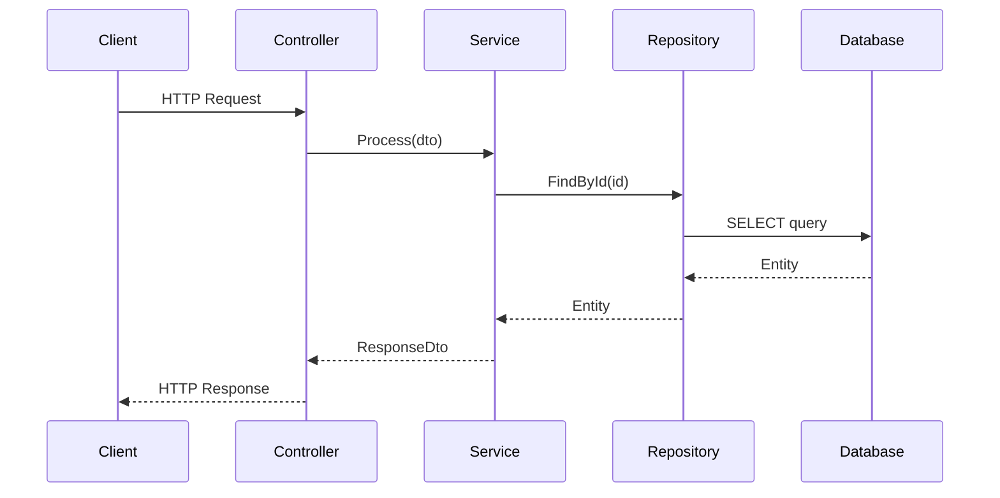

# Project Workflow Documentation Generator

## Purpose

Analyze a codebase and document representative end-to-end workflows that serve as implementation templates for similar features. This prompt produces comprehensive documentation of code patterns, naming conventions, and reusable templates.

## Configuration Variables

| Variable | Options | Description |
|----------|---------|-------------|
| `PROJECT_TYPE` | Auto-detect \| .NET \| Java \| Spring \| Node.js \| Python \| React \| Angular \| Go \| Rust \| Microservices \| Other | Primary technology stack |
| `ENTRY_POINT` | Auto-detect \| API \| GraphQL \| Frontend \| CLI \| Message Consumer \| Scheduled Job \| Custom | Starting point for the flow |
| `PERSISTENCE_TYPE` | Auto-detect \| SQL Database \| NoSQL Database \| File System \| External API \| Message Queue \| Cache \| None | Data storage type |
| `ARCHITECTURE_PATTERN` | Auto-detect \| Layered \| Clean \| CQRS \| Microservices \| MVC \| MVVM \| Serverless \| Event-Driven \| Hexagonal \| Other | Primary architecture pattern |
| `WORKFLOW_COUNT` | 1-5 | Number of workflows to document |
| `DETAIL_LEVEL` | Standard \| Implementation-Ready | Level of implementation detail |
| `INCLUDE_SEQUENCE_DIAGRAM` | true \| false | Generate Mermaid sequence diagrams |
| `INCLUDE_TEST_PATTERNS` | true \| false | Include testing approach |

---

## Security Guidelines

> ⚠️ **CRITICAL - Apply Before Documenting:**

| Risk | Action |
|------|--------|
| **Credentials** | REDACT all API keys, passwords, connection strings, tokens |
| **Internal Infrastructure** | MASK IP addresses, server names, internal URLs |
| **Authentication Details** | GENERALIZE auth implementations (show patterns, not secrets) |
| **Sensitive Business Logic** | REVIEW before including proprietary algorithms |

**Output Classification:** Mark documentation as `INTERNAL USE ONLY` if it exposes architectural details.

---

## Instructions

### Phase 1: Codebase Detection

**When Auto-detect is used, analyze step by step:**

#### 1.1 Technology Detection
Examine project files to identify the technology stack:

| Indicator File | Technology |
|----------------|------------|
| `*.csproj`, `*.sln` | .NET |
| `pom.xml`, `build.gradle` | Java/Spring |
| `package.json` | Node.js/React/Angular |
| `requirements.txt`, `pyproject.toml` | Python |
| `go.mod` | Go |
| `Cargo.toml` | Rust |

#### 1.2 Architecture Detection
Infer architecture from folder structure:

| Folder Pattern | Architecture |
|----------------|--------------|
| `Controllers/`, `Services/`, `Repositories/` | Layered/MVC |
| `Application/`, `Domain/`, `Infrastructure/` | Clean Architecture |
| `Commands/`, `Queries/`, `Handlers/` | CQRS |
| `Aggregates/`, `Events/`, `Projections/` | Event Sourcing |
| `Adapters/`, `Ports/` | Hexagonal |

#### 1.3 Entry Point Detection
Identify how requests enter the system:

| Pattern | Entry Point Type |
|---------|-----------------|
| Route definitions, `@Controller` | API |
| GraphQL schema, resolvers | GraphQL |
| Component event handlers | Frontend |
| Message handlers, subscribers | Message Consumer |
| Cron definitions, `@Scheduled` | Scheduled Job |

#### 1.4 Persistence Detection
Determine data storage mechanisms:

| Pattern | Persistence Type |
|---------|-----------------|
| DbContext, EntityManager | SQL Database |
| MongoDB, Cosmos, DynamoDB clients | NoSQL |
| HttpClient, RestTemplate | External API |
| Queue clients, pub/sub | Message Queue |
| Redis, Memcached clients | Cache |

**If detection is uncertain:** State assumptions clearly and proceed with the most likely interpretation.

---

### Phase 2: Workflow Documentation

For each of the **${WORKFLOW_COUNT}** most representative workflows:

#### 2.1 Workflow Overview
```markdown
## Workflow: [Descriptive Name]

**Business Purpose:** [What value does this deliver?]
**Trigger:** [What initiates this workflow?]
**Actors:** [Who/what interacts with this workflow?]

### Files Involved
| Layer | File | Purpose |
|-------|------|---------|
| Entry | [file.ext] | [Description] |
| Service | [file.ext] | [Description] |
| Data | [file.ext] | [Description] |
```

#### 2.2 Entry Point Implementation
Document the complete entry point with code examples:

```
- Controller/Handler class and method signature
- Request DTO/model with all properties and validation
- Authentication/authorization attributes or guards
- Route definition and HTTP methods
```

**Target Length:** 50-100 lines per workflow

#### 2.3 Service Layer Implementation
Document business logic layer:

```
- Service interface definition
- Service implementation with dependencies
- Key business logic decision points
- Domain model transformations
- Dependency injection registration
```

**Target Length:** 100-200 lines per workflow (Implementation-Ready)

#### 2.4 Data Access Implementation
Document persistence layer:

```
- Repository interface
- Repository implementation
- Entity/model definitions with relationships
- Query implementations (SQL/ORM)
- Transaction handling patterns
```

**⚠️ REDACT:** Connection strings, credentials, internal database names

**Target Length:** 50-100 lines per workflow

#### 2.5 Response & Error Handling
Document output construction:

```
- Response DTO structure
- Mapping from domain to response models
- HTTP status code selection logic
- Exception types and global handlers
- Error response format
```

**Target Length:** 50-100 lines per workflow

---

### Phase 3: Optional Sections

#### 3.1 Sequence Diagram (if INCLUDE_SEQUENCE_DIAGRAM=true)

Generate a Mermaid sequence diagram showing the complete flow:



Include:
- All component interactions
- Method names with key parameters
- Return values
- Error paths (alt blocks)

#### 3.2 Testing Patterns (if INCLUDE_TEST_PATTERNS=true)

Document testing approach for each layer:

```markdown
### Unit Tests
- Service layer test examples with mocking
- Repository test examples with in-memory DB
- Controller test examples with mocked services

### Integration Tests
- API endpoint tests
- Database integration tests
- External service mocking patterns

### Test Data
- Factory/builder patterns used
- Fixture setup patterns
```

---

### Phase 4: Implementation Templates

Provide copy-paste templates for adding new features:

#### Template 1: New API Endpoint
```
[Language-appropriate template with placeholders]
```

#### Template 2: New Service Method
```
[Language-appropriate template with placeholders]
```

#### Template 3: New Repository Method
```
[Language-appropriate template with placeholders]
```

#### Template 4: New Domain Model
```
[Language-appropriate template with placeholders]
```

#### Template 5: Error Handling
```
[Language-appropriate exception and handler template]
```

---

### Phase 5: Naming Conventions Summary

Create a reference table of observed patterns:

| Component | Pattern | Example |
|-----------|---------|---------|
| Controller | `{Entity}Controller` | `UserController` |
| Service | `{Entity}Service` or `I{Entity}Service` | `UserService` |
| Repository | `I{Entity}Repository` | `IUserRepository` |
| Request DTO | `{Action}{Entity}Request` | `CreateUserRequest` |
| Response DTO | `{Entity}Response` | `UserResponse` |
| Command | `{Action}{Entity}Command` | `CreateUserCommand` |
| Query | `Get{Entity}Query` | `GetUserQuery` |
| Handler | `{Command/Query}Handler` | `CreateUserCommandHandler` |
| Entity | `{Entity}` | `User` |
| Event | `{Entity}{Action}Event` | `UserCreatedEvent` |

---

### Phase 6: Implementation Guidelines

#### Step-by-Step Process
1. **Model First:** Define entity/domain models
2. **Repository:** Create data access interface and implementation
3. **Service:** Implement business logic
4. **Controller:** Create entry point
5. **DTOs:** Define request/response models
6. **Tests:** Write unit and integration tests
7. **Integration:** Register dependencies, add routes

#### Common Pitfalls
| Pitfall | Prevention |
|---------|------------|
| [Observed issue 1] | [How to avoid] |
| [Observed issue 2] | [How to avoid] |
| [Observed issue 3] | [How to avoid] |

#### Extension Points
- Document plugin/extension mechanisms
- Show how to add features without modifying existing code
- Explain configuration-driven patterns

---

## Error Handling

### If Workflows Cannot Be Identified

```markdown
⚠️ **Unable to identify clear workflows**

**Possible reasons:**
- [ ] Codebase uses unfamiliar architecture pattern
- [ ] Entry points are dynamically generated
- [ ] Code is heavily obfuscated or generated
- [ ] Repository structure doesn't match common patterns

**Recommendations:**
1. Specify PROJECT_TYPE and ARCHITECTURE_PATTERN explicitly
2. Point to a specific feature folder to analyze
3. Provide a sample workflow to use as reference
```

### If Architecture Is Ambiguous

```markdown
⚠️ **Architecture Assumption**

Multiple patterns detected. Proceeding with: [Pattern Name]

**Evidence:**
- [Observation 1]
- [Observation 2]

**Alternative interpretation:** [Other possible pattern]
```

---

## Output Format

### Length Guidelines

| Detail Level | Per Workflow | Total Maximum |
|--------------|--------------|---------------|
| Standard | ~500 words | 5,000 words |
| Implementation-Ready | ~1,500 words | 10,000 words |

### Document Structure

```markdown
# Project Workflow Documentation

**Generated:** [Date]
**Classification:** INTERNAL USE ONLY

## Executive Summary
[1-2 paragraph overview of the codebase and key patterns]

## Technology Stack
| Component | Technology | Version |
|-----------|------------|---------|
| [Layer] | [Tech] | [Version] |

## Workflow 1: [Name]
[Complete workflow documentation]

## Workflow 2: [Name]
[Complete workflow documentation]

...

## Implementation Templates
[Reusable code templates]

## Naming Conventions
[Summary table]

## Implementation Guidelines
[Step-by-step process and pitfalls]

## Security Considerations
[Architecture-specific security notes - REDACTED as appropriate]
```

---

## Technology-Specific Guidance

### .NET / ASP.NET Core
- Look for: `Startup.cs`, `Program.cs`, `*.csproj`
- Key patterns: Dependency injection in `IServiceCollection`, middleware pipeline
- Common ORMs: Entity Framework Core, Dapper
- Testing: xUnit, NUnit with Moq

### Java / Spring Boot
- Look for: `@SpringBootApplication`, `pom.xml`, `application.yml`
- Key patterns: `@RestController`, `@Service`, `@Repository` annotations
- Common ORMs: Spring Data JPA, Hibernate
- Testing: JUnit 5, Mockito

### Node.js / Express
- Look for: `package.json`, `app.js`, route definitions
- Key patterns: Middleware chains, async/await handlers
- Common ORMs: Prisma, TypeORM, Sequelize
- Testing: Jest, Mocha

### Python / FastAPI / Django
- Look for: `requirements.txt`, `manage.py`, `main.py`
- Key patterns: Decorators, dependency injection (FastAPI)
- Common ORMs: SQLAlchemy, Django ORM
- Testing: pytest, unittest

### React / Frontend
- Look for: `package.json`, component files (`.tsx`, `.jsx`)
- Key patterns: Hooks, state management (Redux, Zustand)
- API layer: Axios, fetch, React Query
- Testing: Jest, React Testing Library

---

## Example Usage

```yaml
PROJECT_TYPE: Auto-detect
ENTRY_POINT: API
PERSISTENCE_TYPE: SQL Database
ARCHITECTURE_PATTERN: Clean
WORKFLOW_COUNT: 3
DETAIL_LEVEL: Implementation-Ready
INCLUDE_SEQUENCE_DIAGRAM: true
INCLUDE_TEST_PATTERNS: true
```

**Resulting documentation will include:**
- 3 complete workflow documentations with full code examples
- Mermaid sequence diagrams for each workflow
- Testing patterns for unit and integration tests
- Implementation templates for the Clean Architecture pattern
- ~4,500 words total (3 × 1,500)
