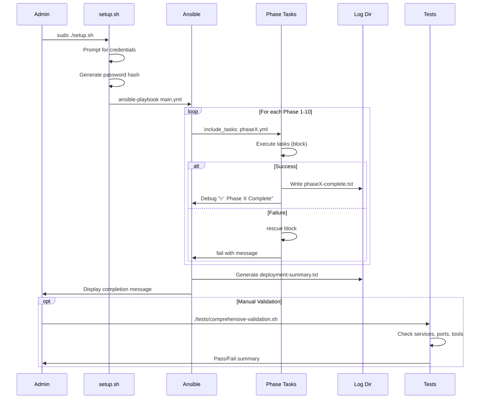

# Project Workflow Documentation

**Generated:** 2026-01-31
**Classification:** INTERNAL USE ONLY
**Project:** VPS RDP Developer Workstation

---

## Executive Summary

This codebase implements an **Ansible-based Infrastructure Automation** project that transforms a fresh Debian 13 VPS into a fully-configured RDP developer workstation. The architecture follows a **Phased Deployment Pattern** with 10 sequential phases, each containing validation checkpoints, rollback capability, and comprehensive logging.

Key patterns identified:
- **Orchestration Playbook** (`playbooks/main.yml`) - Central controller that imports phase tasks
- **Phase-based Task Files** - Modular task definitions per deployment phase
- **Role-based Configuration** - 12 reusable Ansible roles for specific functionality
- **Bash Test Scripts** - Phase-specific validation with pass/fail reporting
- **Checkpoint System** - State capture for rollback capability

---

## Technology Stack

| Component | Technology | Version |
|-----------|------------|---------|
| Automation | Ansible | 2.14+ |
| Configuration Language | YAML + Jinja2 | - |
| Testing | Bash Scripts | - |
| Target OS | Debian 13 (Trixie) | - |
| Collections | community.general, community.docker, ansible.posix | - |

---

## Detected Configuration

| Variable | Detected Value |
|----------|----------------|
| PROJECT_TYPE | Ansible Infrastructure Automation |
| ENTRY_POINT | CLI (`setup.sh` → Ansible Playbook) |
| PERSISTENCE_TYPE | File System (logs, state files) |
| ARCHITECTURE_PATTERN | Phased Deployment with Validation Gates |

---

## Workflow 1: Full VPS Provisioning (Main Deployment)

**Business Purpose:** Transform a bare Debian 13 VPS into a complete RDP-accessible developer workstation with all tools pre-configured.

**Trigger:** User executes `sudo ./setup.sh` (interactive) or sets environment variables and runs non-interactively.

**Actors:**
- System Administrator (runs setup)
- Ansible Controller (localhost)
- Target User (configured via `VPS_USERNAME`)

### Files Involved

| Layer | File | Purpose |
|-------|------|---------|
| Entry | [setup.sh](file:///home/apexdev/vps-rdp-workstation/setup.sh) | Bash bootstrap, prompts for credentials, invokes Ansible |
| Orchestration | [playbooks/main.yml](file:///home/apexdev/vps-rdp-workstation/playbooks/main.yml) | Master playbook with 10 phases |
| Phase Tasks | [playbooks/tasks/phase*.yml](file:///home/apexdev/vps-rdp-workstation/playbooks/tasks) | Individual phase implementations |
| Configuration | [inventory/hosts.yml](file:///home/apexdev/vps-rdp-workstation/inventory/hosts.yml) | Target host definition |
| Templates | [templates/*.j2](file:///home/apexdev/vps-rdp-workstation/templates) | Jinja2 configuration templates |

### Entry Point Implementation

```yaml
# playbooks/main.yml - Orchestration Structure

- name: "Phase 1: System Preparation & Checkpoint Creation"
  hosts: localhost
  become: true
  gather_facts: true
  tags:
    - phase1
    - preparation
  tasks:
    - name: Include Phase 1 playbook
      ansible.builtin.include_tasks: tasks/phase1-preparation.yml

# Pattern repeats for phases 2-10...
```

**Key Patterns:**
- Each phase is a separate play with specific tags
- `become: true` for privilege escalation
- `gather_facts` only where needed (minimizes overhead)
- Phase-specific tags for selective execution

### Phase Task Implementation

```yaml
# playbooks/tasks/phase1-preparation.yml - Structure Example

---
#===============================================================================
# Phase 1: System Preparation & Checkpoint Creation
#===============================================================================
# Creates system checkpoint, initializes logging, and validates prerequisites
#===============================================================================

- name: Create log directory
  ansible.builtin.file:
    path: "{{ vps_setup_log_dir }}"
    state: directory
    mode: '0755'

- name: Record initial system state
  block:
    - name: Record initial packages
      ansible.builtin.shell: dpkg -l > {{ vps_setup_log_dir }}/initial-packages.txt
      args:
        creates: "{{ vps_setup_log_dir }}/initial-packages.txt"

    - name: Record system information
      ansible.builtin.copy:
        content: |
          Deployment Date: {{ ansible_date_time.iso8601 }}
          Hostname: {{ ansible_hostname }}
          OS: {{ ansible_distribution }} {{ ansible_distribution_version }}
          # ... additional system info
        dest: "{{ vps_setup_log_dir }}/initial-system-info.txt"
        mode: '0644'

  rescue:
    - name: Phase 1 failed
      ansible.builtin.fail:
        msg: "Phase 1 System Preparation failed. Check logs at {{ vps_setup_log_dir }}"

- name: Mark Phase 1 complete
  ansible.builtin.copy:
    content: |
      Phase 1: System Preparation - COMPLETE
      Timestamp: {{ ansible_date_time.iso8601 }}
    dest: "{{ vps_setup_log_dir }}/phase1-complete.txt"
    mode: '0644'

- name: Phase 1 completion notice
  ansible.builtin.debug:
    msg: "✅ Phase 1: System Preparation Complete"
```

**Key Patterns:**
- Banner comments with `#===` for phase identification
- `block/rescue` for error handling
- Idempotent `creates:` argument for shell commands
- Phase completion markers written to log directory
- Debug messages with emoji indicators for visual feedback

### Deployment Phases Overview

| Phase | Name | Key Tasks |
|-------|------|-----------|
| 1 | System Preparation | Hostname, timezone, packages, checkpoint |
| 2 | User Management | Create user, sudo config, permissions |
| 3 | Dependencies | Add repos (Node, Docker, VS Code), install tools |
| 4 | Desktop Environment | KDE Plasma, XRDP, SDDM |
| 5 | Development Tools | Docker, VS Code, fonts, terminal (Zsh/Starship) |
| 6 | Installation Validation | Verify installations |
| 7 | Optimization | Security hardening, performance tuning |
| 8 | Enhancements | Additional utilities, customizations |
| 9 | Final Validation | Comprehensive checks |
| 10 | Optional Extensions | Extra enhancements (conditional) |

### Response & Error Handling

```yaml
# Error handling pattern from phase tasks

- name: System preparation
  block:
    # ... all phase tasks ...

  rescue:
    - name: Phase X failed
      ansible.builtin.fail:
        msg: "Phase X failed. Check logs at {{ vps_setup_log_dir }}"

# Final response - deployment summary generation
- name: Generate deployment summary
  ansible.builtin.copy:
    content: |
      ╔══════════════════════════════════════════════════════════════════╗
      ║              VPS RDP Workstation - Deployment Complete           ║
      ╠══════════════════════════════════════════════════════════════════╣
      ║  RDP Connection: {{ vps_ip }}:{{ xrdp_port }}
      ║  Username:       {{ vps_username }}
      ║  Deployed:       {{ ansible_date_time.iso8601 }}
      ╚══════════════════════════════════════════════════════════════════╝
    dest: "{{ vps_setup_log_dir }}/deployment-summary.txt"
    mode: '0644'
```

---

## Workflow 2: Phase Rollback

**Business Purpose:** Revert changes made during specific deployment phases when issues arise or cleanup is needed.

**Trigger:** Administrator runs `ansible-playbook playbooks/rollback.yml --tags phaseX`

**Actors:**
- System Administrator
- Ansible Controller

### Files Involved

| Layer | File | Purpose |
|-------|------|---------|
| Entry | [playbooks/rollback.yml](file:///home/apexdev/vps-rdp-workstation/playbooks/rollback.yml) | Rollback orchestration |
| Supporting | rollback/phase*.yml | Phase-specific rollback tasks |

### Rollback Implementation Pattern

```yaml
# playbooks/rollback.yml - Rollback Structure

- name: VPS RDP Workstation Rollback
  hosts: localhost
  become: true
  gather_facts: true

  vars:
    vps_username: "{{ lookup('env', 'VPS_USERNAME') | default('developer', true) }}"
    vps_setup_log_dir: /var/log/vps-setup

  tasks:
    #---------------------------------------------------------------------------
    # Phase 8 Rollback: Enhancements
    #---------------------------------------------------------------------------
    - name: "Rollback Phase 8: Remove enhancements"
      tags:
        - phase8
        - enhancements
      block:
        - name: Remove additional utilities
          ansible.builtin.apt:
            name:
              - tree
              - ncdu
              - iotop
              # ...
            state: absent
          ignore_errors: true

        - name: Log Phase 8 rollback
          ansible.builtin.debug:
            msg: "✅ Phase 8 Rollback Complete"

    #---------------------------------------------------------------------------
    # Phase 4 Rollback: RDP Packages
    #---------------------------------------------------------------------------
    - name: "Rollback Phase 4: RDP Packages"
      tags:
        - phase4
        - packages
      block:
        - name: Stop services
          ansible.builtin.systemd:
            name: "{{ item }}"
            state: stopped
          loop:
            - xrdp
            - sddm
            - docker
          ignore_errors: true

        - name: Remove desktop and development packages
          ansible.builtin.apt:
            name:
              - kde-plasma-desktop
              - xrdp
              # ...
            state: absent
            purge: true
          ignore_errors: true
```

**Key Patterns:**
- Rollback phases are in **reverse order** (8 → 4 → 3 → 2)
- Each rollback block tagged for selective execution
- `ignore_errors: true` ensures partial rollbacks complete
- Services stopped before package removal
- `purge: true` removes config files

---

## Workflow 3: Validation Testing

**Business Purpose:** Verify deployment completed successfully and all components function correctly.

**Trigger:**
- Automatic: Phase 6 and Phase 9 during deployment
- Manual: `./tests/comprehensive-validation.sh`

**Actors:**
- Ansible Controller (automatic)
- System Administrator (manual)

### Files Involved

| Layer | File | Purpose |
|-------|------|---------|
| Main | [tests/comprehensive-validation.sh](file:///home/apexdev/vps-rdp-workstation/tests/comprehensive-validation.sh) | Full validation suite |
| Phase Tests | [tests/phase*-tests.sh](file:///home/apexdev/vps-rdp-workstation/tests) | Phase-specific validation |

### Test Framework Pattern

```bash
#!/bin/bash
# Test Framework from comprehensive-validation.sh

# Colors
RED='\033[0;31m'
GREEN='\033[0;32m'
YELLOW='\033[1;33m'
NC='\033[0m'

PASSED=0
FAILED=0
WARNINGS=0

# Test helper functions
pass() {
    echo -e "${GREEN}✅ PASS${NC}: $1"
    ((PASSED++))
}

fail() {
    echo -e "${RED}❌ FAIL${NC}: $1"
    ((FAILED++))
}

warn() {
    echo -e "${YELLOW}⚠️  WARN${NC}: $1"
    ((WARNINGS++))
}

# Example service test
if systemctl is-active --quiet xrdp; then
    pass "XRDP service is running"
else
    fail "XRDP service is not running"
fi

# Example command test
if command -v node &>/dev/null; then
    pass "Node.js: $(node --version)"
else
    fail "Node.js is not installed"
fi

# Summary with exit code
if [ $FAILED -eq 0 ]; then
    echo "ALL REQUIRED TESTS PASSED!"
    exit 0
else
    echo "SOME TESTS FAILED"
    exit 1
fi
```

**Key Patterns:**
- Colored output for visual clarity
- Pass/Fail/Warn counters
- Service checks via `systemctl is-active`
- Command availability via `command -v`
- Exit code 0 for success, 1 for failure

---

## Sequence Diagram: Full Deployment



---

## Implementation Templates

### Template 1: New Deployment Phase

```yaml
---
#===============================================================================
# Phase X: [Phase Name]
#===============================================================================
# [Description of what this phase does]
#===============================================================================

- name: [First task description]
  ansible.builtin.MODULE:
    PARAMS

- name: [Main phase tasks]
  block:
    - name: [Task 1]
      ansible.builtin.MODULE:
        PARAMS
      register: result_var

    - name: [Task 2]
      ansible.builtin.MODULE:
        PARAMS
      when: condition

  rescue:
    - name: Phase X failed
      ansible.builtin.fail:
        msg: "Phase X failed. Check logs at {{ vps_setup_log_dir }}"

- name: Mark Phase X complete
  ansible.builtin.copy:
    content: |
      Phase X: [Phase Name] - COMPLETE
      Timestamp: {{ ansible_date_time.iso8601 }}
      [Additional completion info]
    dest: "{{ vps_setup_log_dir }}/phaseX-complete.txt"
    mode: '0644'

- name: Phase X completion notice
  ansible.builtin.debug:
    msg: "✅ Phase X: [Phase Name] Complete"
```

### Template 2: New Repository Setup Task

```yaml
#-------------------------------------------------------------------------------
# [Tool Name] Repository
#-------------------------------------------------------------------------------

- name: Download [Tool] GPG key
  ansible.builtin.get_url:
    url: https://[url]/gpg.key
    dest: /tmp/[tool].gpg.key
    mode: '0644'
    timeout: 30
  register: key_download
  retries: 3
  delay: 10
  until: key_download is succeeded

- name: Dearmor [Tool] GPG key
  ansible.builtin.shell: |
    gpg --dearmor --yes -o /usr/share/keyrings/[tool].gpg /tmp/[tool].gpg.key
  args:
    creates: /usr/share/keyrings/[tool].gpg

- name: Add [Tool] repository
  ansible.builtin.apt_repository:
    repo: "deb [arch=amd64 signed-by=/usr/share/keyrings/[tool].gpg] https://[url] stable main"
    filename: [tool]
    state: present

- name: Install [Tool]
  ansible.builtin.apt:
    name: [package-name]
    state: present
    update_cache: true
```

### Template 3: New Phase Test Script

```bash
#!/bin/bash
#===============================================================================
# Phase X Tests - [Phase Name]
#===============================================================================
set -e

echo "=== Phase X: [Phase Name] ==="

FAILED=0
LOG_DIR="${VPS_SETUP_LOG_DIR:-/var/log/vps-setup}"

# Test 1: [Description]
echo "Test 1: [Description]..."
if [ CONDITION ]; then
    echo "  ✅ [Success message]"
else
    echo "  ❌ [Failure message]"
    ((FAILED++))
fi

# Test 2: [Description]
echo "Test 2: [Description]..."
if command -v [tool] &>/dev/null; then
    echo "  ✅ [Tool] is installed"
else
    echo "  ❌ [Tool] is not installed"
    ((FAILED++))
fi

# Summary
echo ""
if [ $FAILED -eq 0 ]; then
    echo "=== Phase X Validation: ALL TESTS PASSED ✅ ==="
    exit 0
else
    echo "=== Phase X Validation: $FAILED TESTS FAILED ❌ ==="
    exit 1
fi
```

### Template 4: New Ansible Role

```
roles/[role_name]/
├── tasks/
│   └── main.yml
├── handlers/
│   └── main.yml
├── templates/
│   └── config.j2
├── files/
├── vars/
│   └── main.yml
└── defaults/
    └── main.yml
```

```yaml
# roles/[role_name]/tasks/main.yml
---
- name: [Task 1]
  ansible.builtin.MODULE:
    PARAMS
  notify: [handler_name]

- name: [Task 2]
  ansible.builtin.template:
    src: config.j2
    dest: /path/to/config
    mode: '0644'

# roles/[role_name]/handlers/main.yml
---
- name: [handler_name]
  ansible.builtin.systemd:
    name: [service]
    state: restarted
```

### Template 5: Rollback Block

```yaml
#---------------------------------------------------------------------------
# Phase X Rollback: [Phase Name]
#---------------------------------------------------------------------------

- name: "Rollback Phase X: [Phase Name]"
  tags:
    - phaseX
    - [feature_tag]
  block:
    - name: Stop related services
      ansible.builtin.systemd:
        name: "{{ item }}"
        state: stopped
      loop:
        - [service1]
        - [service2]
      ignore_errors: true

    - name: Remove installed packages
      ansible.builtin.apt:
        name:
          - [package1]
          - [package2]
        state: absent
        purge: true
      ignore_errors: true

    - name: Remove configuration files
      ansible.builtin.file:
        path: "{{ item }}"
        state: absent
      loop:
        - /path/to/config1
        - /path/to/config2

    - name: Log Phase X rollback
      ansible.builtin.debug:
        msg: "✅ Phase X Rollback Complete"
```

---

## Naming Conventions Summary

| Component | Pattern | Example |
|-----------|---------|---------|
| Playbook | `{function}.yml` | `main.yml`, `rollback.yml` |
| Phase Task | `phase{N}-{name}.yml` | `phase1-preparation.yml` |
| Role | `{function}` | `common`, `desktop`, `security` |
| Test Script | `phase{N}-tests.sh` | `phase1-tests.sh` |
| Template | `{config-name}.j2` | `docker-daemon.json.j2` |
| Variable | `{component}_{setting}` | `vps_username`, `xrdp_port` |
| Log File | `{phase/function}-{state}.txt` | `phase1-complete.txt` |
| Handler | `{Action} {Service}` | `Restart Docker` |

---

## Implementation Guidelines

### Step-by-Step Process for New Feature

1. **Define Variables** - Add to `inventory/group_vars/all.yml`
2. **Create Task File** - Add `playbooks/tasks/phaseX-feature.yml`
3. **Update Orchestration** - Include task in `playbooks/main.yml`
4. **Add Templates** - Create Jinja2 templates in `templates/`
5. **Create Tests** - Add validation in `tests/phaseX-tests.sh`
6. **Add Rollback** - Include rollback block in `playbooks/rollback.yml`
7. **Document** - Update `README.md` with new feature

### Common Pitfalls

| Pitfall | Prevention |
|---------|------------|
| Non-idempotent shell commands | Use `creates:` or `changed_when:` |
| Missing error handling | Always use `block/rescue` pattern |
| Hardcoded paths | Use variables from `group_vars/all.yml` |
| Forgetting rollback | Add rollback block for every new feature |
| Skipping validation | Include tests in phase test script |
| Permission issues | Use `mode:` on all file operations |

### Extension Points

- **New Tools:** Add repository setup in Phase 3, installation in Phase 5
- **New Services:** Configure in dedicated phase, add to validation tests
- **New Users:** Extend Phase 2 with additional user configuration
- **New Security:** Add to Phase 7 (optimization/security)
- **Optional Features:** Gate with `when: install_feature | default(false)`

---

## Testing Patterns

### Phase-Level Tests

Each phase has a corresponding test script (`tests/phase{N}-tests.sh`):

```bash
# Pattern: Check for expected state
if [ -f "$LOG_DIR/phase1-complete.txt" ]; then
    pass "Phase 1 completion marker exists"
else
    fail "Phase 1 incomplete"
fi
```

### Comprehensive Validation Categories

| Category | Tests |
|----------|-------|
| Services | XRDP, SDDM, Docker, SSH, Fail2ban |
| Ports | 3389 (RDP), 22 (SSH) |
| Dev Tools | Node, npm, Python, PHP, Composer, Docker |
| Terminal | Zsh, Starship, Oh My Zsh |
| User Config | User exists, shell, groups, xsession |
| Security | UFW, Fail2ban jails |
| Fonts | JetBrains Mono Nerd Font |

### Running Tests

```bash
# Single phase
./tests/phase1-tests.sh

# All phases
for i in {1..8}; do ./tests/phase${i}-tests.sh; done

# Comprehensive
./tests/comprehensive-validation.sh
```

---

## Security Considerations

> ⚠️ **REDACTED PATTERNS** (Do not expose in shared documentation):

| Risk Area | Mitigation in Codebase |
|-----------|------------------------|
| Credentials | Password hash via environment variable, not stored |
| SSH Config | Hardened settings in sshd_config template |
| Firewall | UFW deny-by-default, explicit port allowlisting |
| Brute Force | Fail2ban with SSH and XRDP jails |
| Sudo Access | Limited passwordless commands via sudoers.d |
| Updates | Unattended security updates enabled |

---

## Quick Reference: Common Commands

```bash
# Full deployment
sudo ./setup.sh

# Non-interactive deployment
export VPS_USERNAME="developer"
export VPS_PASSWORD="your-password"
sudo -E ./setup.sh --non-interactive

# Run specific phase
ansible-playbook playbooks/main.yml --tags phase5

# Check mode (dry run)
ansible-playbook playbooks/main.yml --check

# Rollback specific phase
ansible-playbook playbooks/rollback.yml --tags phase4

# Full validation
./tests/comprehensive-validation.sh

# View deployment logs
ls -la /var/log/vps-setup/
cat /var/log/vps-setup/deployment-summary.txt
```

---

*Documentation generated following the Project Workflow Documentation Generator template.*
