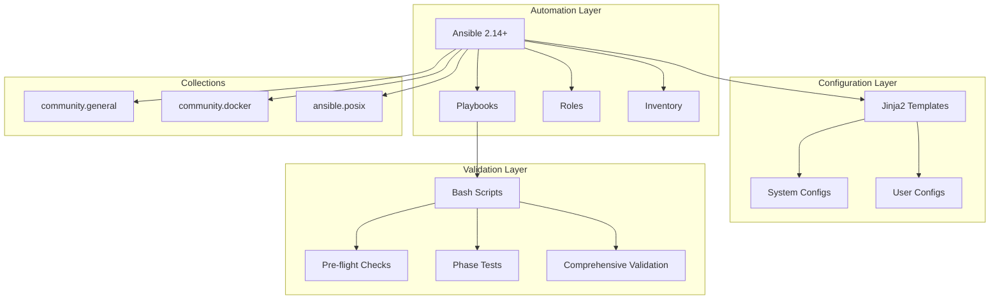
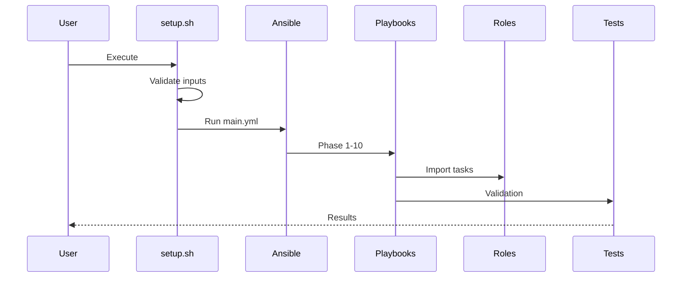

# Technology Stack Blueprint

**Generated:** 2026-01-31
**Classification:** ⚠️ INTERNAL USE ONLY
**Project:** VPS RDP Developer Workstation
**Depth Level:** Comprehensive

---

## Technology Stack Overview



---

## 1. Core Technologies

### 1.1 Ansible (Primary Automation)

| Component | Details |
|-----------|---------|
| **Version** | 2.14+ (ansible-core) |
| **Python** | 3.x (system interpreter) |
| **Configuration** | `ansible.cfg` |
| **Inventory** | YAML format (`inventory/hosts.yml`) |

**Collections:**
- `community.general` - Extended modules (ufw, npm, timezone, locale_gen)
- `community.docker` - Docker management
- `ansible.posix` - POSIX modules (sysctl)

### 1.2 Jinja2 Templates

| Template | Purpose |
|----------|---------|
| `zshrc.j2` | Shell configuration with plugins, aliases, functions |
| `starship.toml.j2` | Prompt configuration with language detection |
| `docker-daemon.json.j2` | Docker daemon settings |
| `fail2ban-jail.local.j2` | Security jail configuration |
| `xrdp.ini.j2` | RDP server settings |

### 1.3 Bash Scripts

| Category | Scripts |
|----------|---------|
| **Pre-deployment** | `pre-flight-checks.sh` - System requirements validation |
| **Utilities** | `create-checkpoint.sh`, `rollback-to-checkpoint.sh` |
| **Validation** | `phase{1-8}-tests.sh`, `comprehensive-validation.sh` |

---

## 2. Project Structure

```
vps-rdp-workstation/
├── ansible.cfg              # Ansible configuration
├── requirements.yml         # Collection dependencies
├── setup.sh                 # Entry point script
├── inventory/
│   ├── hosts.yml           # Target hosts
│   └── group_vars/all.yml  # Configuration variables
├── playbooks/
│   ├── main.yml            # Orchestration (10 phases)
│   ├── rollback.yml        # Rollback orchestration
│   └── tasks/              # Phase implementations
├── roles/                   # 12 reusable roles
├── templates/              # Jinja2 configuration files
├── scripts/                # Utility scripts
├── tests/                  # Validation scripts
└── files/                  # Static files
```

---

## 3. Ansible Configuration Patterns

### 3.1 Inventory Structure

```yaml
# inventory/hosts.yml
all:
  hosts:
    localhost:
      ansible_connection: local
      ansible_python_interpreter: /usr/bin/python3
```

### 3.2 Variable Organization

```yaml
# inventory/group_vars/all.yml - Section pattern
# === Section Name ===
variable_name: value
related_variable: value

# Complex structure for loop iteration
ufw_allowed_ports:
  - { port: 22, proto: tcp, comment: "SSH" }
  - { port: 3389, proto: tcp, comment: "XRDP" }
```

### 3.3 Task Patterns

**Block/Rescue for Error Handling:**
```yaml
- name: Task group
  block:
    - name: Primary task
      ansible.builtin.MODULE:
        param: value
  rescue:
    - name: Error handler
      ansible.builtin.fail:
        msg: "Error message"
```

**Conditional with Feature Flags:**
```yaml
- name: Optional installation
  ansible.builtin.apt:
    name: package
  when: install_feature | default(true)
```

**Retry Logic:**
```yaml
- name: Download with retry
  ansible.builtin.get_url:
    url: https://example.com/file
    dest: /tmp/file
  retries: 3
  delay: 10
  until: result is succeeded
```

---

## 4. Bash Script Patterns

### 4.1 Test Framework

```bash
# Color definitions
RED='\033[0;31m'
GREEN='\033[0;32m'
NC='\033[0m'

# Counter variables
PASSED=0
FAILED=0

# Helper functions
pass() { echo -e "${GREEN}✅ PASS${NC}: $1"; ((PASSED++)); }
fail() { echo -e "${RED}❌ FAIL${NC}: $1"; ((FAILED++)); }

# Exit code based on results
[ $FAILED -eq 0 ] && exit 0 || exit 1
```

### 4.2 Pre-flight Check Pattern

```bash
check_memory() {
    local ram_gb=$(($(free -m | awk '/^Mem:/{print $2}') / 1024))
    if [ "$ram_gb" -ge 4 ]; then
        echo -e "${GREEN}✅ ${ram_gb}GB${NC}"
        return 0
    else
        echo -e "${RED}❌ ${ram_gb}GB (minimum: 4GB)${NC}"
        ((ERRORS++))
        return 1
    fi
}
```

---

## 5. Jinja2 Template Patterns

### 5.1 Managed Header

```jinja2
# {{ ansible_managed }}
# Configuration for VPS Developer Workstation
# Generated: {{ ansible_date_time.iso8601 }}
```

### 5.2 Loop Iteration

```jinja2
plugins=(

  {{ plugin }}

)
```

### 5.3 Inline Conditionals

```jinja2
ColorScheme={{ kde_theme[vps_theme].color_scheme | default('BreezeDark') }}
```

---

## 6. Integration Points

### 6.1 Deployment Flow



### 6.2 Configuration Hierarchy

1. **Command Line** (`-e "var=value"`)
2. **Environment Variables** (`VPS_USERNAME`)
3. **group_vars/all.yml** (Primary configuration)
4. **Role defaults** (`roles/*/defaults/main.yml`)

---

## 7. Development Tooling

| Tool | Purpose | Configuration |
|------|---------|---------------|
| **ansible-lint** | YAML/Ansible linting | `.ansible-lint` |
| **yamllint** | YAML validation | `.yamllint` |
| **shellcheck** | Bash linting | `.shellcheckrc` |
| **pre-commit** | Git hooks | `.pre-commit-config.yaml` |

---

## 8. Naming Conventions

| Component | Convention | Example |
|-----------|------------|---------|
| Playbook | `{function}.yml` | `main.yml`, `rollback.yml` |
| Phase Task | `phase{N}-{name}.yml` | `phase1-preparation.yml` |
| Role | lowercase | `common`, `desktop` |
| Variable | `snake_case` | `vps_username`, `xrdp_port` |
| Feature Flag | `install_*`, `enable_*` | `install_docker` |
| Template | `{name}.j2` | `zshrc.j2` |
| Test Script | `phase{N}-tests.sh` | `phase1-tests.sh` |

---

## 9. Technology Decision Context

| Decision | Rationale |
|----------|-----------|
| **Ansible over Shell** | Idempotency, error handling, modularity |
| **YAML Inventory** | Human-readable, supports complex structures |
| **Jinja2 Templates** | Dynamic configuration with variable substitution |
| **Bash for Tests** | Native execution, no dependencies, CI-friendly |
| **community.general** | Extended module support (ufw, npm, etc.) |

---

## 10. Version Matrix

| Technology | Version | Source |
|------------|---------|--------|
| Target OS | Debian 13 (Trixie) | Requirement |
| Ansible | 2.14+ | `requirements.yml` |
| Python | 3.x | System interpreter |
| Node.js | 20.x LTS | `nodejs_version` variable |
| Docker | Latest CE | Official repository |
| KDE Plasma | Minimal | Debian packages |

---

*Total Files: 106 | Technologies: 4 primary (Ansible, Jinja2, Bash, YAML)*
