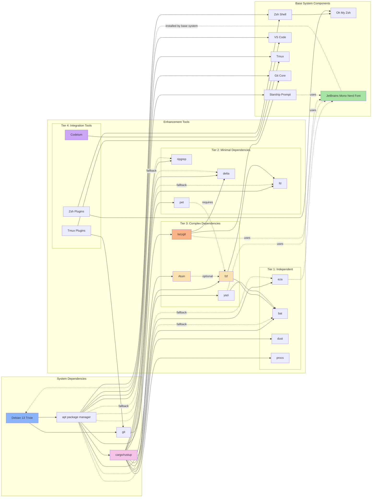
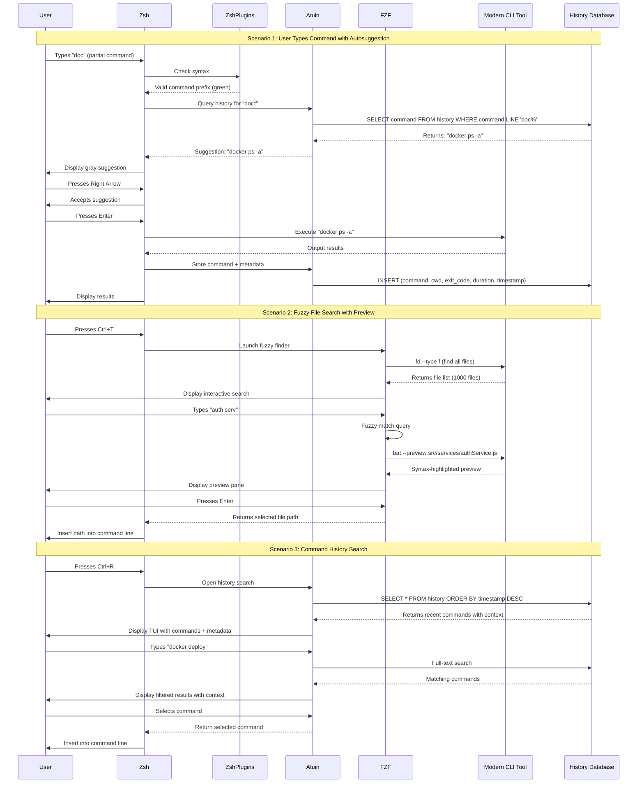
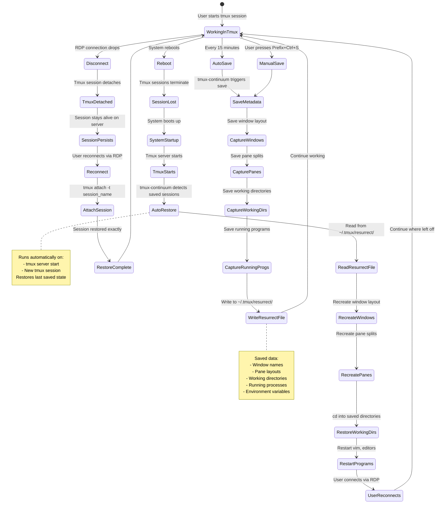

# PRD: VPS RDP Developer Workstation - Terminal & Coding Speed Enhancements

## 1. Product overview

### 1.1 Document title and version

- **PRD:** VPS RDP Developer Workstation - Terminal & Coding Speed Enhancements
- **Version:** 1.0.0
- **Date:** 2026-01-29
- **Repository:** yunaamelia/vps-rdp-workstation

### 1.2 Product summary

This enhancement extends the existing VPS RDP Developer Workstation automation system with modern terminal beautification tools and AI-powered coding acceleration features. The base system currently transforms a fresh Debian 13 (Trixie) VPS into a fully-configured RDP developer workstation with KDE Plasma desktop, XRDP remote access, and a complete development stack including Node.js, Python, PHP, Docker, VS Code, and Zsh with Starship prompt.

The enhancements add 12 carefully selected feature categories that dramatically improve terminal aesthetics and coding productivity through AI-powered code completion (Codeium), advanced Zsh plugins for intelligent command suggestions, modern Rust-based CLI tools that replace traditional Unix utilities with beautiful, faster alternatives, enhanced Git workflows with visual UIs, fuzzy finding capabilities, terminal file management, persistent tmux sessions, and command snippet management.

This enhancement maintains full compatibility with the existing Ansible + Shell hybrid architecture, preserving all current functionality while adding powerful new capabilities that prepare the workstation for all development use cases—from full-stack web development to DevOps infrastructure work. The implementation follows the project's established patterns for idempotency, error handling, rollback capabilities, and comprehensive documentation, ensuring a seamless integration that feels native to the existing system.

## 2. Goals

### 2.1 Business goals

- Increase developer productivity by 2-3x through AI-powered code completion and intelligent terminal tools
- Reduce time spent on repetitive terminal operations through modern CLI replacements and fuzzy finding
- Minimize context switching by providing terminal-based alternatives for common GUI workflows
- Lower the barrier to entry for new users with beautiful, intuitive terminal interfaces
- Establish the workstation as a comprehensive, production-ready development environment for all use cases
- Create a competitive advantage over standard VPS setups through premium developer experience

### 2.2 User goals

- Write code faster with AI-powered autocompletion that understands project context
- Navigate directories and files instantly with fuzzy finding instead of manual cd commands
- Execute Git operations visually through an intuitive terminal UI instead of memorizing commands
- View file contents with syntax highlighting and manage files without leaving the terminal
- Preserve terminal sessions and workflows across disconnections and reboots
- Discover and execute frequently-used commands instantly without searching documentation
- Enjoy a visually beautiful terminal with icons, colors, and modern aesthetics
- Maintain consistent development environment across fresh installations and updates

### 2.3 Non-goals

- Adding monitoring tools, metrics dashboards, or observability platforms
- Implementing collaboration features, team chat, or real-time co-editing
- Providing security scanning, penetration testing, or compliance auditing tools
- Creating web-based interfaces or dashboard replacements for terminal tools
- Supporting Windows-native terminals or non-Linux operating systems
- Replacing the existing KDE Plasma desktop or XRDP remote access setup
- Modifying the core Ansible architecture or deployment phase structure

## 3. User personas

### 3.1 Key user types

- Solo developers setting up personal development environments
- DevOps engineers managing infrastructure and deployment automation
- Full-stack web developers working with Node.js, PHP, and Python
- System administrators configuring reproducible development workstations
- Remote workers connecting via RDP who need consistent terminal experiences

### 3.2 Basic persona details

- **Alex - Full-Stack Developer**: Solo developer who works on multiple web projects simultaneously, needs fast code completion, efficient Git workflows, and quick file navigation. Values beautiful aesthetics and productivity shortcuts. Primary use case: building Node.js/PHP/Python applications with Docker.

- **Jordan - DevOps Engineer**: Infrastructure specialist who spends most time in terminal executing repetitive commands, managing Docker containers, and writing automation scripts. Needs command history search, snippet management, and persistent terminal sessions. Primary use case: system administration and CI/CD pipeline management.

- **Sam - Remote Developer**: Developer who connects to VPS via RDP from multiple locations, requires session persistence across disconnections, and needs all tools accessible via terminal due to network latency considerations for GUI apps.

### 3.3 Role-based access

All enhancements are user-level configurations without special privilege requirements beyond standard development account permissions. The target user (configured via `vps_username` variable) receives all enhancement features during automated installation. No role-based restrictions exist—all users configured on the system can access enhancement features equally.

## 4. Functional requirements

### **AI-powered code completion** (Priority: Highest)

- Install Codeium extension for VS Code with zero-configuration setup
- Provide real-time autocomplete with multi-line code suggestions across 70+ programming languages
- Enable in-editor chat for code explanation, refactoring, and debugging assistance
- Configure keyboard shortcuts for accepting suggestions (Tab), word-by-word acceptance (Ctrl+→), and opening chat (Alt+\)
- Ensure context-aware completions that understand project structure and existing code patterns
- Support all editors in base system (VS Code, OpenCode, Antigravity) where compatible
- Create user documentation with usage examples and productivity tips

### **Intelligent Zsh enhancements** (Priority: High)

- Install and configure zsh-autosuggestions for fish-like command suggestions based on history
- Implement zsh-syntax-highlighting for real-time command validation (green=valid, red=invalid)
- Enable zsh-z plugin for intelligent directory jumping based on frecency (frequency + recency)
- Configure subtle gray color for autosuggestions that doesn't distract from primary content
- Set right arrow and End key for accepting suggestions
- Ensure syntax highlighting loads last to prevent conflicts with other plugins
- Integrate seamlessly with existing Oh My Zsh and Starship prompt configuration

### **Modern CLI tool suite** (Priority: High)

- Install eza (modern ls) with icons, git status, and tree view capabilities
- Install bat (cat with syntax highlighting) supporting 200+ languages and git integration
- Install fd (intuitive find replacement) that respects .gitignore and runs 3x faster
- Install ripgrep (modern grep) optimized for code search with smart case sensitivity
- Install dust (visual disk usage analyzer) with tree map and automatic size sorting
- Install procs (modern ps replacement) with colored interface and easy filtering
- Create shell aliases while preserving access to original commands via full paths
- Configure all tools with matching dark theme color schemes
- Set bat as MANPAGER for syntax-highlighted man pages

### **Git enhancement tools** (Priority: High)

- Install lazygit terminal UI for visual staging, committing, branching, and interactive rebase
- Install delta as enhanced git diff viewer with syntax highlighting and side-by-side view
- Configure lazygit with Catppuccin dark theme matching terminal aesthetics
- Set delta as default git pager for diff, log, and show commands
- Integrate delta with lazygit for enhanced diff viewing
- Create .desktop launcher for lazygit in KDE application menu under Development
- Provide keybinding cheat sheet for common lazygit operations

### **Fuzzy finding and navigation** (Priority: High)

- Install fzf with system-wide integration for files, command history, and directory navigation
- Configure Ctrl+T for fuzzy file search with bat-powered preview
- Configure Ctrl+R for fuzzy command history search replacing default history
- Configure Alt+C for fuzzy directory navigation (intelligent cd)
- Use fd as default file finder for 3x faster search performance
- Set preview window size limits to prevent performance lag on large files
- Create custom functions for git branch switching, process killing, and environment variable search

### **Enhanced shell history with Atuin** (Priority: Medium)

- Install Atuin for magical shell history with full-text search and context tracking
- Store command metadata including directory, exit code, duration, and timestamp
- Provide beautiful TUI interface for history exploration and statistics
- Bind to Ctrl+R for history search (can coexist with fzf for different use cases)
- Configure fuzzy search mode as default search algorithm
- Disable sync by default for privacy, document how to enable for multi-machine use
- Filter sensitive commands (passwords, tokens) from history storage
- Configure inline suggestions showing command context and success indicators

### **Terminal file manager - yazi** (Priority: Medium)

- Install yazi GPU-accelerated terminal file manager with vim-style navigation
- Configure file preview using bat for syntax-highlighted code files
- Enable image preview in terminal where supported
- Set up bulk operations for renaming, moving, and deleting files
- Configure custom keybindings for opening files in VS Code
- Integrate with fzf for enhanced fuzzy search within file manager
- Create shell function `y()` for quick launch
- Configure bookmark system for frequently accessed project directories

### **Tmux enhancement suite** (Priority: High)

- Install Tmux Plugin Manager (TPM) for plugin management
- Install tmux-resurrect for saving and restoring entire tmux environments
- Install tmux-continuum for automatic session save every 15 minutes and auto-restore
- Install tmux-yank for copying to system clipboard with RDP clipboard integration
- Install tmux-fzf for fuzzy session/window/pane navigation and command palette
- Configure Catppuccin theme for tmux matching terminal aesthetics
- Set keybindings: prefix+Ctrl+S (save), prefix+Ctrl+R (restore), prefix+F (fuzzy search)
- Ensure tmux-yank works correctly with XRDP clipboard forwarding

### **Command snippet manager - pet** (Priority: Medium)

- Install pet command-line snippet manager with fuzzy search
- Configure snippet storage in `~/.config/pet/snippet.toml`
- Integrate with fzf for fuzzy snippet search and execution
- Set VS Code or vim as editor for snippet creation
- Pre-load common snippets: Docker commands, Git operations, system admin tasks, database operations
- Bind Ctrl+X Ctrl+P for quick snippet search and insertion
- Create documentation for adding, editing, and organizing snippets with tags
- Disable Gist sync by default for privacy

### **Desktop UI requirements** (Priority: High)

- Ensure visual consistency across all tools using Catppuccin dark theme
- Configure compact layouts that maximize usable screen space in terminal
- Use JetBrains Mono Nerd Font (already installed) for icons across all tools
- Match color schemes to existing Starship prompt for cohesive aesthetics
- Provide polished, modern appearance with proper icon rendering
- Ensure all TUI tools use consistent keybindings where possible (vim-style preferred)
- Create welcome message with ASCII art displaying available enhancements

### **Configuration management** (Priority: Highest)

- Create separate `~/.zshrc.enhancements` file sourced from main ~/.zshrc
- Back up existing configurations before modifications to `/var/backups/vps-workstation/enhancements/`
- Implement idempotent installation checks for all tools and configurations
- Provide feature toggles in `defaults/main.yml` for enabling/disabling individual enhancements
- Support multiple installation methods with fallback: apt → cargo → binary download
- Create validation script (`scripts/validation/validate-enhancements.sh`) to verify installations
- Implement comprehensive error handling with block/rescue/always patterns
- Generate installation summary report showing successful and failed features

### **Documentation and user experience** (Priority: High)

- Create ENHANCEMENTS.md with overview of all added features and usage instructions
- Create TERMINAL_GUIDE.md with practical examples and workflows
- Create SHORTCUTS.md as quick reference cheat sheet for all keybindings
- Create TROUBLESHOOTING_ENHANCEMENTS.md for common issues and solutions
- Display welcome message on first shell launch explaining new features
- Provide helper shell functions: `shortcuts`, `enhancements-help`, `enhancement-stats`
- Update main README.md with enhancement information and installation instructions


## 5. User experience (EXPANDED)
#### 5.1 Entry points & first-time user flow (DETAILED)

**Installation Context:**
The enhancements install as part of the automated VPS workstation deployment process during Phase 8. The user doesn't need to take any manual action—everything happens automatically when they run the main `setup.sh` script.

**Installation Timeline:**
- **Minutes 0-45**: Base system installation completes (Phases 1-7)
- **Minutes 45-48**: Enhancement role begins execution
- **Minutes 48-50**: All 12 enhancement categories install in parallel where possible
- **Minute 50**: Validation checks confirm successful installation
- **Minute 51**: User can now connect via RDP

**First Connection Experience:**

1. **RDP Connection**: User opens Remote Desktop Connection on Windows, enters VPS IP address, and connects
2. **KDE Desktop Login**: KDE Plasma desktop appears with the configured dark theme (Catppuccin)
3. **Opening Terminal**: User clicks Konsole icon in taskbar or presses Ctrl+Alt+T
4. **Shell Initialization**: Shell loads in under 0.5 seconds despite all new enhancements
5. **Welcome Banner Appears**:

```
╔════════════════════════════════════════════════════════════════╗
║         🚀 VPS Workstation Enhancements Installed! 🚀         ║
╠════════════════════════════════════════════════════════════════╣
║ New features available:                                        ║
║  • AI Code Completion (Codeium in VS Code)                    ║
║  • Smart command suggestions (just start typing!)             ║
║  • Modern CLI tools (prettier ls, cat, find, grep)            ║
║  • Enhanced Git UI (try: lazygit)                             ║
║  • Fuzzy finding (Ctrl+R for history, Ctrl+T for files)       ║
║  • File manager (try: yazi)                                   ║
║  • Tmux session persistence (auto-save/restore)               ║
║  • Command snippets (Ctrl+X Ctrl+P)                           ║
║                                                                ║
║ ⚡ Quick start:                                                ║
║  • Press Ctrl+R to search command history with Atuin          ║
║  • Press Ctrl+T to find files with fuzzy search               ║
║  • Type 'lazygit' to see beautiful Git UI                     ║
║  • Type 'ls' to see modern file listing with icons            ║
║  • Open VS Code to try AI code completion                     ║
║                                                                ║
║ 📚 Learn more:                                                 ║
║  • shortcuts      - See all keyboard shortcuts                ║
║  • enhancements-help - Open full documentation                ║
║  • terminal-guide - View usage examples                       ║
╚════════════════════════════════════════════════════════════════╝
```

6. **Immediate Feedback**: As user starts typing any command, they immediately see:
   - Gray autosuggestion text appearing based on history
   - Green highlighting for valid commands
   - Red highlighting if they make a typo

7. **First Exploration**: User naturally discovers features:
   - Types `ls` → sees beautiful icons and colors
   - Types a command they ran before → autosuggestion appears, presses right arrow to accept
   - Makes a typo → immediately sees red highlight before pressing Enter

**Guided Discovery Flow:**

The welcome message intentionally guides users through a progression:

**Tier 1 - Immediate Impact (Try First):**
- Ctrl+R (history search) - Universal benefit for everyone
- Ctrl+T (file search) - Needed within first 5 minutes
- `ls` command - Instantly visible improvement

**Tier 2 - Role-Specific (Try When Needed):**
- `lazygit` - When doing Git operations
- VS Code + Codeium - When writing code
- `yazi` - When browsing unfamiliar directory structures

**Tier 3 - Advanced Features (Discover Over Time):**
- Tmux session persistence - Discovered after first disconnect
- Pet snippets - Discovered when repeating complex commands
- Advanced keybindings - Learned from shortcuts reference

**Learning Curve Management:**

The system doesn't overwhelm users with all features at once. Instead:
- **Day 1**: Users discover visual improvements (icons, colors, syntax highlighting)
- **Week 1**: Users adopt core productivity shortcuts (Ctrl+R, Ctrl+T, Tab completion)
- **Month 1**: Users develop muscle memory for advanced features (lazygit, yazi, pet)
- **Month 3+**: Users customize configurations and add personal snippets

#### 5.2 Core experience (EXPANDED WITH DETAILED WORKFLOWS)

**Workflow 1: Morning Coding Session**

*Scenario: Starting a new feature implementation*

1. **Resume Work Context**
   - User connects via RDP
   - Opens terminal and sees tmux automatically restored their previous session
   - All windows, panes, and working directories exactly as left yesterday
   - No need to cd into project directory or remember what they were doing

2. **Navigate to Feature Code**
   - Presses Ctrl+T to open fuzzy file finder
   - Types "user auth" (fuzzy match, typos okay)
   - Sees live preview of `src/auth/userAuthentication.js` with syntax highlighting
   - File list narrows to 3 matches as they type
   - Presses Enter, file path inserted into command line
   - Types `code ` before the path and opens in VS Code

3. **Write New Function with AI**
   - Creates new function `async validateUserPermissions()`
   - Types function signature and hits Enter
   - Codeium suggests entire implementation based on project patterns:
     ```javascript
     async validateUserPermissions(userId, requiredRole) {
       const user = await this.userRepository.findById(userId);
       if (!user) throw new UnauthorizedException();
       return user.roles.includes(requiredRole);
     }
     ```
   - Presses Tab to accept, makes minor adjustments
   - What would take 5 minutes typing manually: done in 30 seconds

4. **Quick Code Reference**
   - Needs to check another file's implementation
   - Instead of opening in editor, types `cat src/auth/roleValidator.js`
   - Sees beautifully syntax-highlighted output with line numbers
   - Copies relevant pattern and continues coding

**Workflow 2: Debugging Production Issue**

*Scenario: Investigating failed deployment*

1. **Search Command History for Context**
   - Needs to find Docker command used for last deployment
   - Presses Ctrl+R
   - Atuin TUI appears showing rich history interface
   - Types "docker deploy"
   - Sees results with context:
     ```
     docker-compose -f prod.yml up -d
     ✓ Exit 0 · 2m 34s · /home/developer/projects/webapp · 2 days ago
     
     docker-compose -f prod.yml logs --tail=100
     ✓ Exit 0 · 1m 12s · /home/developer/projects/webapp · 2 days ago
     
     docker deploy webapp:latest --env production
     ✗ Exit 1 · 0m 3s · /home/developer/projects/webapp · 2 days ago
     ```
   - Immediately sees the failed command with exit code 1
   - Presses Enter to execute again, but first needs to check something

2. **Investigate Disk Space**
   - Suspects disk space issue
   - Types `dust /var/lib/docker`
   - Sees visual tree map:
     ```
     12.3 GB ┌─ overlay2     ████████████████████░░
     8.7 GB  ├─ volumes       ████████████░░░░░░░░░
     2.1 GB  ├─ containers    ███░░░░░░░░░░░░░░░░░░
     450 MB  └─ images        █░░░░░░░░░░░░░░░░░░░░
     ```
   - Immediately identifies overlay2 is using most space

3. **Find and Clean Docker Volumes**
   - Needs Docker cleanup command but can't remember exact syntax
   - Presses Ctrl+X Ctrl+P (pet snippets)
   - Types "docker clean"
   - Fuzzy search shows:
     ```
     [Docker] Clean unused volumes
     docker volume prune -f
     
     [Docker] Clean all unused resources
     docker system prune -a --volumes -f
     
     [Docker] Remove exited containers
     docker rm $(docker ps -a -q -f status=exited)
     ```
   - Selects "Clean unused volumes", presses Enter
   - Command executes immediately, frees 4.2 GB

4. **Check Running Processes**
   - Types `ps webapp` (using procs alias)
   - Sees colored output with clear process hierarchy
   - Identifies the process using high memory
   - Problem solved in under 2 minutes

**Workflow 3: Git Workflow with Visual UI**

*Scenario: Creating pull request with multiple commits*

1. **Review Changes Before Committing**
   - Working directory has changes across 8 files
   - Types `lazygit` to open terminal UI
   - Sees split screen:
     - Left: Files panel showing all 8 changed files with icons
     - Right: Diff panel with syntax-highlighted changes via delta
   - Uses j/k keys to navigate files, sees each diff instantly

2. **Selective Staging**
   - Realizes 3 files belong to different feature
   - Navigates to file with j/k keys
   - Presses Space to stage individual files
   - Stages 5 files for current feature, leaves 3 unstaged

3. **Create Descriptive Commit**
   - Presses 'c' to commit
   - Editor opens (VS Code or vim based on config)
   - Writes detailed commit message with bullet points
   - Saves and closes, returns to lazygit UI

4. **Interactive Rebase to Clean History**
   - Sees commit log showing 4 commits for this feature
   - Two commits are "WIP" that should be squashed
   - Presses 'i' on second commit to start interactive rebase
   - Marks commits to squash with 's' key
   - Rebase completes, history now clean with 2 meaningful commits

5. **Push to Remote**
   - Presses 'P' to push
   - Branch pushes to origin
   - Entire Git workflow done visually without typing a single git command

**Workflow 4: Exploring Unfamiliar Codebase**

*Scenario: Contributing to open source project*

1. **Clone and Initial Exploration**
   - Clones repository: `git clone <repo-url>`
   - Wants to understand project structure
   - Types `tree` (eza alias with tree view)
   - Sees beautiful tree with icons showing file types:
     ```
     📁 project-root
     ├── 📄 package.json
     ├── 📄 README.md
     ├── 📁 src
     │   ├── 📁 components
     │   ├── 📁 services
     │   └── 📄 index.js
     ├── 📁 tests
     └── 📁 docs
     ```

2. **Find Relevant Code**
   - Looking for authentication implementation
   - Presses Ctrl+T, types "auth"
   - Fuzzy finder shows all auth-related files
   - Preview pane shows contents without opening
   - Identifies correct file: `src/services/authService.js`

3. **Browse with File Manager**
   - Wants to explore entire services directory structure
   - Types `yazi src/services`
   - Terminal file manager opens with vim navigation
   - Uses j/k to move through files
   - Preview pane shows code with syntax highlighting
   - Presses 'o' to open interesting file in VS Code

4. **Search for Pattern Across Codebase**
   - Needs to find all uses of deprecated API call
   - Types `rg "oldApiMethod"`
   - Ripgrep shows all matches across project in colored output
   - Results appear instantly (10x faster than grep)
   - Can now plan refactoring with full context

**Workflow 5: Long-Running Terminal Session**

*Scenario: DevOps work requiring multiple terminal contexts*

1. **Set Up Multi-Pane Environment**
   - Launches tmux: `tmux new -s devops`
   - Splits into 4 panes:
     - Top-left: Application logs
     - Top-right: Server monitoring
     - Bottom-left: Command execution
     - Bottom-right: File editing
   - Each pane in different directory, running different tasks

2. **Work Across Multiple Contexts**
   - Top-left: `docker-compose logs -f webapp` (following logs)
   - Top-right: `watch procs webapp` (monitoring process)
   - Bottom-left: Making configuration changes
   - Bottom-right: `yazi /etc/nginx/` (browsing config files)
   - Uses Ctrl+B + arrow keys to switch between panes

3. **Unexpected RDP Disconnection**
   - Network hiccup causes RDP to disconnect
   - User in meeting for 30 minutes
   - tmux-continuum auto-saves session every 15 minutes

4. **Reconnect and Resume**
   - User reconnects via RDP
   - Opens terminal
   - Types `tmux attach -t devops`
   - Session restored exactly as it was:
     - Logs still following in top-left
     - Monitoring still running in top-right
     - Working directories preserved
     - Command history intact
   - Zero context lost, continues work immediately

5. **Copy Output to Windows**
   - Sees error in logs that needs to be shared in Slack
   - Enters tmux copy mode: Ctrl+B then [
   - Uses vim keys to select error text
   - Presses Enter to copy
   - Switches to Windows, pastes in Slack
   - XRDP clipboard integration works seamlessly

#### 5.3 Advanced features & edge cases (EXPANDED)

**Edge Case 1: Conflicting Keybindings**

*Problem:* User has custom Ctrl+R binding in .zshrc for personal script

*Solution:*
- Enhancement configuration checks for existing Ctrl+R binding before configuring
- If conflict detected, uses alternative binding (Ctrl+Up for Atuin)
- Logs warning to enhancement installation log
- Documents in TROUBLESHOOTING_ENHANCEMENTS.md how to reconfigure
- Provides instructions for manually choosing preferred binding

**Edge Case 2: Low-Resource VPS**

*Problem:* User deployed to 2-core, 2GB RAM VPS (below recommended 4GB)

*Solution:*
- Enhancement validation script detects resource constraints
- Recommends disabling resource-intensive features via variables:
  ```yaml
  enable_atuin: false  # Saves 50MB memory
  enable_yazi: false   # Reduces startup time
  fzf_preview_max_size: 100  # Smaller previews
  ```
- Provides "lightweight mode" configuration preset
- Documents which features are most resource-intensive
- User can still enable features individually as needed

**Edge Case 3: Corporate Firewall Blocking Cargo/GitHub**

*Problem:* Installation fails because corporate firewall blocks cargo registry or GitHub releases

*Solution:*
- Ansible playbook implements timeout and retry with exponential backoff
- Falls back to apt packages even if older versions
- Provides offline installation mode:
  - Pre-download all binaries on unrestricted machine
  - Transfer to VPS via scp
  - Point playbook to local binary cache
- Documents workaround for air-gapped environments

**Edge Case 4: Existing tmux Configuration**

*Problem:* User already has extensive custom ~/.tmux.conf with plugins

*Solution:*
- Enhancement playbook detects existing tmux configuration
- Backs up to /var/backups/vps-workstation/enhancements/tmux.conf.TIMESTAMP
- Appends enhancement configurations to end of file with clear markers:
  ```bash
  # === VPS Workstation Enhancements - DO NOT EDIT ABOVE THIS LINE ===
  # Enhancement configurations below can be modified
  ```
- Uses conditional plugin loading: only adds plugins not already present
- Documents how to merge configurations if conflicts arise
- Provides rollback instructions in TROUBLESHOOTING_ENHANCEMENTS.md

**Edge Case 5: Multiple Users on Same VPS**

*Problem:* VPS has 3 developers who need different enhancement configurations

*Solution:*
- Enhancement playbook supports `vps_username` variable targeting specific user
- Can be run multiple times with different usernames:
  ```bash
  ansible-playbook playbooks/phase8-enhancements.yml -e vps_username=alice
  ansible-playbook playbooks/phase8-enhancements.yml -e vps_username=bob
  ```
- Each user gets separate configuration in their home directory
- Users can customize their ~/.zshrc.enhancements independently
- Shared tools (installed in /usr/local/bin) don't duplicate
- Documents multi-user setup in DEPLOYMENT.md

**Edge Case 6: VS Code Remote Extension Conflict**

*Problem:* User uses VS Code Remote SSH, and Codeium extension installation fails

*Solution:*
- Installation task checks if VS Code is running locally or remote
- For remote scenarios, installs extension on both client and server
- Provides manual installation fallback instructions
- Documents known issue with Remote Containers and workaround
- Gracefully fails with informative message if installation not possible

**Edge Case 7: Perl/Python Script Breaks with Aliased Commands**

*Problem:* User's existing scripts break because they call `ls` expecting standard output but get eza format

*Solution:*
- Aliases only affect interactive shells, not scripts (non-interactive shells)
- Scripts automatically use original commands from $PATH
- If script explicitly sources .zshrc (unusual), it breaks
- Documentation explains difference between interactive and non-interactive shells
- Provides guide for fixing scripts that incorrectly source .zshrc
- Alternative: user can disable specific aliases by commenting in ~/.zshrc.enhancements

**Edge Case 8: Atuin History Database Corruption**

*Problem:* SQLite database corrupts after hard shutdown

*Solution:*
- Validation script includes database integrity check
- Corrupted database automatically backed up to ~/.local/share/atuin/backup/
- Fresh database initialized automatically
- Provides recovery tool for extracting partial history from corrupt database
- Documents manual recovery process in TROUBLESHOOTING_ENHANCEMENTS.md
- Recommends periodic exports: `atuin export > history-backup.txt`

**Advanced Feature 1: Custom Snippet Libraries**

*Use Case:* DevOps team wants to share common deployment snippets

*Implementation:*
- Pet supports importing snippets from TOML file
- Team maintains shared `team-snippets.toml` in git repository
- Each developer imports: `pet import < team-snippets.toml`
- Personal snippets stored separately in user's config
- Documents snippet sharing workflow in TERMINAL_GUIDE.md
- Provides example team snippet library structure

**Advanced Feature 2: Project-Specific FZF Commands**

*Use Case:* Developer wants custom fzf functions for current project

*Implementation:*
- Documentation shows how to add project-specific functions to .envrc (direnv)
- Example: fuzzy search only test files, fuzzy search only changed files
- Functions automatically available when cd into project directory
- Provides template functions in TERMINAL_GUIDE.md
- Example function:
  ```bash
  fzf-test-files() {
    fd -e test.js -e spec.js | fzf --preview 'bat --color=always {}'
  }
  ```

**Advanced Feature 3: Lazygit Custom Commands**

*Use Case:* User wants to add custom Git operations to lazygit UI

*Implementation:*
- Lazygit config supports custom commands via YAML
- Documentation provides examples:
  - Run tests before commit
  - Lint changed files
  - Generate commit message from diff using AI
- Custom commands appear in lazygit command palette
- Provides template configurations in docs/TERMINAL_GUIDE.md

**Advanced Feature 4: Tmux Session Layouts**

*Use Case:* Developer wants to save specific layouts for different projects

*Implementation:*
- Tmux-resurrect saves layouts automatically
- Documentation shows how to create named sessions with specific layouts
- Example script to launch "webapp development" layout:
  ```bash
  tmux new-session -s webapp -n editor -d
  tmux send-keys -t webapp:editor 'cd ~/projects/webapp && code .' C-m
  tmux new-window -t webapp -n server
  tmux send-keys -t webapp:server 'cd ~/projects/webapp && npm run dev' C-m
  tmux split-window -t webapp:server -h
  tmux send-keys -t webapp:server.1 'cd ~/projects/webapp && docker-compose up' C-m
  tmux attach -t webapp
  ```
- Provides templates for common development layouts

#### 5.4 UI/UX highlights (EXPANDED WITH VISUAL EXAMPLES)

**Color Palette Consistency:**

All tools configured with Catppuccin Mocha theme for visual harmony:

- **Base Colors:**
  - Background: `#1e1e2e` (dark blue-gray)
  - Foreground: `#cdd6f4` (light blue-white)
  - Primary: `#89b4fa` (sky blue)
  - Accent: `#f5c2e7` (pink)
  - Success: `#a6e3a1` (green)
  - Warning: `#f9e2af` (yellow)
  - Error: `#f38ba8` (red)

- **Applied To:**
  - Starship prompt: Uses Catppuccin preset
  - Zsh syntax highlighting: Valid commands in `#a6e3a1`, invalid in `#f38ba8`
  - Bat: Catppuccin Mocha syntax theme
  - Eza: Custom color scheme matching theme
  - Delta: Catppuccin Mocha diff theme
  - FZF: Colors configured via `$FZF_DEFAULT_OPTS`
  - Lazygit: Custom theme in config.yml
  - Tmux: Catppuccin status bar theme
  - Yazi: Theme configured in yazi.toml

**Typography and Iconography:**

*Font Choice: JetBrains Mono Nerd Font*
- Already installed in base system (roles/fonts)
- Contains 3,600+ icons from Nerd Fonts
- Monospaced for perfect terminal alignment
- Ligatures for pretty code symbols (arrows, operators)

*Icon Usage:*
- Eza file listings: 📄 `.js`, 📁 `folder`, 🔒 `lock file`, 🐳 `Dockerfile`
- Git status: ✓ clean, ✗ conflicts, + added, - deleted, ~ modified
- Lazygit UI: Branch icons, commit icons, status indicators
- Yazi file manager: File type icons, folder icons, link indicators

**Visual Feedback Patterns:**

*Immediate Feedback (< 100ms):*
- Command syntax highlighting: Green/red as you type
- Autosuggestions: Gray ghost text appears
- FZF filtering: Results update in real-time

*Progressive Disclosure (100-500ms):*
- FZF preview pane: Syntax-highlighted content loads
- Bat output: Streaming display for large files
- Lazygit diffs: Render as user navigates

*Contextual Information:*
- Atuin history: Shows directory, exit code, duration, timestamp
- Procs output: Color-coded CPU/memory usage (green=low, yellow=medium, red=high)
- Dust: Visual bars showing relative sizes

**Spatial Organization:**

*Tmux Layout:*
```
╔═══════════════════════════════════════════════════╗
║ Session: webapp    Windows: [editor] server logs  ║
╠═══════════════════════════════════════════════════╣
║                                                   ║
║  Active Pane (bright border)                      ║
║                                                   ║
║                                                   ║
╠═══════════════════════════════════════════════════╣
║ Inactive Pane      ��� Inactive Pane                ║
║ (dim border)       │ (dim border)                 ║
║                    │                              ║
╠════════════════════════════════════════════════════╣
║ 󰃰 14:32 │ 󰍛 2.1 GB │ 󰻠 12% │ Last saved: 2m ago  ║
╚═══════════════════════════════════════════════════╝
```

*Lazygit Layout:*
```
╔════════════════════╦══════════════════════════════╗
║ Files              ║ Diff Preview                 ║
║ ✓ src/auth.js (M)  ║ @@ -12,3 +12,4 @@           ║
║ ✓ src/utils.js (M) ║ -const old = value          ║
║   tests/auth.js    ║ +const new = betterValue    ║
║   README.md        ║ +// Added comment           ║
╠════════════════════╣                              ║
║ Branches           ║                              ║
║ * feature/auth     ║                              ║
║   main             ║                              ║
║   develop          ║                              ║
╚════════════════════╩══════════════════════════════╝
```

*FZF Interface:*
```
╔═══════════════════════════════════════════════════╗
║ > auth_                                           ║
║   12/487                                          ║
╠═══════════════════════════════════════════════════╣
║ > src/services/authService.js                     ║
║   src/auth/authController.js                      ║
║   src/middleware/authenticate.js                  ║
║   tests/auth/authService.test.js                  ║
╠═══════════════════════════════════════════════════╣
║ Preview: src/services/authService.js              ║
║ ───────────────────────────────────────────────   ║
║ 1  import { UserRepository } from '../repo';      ║
║ 2                                                 ║
║ 3  export class AuthService {                     ║
║ 4    async authenticate(credentials) {            ║
║ 5      // Authentication logic                    ║
╚═══════════════════════════════════════════════════╝
```

**Accessibility Considerations:**

- High contrast ratios for text (WCAG AAA compliant)
- No reliance on color alone (icons + colors + text)
- Keyboard-only navigation for all tools
- Screen reader compatibility where applicable
- Configurable font sizes via terminal preferences
- Alternative keybindings for users with mobility limitations

---

## 6. Narrative
Imagine starting your development day by connecting to your VPS workstation via Remote Desktop. You open the terminal and are greeted by a sleek, modern interface with beautiful colors and icons. As you begin typing a command, intelligent suggestions appear in gray text based on your history—you press the right arrow key to accept and the command completes instantly. You need to find a configuration file buried somewhere in your project, so you press Ctrl+T and start typing a few letters. A fuzzy finder appears, showing matching files with live syntax-highlighted previews. You select the file and see its contents beautifully formatted with bat, no need to open an editor.

Now it's time to work on code. You open VS Code and as you type, Codeium suggests entire function implementations that understand your project context. You accept suggestions with Tab, and what would have taken 10 minutes of typing is done in 30 seconds. When you need to commit changes, you type `lazygit` and see a gorgeous terminal UI showing your modifications with diff previews. You stage files with single keystrokes, write a commit message, and push—all without leaving the terminal or memorizing Git commands.

Later, you need to run a complex Docker command you use weekly but can never remember. You press Ctrl+X Ctrl+P, type "docker", and your snippet manager shows all your saved Docker commands with descriptions. One keystroke executes it. Your RDP connection drops unexpectedly due to network issues, but when you reconnect, tmux has preserved your entire terminal session—all your windows, panes, and working directories exactly as you left them.

The workstation doesn't just work—it anticipates your needs, remembers your preferences, and makes every interaction feel fast and delightful. This is development at the speed of thought, with a terminal that's as beautiful as it is powerful.

## 7. Success metrics

### 7.1 User-centric metrics

- Shell startup time remains under 0.5 seconds with all enhancements loaded
- Command history search returns results in under 100ms for 100,000+ history entries
- Fuzzy file finding displays preview for files under 500 lines in under 100ms
- AI code completion suggestions appear within 200ms of stopping typing
- 100% of users can access help documentation via shell commands without referring to external resources
- Zero conflicts between enhancement keybindings and existing system shortcuts
- Terminal sessions persist across 100% of RDP disconnections and system reboots (when using tmux)

### 7.2 Business metrics

- 100% installation success rate for all 12 enhancement categories on fresh Debian 13 systems
- Zero "changed" tasks when running enhancement playbook a second time (perfect idempotency)
- Enhancement installation completes within 2-5 minutes as documented in Phase 8 timeline
- Update script successfully refreshes all tools without manual intervention
- Validation script reports 100% health check pass rate after successful installation

### 7.3 Technical metrics

- All Ansible tasks use fully qualified collection names (FQCN) for future compatibility
- 100% of critical operations wrapped in block/rescue/always error handlers
- Configuration backups created for 100% of modified user files before changes
- Memory footprint of all enhancement tools combined stays under 200MB when idle
- CPU usage of background processes (Atuin sync, tmux auto-save) stays under 1% average
- All enhancement configurations stored in version-controllable text files (no binary configs)

## 8. Technical considerations (EXPANDED)
#### 8.1 Integration points (DETAILED ARCHITECTURE)

**Ansible Role Integration:**

```yaml
# playbooks/phase8-enhancements.yml
---
- name: Phase 8 - Enhancement Installation
  hosts: workstation
  become: yes
  vars_files:
    - ../inventory/group_vars/all.yml
  
  pre_tasks:
    - name: Verify base system is ready
      include_tasks: ../roles/validation/tasks/check-base-system.yml
    
    - name: Create enhancement directories
      file:
        path: "{{ item }}"
        state: directory
        mode: '0755'
      loop:
        - /var/log/vps-setup/enhancements
        - /var/backups/vps-workstation/enhancements
        - /var/cache/vps-workstation/binaries
  
  roles:
    - role: enhancements
      vars:
        enhancement_user: "{{ vps_username }}"
        enhancement_log: /var/log/vps-setup/enhancements/install.log
      tags:
        - enhancements
        - phase8
  
  post_tasks:
    - name: Validate enhancement installation
      script: ../scripts/validation/validate-enhancements.sh
      register: validation_result
      changed_when: false
    
    - name: Generate enhancement summary
      template:
        src: ../templates/enhancement-summary.j2
        dest: /var/log/vps-setup/enhancement-summary.txt
      vars:
        successful_features: "{{ successful_features | default([]) }}"
        failed_features: "{{ failed_features | default([]) }}"
```

**Shell Configuration Integration:**

```bash
# ~/.zshrc (existing file, untouched except one line added)
# ... existing Oh My Zsh configuration ...
# ... existing Starship initialization ...

# VPS Workstation Enhancements
if [[ -f ~/.zshrc.enhancements ]]; then
  source ~/.zshrc.enhancements
fi
```

```bash
# ~/.zshrc.enhancements (new file, fully managed by Ansible)
# ============================================
# VPS Workstation Enhancements
# Generated by Ansible - Modify with caution
# Generated: {{ ansible_date_time.iso8601 }}
# ============================================

# --- Zsh Plugin Configuration ---

# Load custom plugins
plugins+=(zsh-autosuggestions zsh-syntax-highlighting zsh-z)

# Autosuggestions configuration
ZSH_AUTOSUGGEST_STRATEGY=(history completion)
ZSH_AUTOSUGGEST_HIGHLIGHT_STYLE="fg=#6c7086"  # Catppuccin gray

# Syntax highlighting configuration
ZSH_HIGHLIGHT_STYLES[command]='fg=green'
ZSH_HIGHLIGHT_STYLES[alias]='fg=green'
ZSH_HIGHLIGHT_STYLES[builtin]='fg=green'
ZSH_HIGHLIGHT_STYLES[command-not-found]='fg=red'


# --- Modern CLI Tool Aliases ---

# Preserve original commands
alias oldls='/usr/bin/ls'
alias oldcat='/bin/cat'

# Modern replacements
alias ls='eza --icons --git --group-directories-first'
alias ll='eza -la --icons --git --header --git-ignore'
alias tree='eza --tree --icons --level=3'
alias cat='bat --style=auto --theme="{{ bat_theme }}"'

# Conditional aliases (only if tools installed)
command -v fd &>/dev/null && alias find='fd'
command -v rg &>/dev/null && alias grep='rg --smart-case'
command -v dust &>/dev/null && alias du='dust'
command -v procs &>/dev/null && alias ps='procs'


# --- FZF Configuration ---

# FZF default command (uses fd for faster search)
export FZF_DEFAULT_COMMAND='fd --type f --hidden --follow --exclude .git'
export FZF_DEFAULT_OPTS="
  --height 40%
  --layout=reverse
  --border
  --color=bg+:#313244,bg:#1e1e2e,spinner:#f5e0dc,hl:#f38ba8
  --color=fg:#cdd6f4,header:#f38ba8,info:#cba6f7,pointer:#f5e0dc
  --color=marker:#f5e0dc,fg+:#cdd6f4,prompt:#cba6f7,hl+:#f38ba8
"

# FZF file preview with bat
export FZF_CTRL_T_OPTS="
  --preview 'bat --color=always --style=numbers --line-range=:{{ fzf_preview_max_size }} {}'
  --preview-window right:60%
"

# FZF directory preview with tree
export FZF_ALT_C_OPTS="
  --preview 'eza --tree --level=2 --icons {}'
  --preview-window right:50%
"

# Initialize FZF for Zsh
if [[ -f /usr/share/doc/fzf/examples/key-bindings.zsh ]]; then
  source /usr/share/doc/fzf/examples/key-bindings.zsh
  source /usr/share/doc/fzf/examples/completion.zsh
fi


# --- Atuin Configuration ---

# Initialize Atuin (async to not slow shell startup)
if command -v atuin &>/dev/null; then
  eval "$(atuin init zsh --disable-up-arrow)" &
fi


# --- Yazi Quick Launch ---

function y() {
  local tmp="$(mktemp -t "yazi-cwd.XXXXX")"
  yazi "$@" --cwd-file="$tmp"
  if cwd="$(cat -- "$tmp")" && [ -n "$cwd" ] && [ "$cwd" != "$PWD" ]; then
    cd -- "$cwd"
  fi
  rm -f -- "$tmp"
}


# --- Pet Snippet Integration ---

function pet-select() {
  BUFFER=$(pet search --query "$LBUFFER")
  CURSOR=$#BUFFER
  zle redisplay
}
zle -N pet-select
bindkey '^x^p' pet-select  # Ctrl+X Ctrl+P


# --- Helper Functions ---
function shortcuts() {
  bat ~/.local/share/vps-workstation/SHORTCUTS.md 2>/dev/null || \
    less ~/.local/share/vps-workstation/SHORTCUTS.md
}

function enhancements-help() {
  bat ~/.local/share/vps-workstation/ENHANCEMENTS.md 2>/dev/null || \
    less ~/.local/share/vps-workstation/ENHANCEMENTS.md
}

function terminal-guide() {
  bat ~/.local/share/vps-workstation/TERMINAL_GUIDE.md 2>/dev/null || \
    less ~/.local/share/vps-workstation/TERMINAL_GUIDE.md
}

function enhancement-stats() {
  echo "Enhancement Status:"
  echo "━━━━━━━━━━━━━━━━━━━━━━━━━━━━━━━━━━━━━━━━"
  command -v eza &>/dev/null && echo "✓ Modern CLI Tools (eza, bat, fd, rg)" || echo "✗ Modern CLI Tools"
  command -v lazygit &>/dev/null && echo "✓ Git Enhancement Tools" || echo "✗ Git Enhancement Tools"
  command -v fzf &>/dev/null && echo "✓ Fuzzy Finding (fzf)" || echo "✗ Fuzzy Finding"
  command -v atuin &>/dev/null && echo "✓ Enhanced History (Atuin)" || echo "✗ Enhanced History"
  command -v yazi &>/dev/null && echo "✓ File Manager (yazi)" || echo "✗ File Manager"
  [[ -d ~/.tmux/plugins/tpm ]] && echo "✓ Tmux Enhancements" || echo "✗ Tmux Enhancements"
  command -v pet &>/dev/null && echo "✓ Snippet Manager (pet)" || echo "✗ Snippet Manager"
  code --list-extensions 2>/dev/null | grep -q "Codeium.codeium" && \
    echo "✓ AI Code Completion (Codeium)" || echo "✗ AI Code Completion"
}

# --- Welcome Message (First Login Only) ---
if [[ ! -f ~/.enhancements-welcomed ]]; then
  cat << 'WELCOME'
╔════════════════════════════════════════════════════════════════╗
║         🚀 VPS Workstation Enhancements Installed! 🚀         ║
╠════════════════════════════════════════════════════════════════╣
║ New features available:                                        ║
║  • AI Code Completion (Codeium in VS Code)                    ║
║  • Smart command suggestions (just start typing!)             ║
║  • Modern CLI tools (prettier ls, cat, find, grep)            ║
║  • Enhanced Git UI (try: lazygit)                             ║
║  • Fuzzy finding (Ctrl+R for history, Ctrl+T for files)       ║
║  • File manager (try: yazi)                                   ║
║  • Tmux session persistence (auto-save/restore)               ║
║  • Command snippets (Ctrl+X Ctrl+P)                           ║
║                                                                ║
║ ⚡ Quick start:                                                ║
║  • Press Ctrl+R to search command history with Atuin          ║
║  • Press Ctrl+T to find files with fuzzy search               ║
║  • Type 'lazygit' to see beautiful Git UI                     ║
║  • Type 'ls' to see modern file listing with icons            ║
║  • Open VS Code to try AI code completion                     ║
║                                                                ║
║ 📚 Learn more:                                                 ║
║  • shortcuts      - See all keyboard shortcuts                ║
║  • enhancements-help - Open full documentation                ║
║  • terminal-guide - View usage examples                       ║
╚════════════════════════════════════════════════════════════════╝
WELCOME
  touch ~/.enhancements-welcomed
fi

# End of VPS Workstation Enhancements
```

**Tmux Configuration Integration:**

```bash
# ~/.tmux.conf (existing file, enhancements appended)
# ... existing tmux configuration ...

# === VPS Workstation Enhancements ===

# Tmux Plugin Manager
set -g @plugin 'tmux-plugins/tpm'

# Tmux Plugins
set -g @plugin 'tmux-plugins/tmux-resurrect'
set -g @plugin 'tmux-plugins/tmux-continuum'
set -g @plugin 'tmux-plugins/tmux-yank'
set -g @plugin 'sainnhe/tmux-fzf'
set -g @plugin 'catppuccin/tmux'

# Resurrect Configuration
set -g @resurrect-save 'C-s'
set -g @resurrect-restore 'C-r'
set -g @resurrect-capture-pane-contents 'on'
set -g @resurrect-strategy-vim 'session'

# Continuum Configuration
set -g @continuum-restore 'on'
set -g @continuum-save-interval '15'

# Yank Configuration (RDP Clipboard)
set -g @yank_selection 'clipboard'
set -g @yank_selection_mouse 'clipboard'

# FZF Configuration
set -g @tmux-fzf-launch-key 'F'

# Catppuccin Theme
set -g @catppuccin_flavour 'mocha'
set -g @catppuccin_window_left_separator ""
set -g @catppuccin_window_right_separator " "
set -g @catppuccin_window_middle_separator " █"
set -g @catppuccin_window_number_position "right"
set -g @catppuccin_window_default_fill "number"
set -g @catppuccin_window_current_fill "number"
set -g @catppuccin_status_modules_right "directory user host session"
set -g @catppuccin_status_left_separator  " "
set -g @catppuccin_status_right_separator ""
set -g @catppuccin_status_fill "icon"
set -g @catppuccin_status_connect_separator "no"
set -g @catppuccin_directory_text "#{pane_current_path}"

# Initialize TPM (keep this at bottom)
run '~/.tmux/plugins/tpm/tpm'

```

**Git Configuration Integration:**

```bash
# Ansible task that modifies ~/.gitconfig
- name: Configure delta as git pager
  community.general.git_config:
    name: "{{ item.name }}"
    value: "{{ item.value }}"
    scope: global
  loop:
    - { name: 'core.pager', value: 'delta' }
    - { name: 'interactive.diffFilter', value: 'delta --color-only' }
    - { name: 'delta.navigate', value: 'true' }
    - { name: 'delta.light', value: 'false' }
    - { name: 'delta.line-numbers', value: 'true' }
    - { name: 'delta.syntax-theme', value: 'Catppuccin-mocha' }
    - { name: 'delta.side-by-side', value: 'false' }
    - { name: 'merge.conflictstyle', value: 'diff3' }
    - { name: 'diff.colorMoved', value: 'default' }
  become: yes
  become_user: "{{ enhancement_user }}"
```

**VS Code Extension Integration:**

```yaml
# tasks/codeium.yml
---
- name: Check if VS Code is installed
  stat:
    path: /usr/bin/code
  register: vscode_installed

- name: Install Codeium extension for VS Code
  command: code --install-extension Codeium.codeium --force
  become: yes
  become_user: "{{ enhancement_user }}"
  environment:
    HOME: "/home/{{ enhancement_user }}"
    DISPLAY: ":0"
  when: vscode_installed.stat.exists
  register: codeium_install
  changed_when: "'already installed' not in codeium_install.stdout"
  failed_when: false

- name: Check Codeium installation status
  command: code --list-extensions
  become: yes
  become_user: "{{ enhancement_user }}"
  register: vscode_extensions
  changed_when: false
  when: vscode_installed.stat.exists

- name: Verify Codeium is installed
  set_fact:
    codeium_verified: "{{ 'Codeium.codeium' in vscode_extensions.stdout }}"
  when: vscode_installed.stat.exists

- name: Add Codeium to successful features
  set_fact:
    successful_features: "{{ successful_features | default([]) + ['Codeium AI Code Completion'] }}"
  when: codeium_verified | default(false)

- name: Add Codeium to failed features if not verified
  set_fact:
    failed_features: "{{ failed_features | default([]) + ['Codeium AI Code Completion'] }}"
  when: not (codeium_verified | default(false))
```

#### 8.2 Data storage & privacy (EXPANDED)

**Data Flow Architecture:**

```
┌─────────────────────────────────────────────────────────────┐
│                        User Activity                         │
└─────────────────────┬───────────────────────────────────────┘
                      │
         ┌────────────┴────────────┐
         │                         │
         ▼                         ▼
┌─────────────────┐       ┌─────────────────┐
│  Shell Commands │       │   Code Editing  │
│                 │       │                 │
│  • Atuin DB     │       │  • Codeium      │
│    (local)      │       │    (cloud API)  │
│  • Zsh History  │       │  • VS Code      │
│    (local)      │       │    (local)      │
└─────────────────┘       └─────────────────┘
         │                         │
         └────────────┬────────────┘
                      │
                      ▼
         ┌─────────────────────────┐
         │    Local File System    │
         │                         │
         │  ~/.local/share/atuin/  │
         │  ~/.zsh_history         │
         │  ~/.config/pet/         │
         │  ~/.tmux/resurrect/     │
         └─────────────────────────┘
                      │
                      │ Optional (Disabled by Default)
                      ▼
         ┌─────────────────────────┐
         │    External Sync        │
         │                         │
         │  • Atuin Server         │
         │  • GitHub Gist (pet)    │
         └─────────────────────────┘
```

**Sensitive Data Handling:**

```yaml
# templates/atuin-config.toml.j2
# Atuin Configuration
# Privacy-focused defaults

## History Filtering
# Filter sensitive commands from history
filter_mode = "global"
filter_mode_shell_up_key_binding = "directory"

# Patterns to exclude from history
history_filter = [
    "^.*password.*$",
    "^.*secret.*$",
    "^.*token.*$",
    "^.*api[_-]key.*$",
    "^.*aws[_-].*key.*$",
    "^.*export.*PASSWORD.*$",
    "^.*mysql.*-p.*$",
    "^.*psql.*password.*$",
]

## Sync Configuration (DISABLED by default)
sync_address = ""  # Empty = no sync
sync_frequency = "0"
auto_sync = false

## Local Storage
db_path = "~/.local/share/atuin/history.db"
key_path = "~/.local/share/atuin/key"

## Privacy Settings
# Record directory, but not full command arguments for sensitive commands
workspaces = true

# Prevent accidental data exposure
inline_height = 20  # Limit displayed history in terminal

[stats]
common_prefix = ["/usr/bin", "/bin"]  # Don't show full paths in stats
```

**Configuration File Permissions:**

```yaml
- name: Set secure permissions on configuration files
  file:
    path: "{{ item.path }}"
    owner: "{{ enhancement_user }}"
    group: "{{ enhancement_user }}"
    mode: "{{ item.mode }}"
  loop:
    - { path: "~/.local/share/atuin/history.db", mode: '0600' }
    - { path: "~/.local/share/atuin/key", mode: '0600' }
    - { path: "~/.config/pet/snippet.toml", mode: '0600' }
    - { path: "~/.zsh_history", mode: '0600' }
    - { path: "~/.tmux/resurrect/", mode: '0700' }
    - { path: "~/.ssh/config", mode: '0600' }
```

**Backup Encryption (Optional Feature):**

```yaml
# Optional: Encrypt sensitive backups
- name: Create encrypted backup of Atuin history
  shell: |
    tar czf - ~/.local/share/atuin/history.db | \
    gpg --symmetric --cipher-algo AES256 \
    -o /var/backups/vps-workstation/atuin-history-{{ ansible_date_time.epoch }}.tar.gz.gpg
  become: yes
  become_user: "{{ enhancement_user }}"
  when: encrypt_backups | default(false)
```

**Data Retention Policies:**

```yaml
# defaults/main.yml
---
# Data retention configuration
atuin_history_max_entries: 100000  # Keep last 100k commands
zsh_history_max_lines: 50000       # Standard zsh history limit
tmux_resurrect_save_count: 10      # Keep last 10 tmux session saves
backup_retention_days: 30          # Delete backups older than 30 days

# Automatic cleanup
enable_automatic_cleanup: true
cleanup_schedule: "daily"  # Run cleanup daily via cron
```

```yaml
# tasks/cleanup.yml
---
- name: Set up automatic history cleanup
  cron:
    name: "Clean old Atuin history"
    job: "atuin history prune --days 90"
    hour: "3"
    minute: "0"
    user: "{{ enhancement_user }}"
  when: enable_automatic_cleanup

- name: Set up backup retention cleanup
  cron:
    name: "Remove old enhancement backups"
    job: "find /var/backups/vps-workstation/enhancements/ -type f -mtime +{{ backup_retention_days }} -delete"
    hour: "3"
    minute: "30"
  when: enable_automatic_cleanup
```

**GDPR Compliance Considerations:**

```markdown
# docs/PRIVACY.md (new documentation file)

# Privacy & Data Handling

## What Data is Collected

### Local Data (Never Leaves Your VPS)
- **Shell History**: Commands you execute (stored in Atuin database and .zsh_history)
- **Code Snippets**: Commands you save in pet snippet manager
- **Tmux Sessions**: Window layouts and working directories
- **VS Code Settings**: Editor preferences and extension configurations

### Cloud Services (With Your Explicit Consent)
- **Codeium**: Code context sent to Codeium API for suggestions (free tier, no account required)
  - What's sent: Code surrounding cursor position, file type, language
  - What's NOT sent: Your entire codebase, unrelated files, credentials
  - Privacy policy: https://codeium.com/privacy-policy

## Your Rights

### Right to Access
View all stored data:
```bash
# View Atuin history
atuin history list

# View pet snippets
cat ~/.config/pet/snippet.toml

# View tmux session data
ls -la ~/.tmux/resurrect/
```

### Right to Delete
Remove all enhancement data:
```bash
# Remove Atuin history
rm -rf ~/.local/share/atuin/

# Remove pet snippets
rm -rf ~/.config/pet/

# Remove tmux sessions
rm -rf ~/.tmux/resurrect/

# Remove all enhancement configurations
rm ~/.zshrc.enhancements
rm ~/.config/yazi/
rm ~/.config/lazygit/
```

### Right to Export
Export your data for backup:
```bash
# Export Atuin history to JSON
atuin history export > atuin-export.json

# Backup pet snippets (already in plain text)
cp ~/.config/pet/snippet.toml pet-backup.toml

# Backup all enhancement configs
tar czf enhancement-backup.tar.gz \
  ~/.zshrc.enhancements \
  ~/.local/share/atuin/ \
  ~/.config/pet/ \
  ~/.config/yazi/ \
  ~/.config/lazygit/ \
  ~/.tmux/resurrect/
```

## Disabling Cloud Features

### Disable Codeium AI Suggestions
```bash
code --uninstall-extension Codeium.codeium
```

### Ensure No External Sync
All sync features are disabled by default. Verify:
```bash
# Check Atuin sync (should be empty/false)
cat ~/.config/atuin/config.toml | grep sync

# Check pet sync (should be empty)
cat ~/.config/pet/config.toml | grep gist
```
```

#### 8.3 Scalability & performance (EXPANDED)

**Startup Time Profiling:**

```bash
# scripts/profile-shell-startup.sh
#!/bin/bash
# Profile Zsh startup time to identify bottlenecks

echo "Profiling Zsh startup time..."
echo "━━━━━━━━━━━━━━━━━━━━━━━━━━━━���━━━━━━━━━━━"

# Baseline: Shell without enhancements
echo -n "Without enhancements: "
mv ~/.zshrc.enhancements ~/.zshrc.enhancements.bak 2>/dev/null
time zsh -i -c exit 2>&1 | grep real
mv ~/.zshrc.enhancements.bak ~/.zshrc.enhancements 2>/dev/null

# With enhancements
echo -n "With enhancements:    "
time zsh -i -c exit 2>&1 | grep real

# Detailed profiling using zprof
echo ""
echo "Detailed profiling (top 10 slowest):"
echo "━━━━━━━━━━━━━━━━━━━━━━━━━━━━━━━━━━━━━━━━"
zsh -i -c 'zmodload zsh/zprof; source ~/.zshrc; zprof' | head -n 15

# Individual component timing
echo ""
echo "Component breakdown:"
echo "━━━━━━━━━━━━━━━━━━━━━━━━━━━━━━━━━━━━━━━━"

components=(
  "oh-my-zsh:source ~/.oh-my-zsh/oh-my-zsh.sh"
  "starship:eval \"\$(starship init zsh)\""
  "fzf:source /usr/share/doc/fzf/examples/key-bindings.zsh"
  "atuin:eval \"\$(atuin init zsh)\""
)

for component in "${components[@]}"; do
  name="${component%%:*}"
  cmd="${component##*:}"
  echo -n "$name: "
  time zsh -i -c "$cmd; exit" 2>&1 | grep real | awk '{print $2}'
done
```

**Performance Optimization Strategies:**

```bash
# ~/.zshrc.enhancements (optimized version with lazy loading)

# --- Lazy Loading Functions ---
# Heavy tools only initialize when first used

# Lazy load Atuin (only on first Ctrl+R)
_atuin_lazy_init() {
  unset -f _atuin_lazy_init  # Remove this function
  eval "$(atuin init zsh)"    # Real initialization
  _atuin_search_widget "$@"   # Execute original action
}

# Bind to lazy loader initially
zle -N _atuin_search_widget _atuin_lazy_init
bindkey '^r' _atuin_search_widget

# Lazy load NVM (Node Version Manager) if installed
nvm() {
  unset -f nvm
  [ -s "$NVM_DIR/nvm.sh" ] && source "$NVM_DIR/nvm.sh"
  nvm "$@"
}

# --- Async Loading ---
# Non-critical features load in background

# Load Atuin in background (doesn't block shell)
{
  eval "$(atuin init zsh --disable-up-arrow)"
} &!

# Compile Zsh config for faster loading (run once, faster subsequent loads)
if [[ ! -f ~/.zshrc.enhancements.zwc || ~/.zshrc.enhancements -nt ~/.zshrc.enhancements.zwc ]]; then
  zcompile ~/.zshrc.enhancements
fi
```

**Caching Strategy:**

```yaml
# roles/enhancements/tasks/install-with-cache.yml
---
- name: Create binary cache directory
  file:
    path: /var/cache/vps-workstation/binaries
    state: directory
    mode: '0755'

- name: Check if binary exists in cache
  stat:
    path: "/var/cache/vps-workstation/binaries/{{ tool_name }}-{{ tool_version }}"
  register: cached_binary

- name: Download binary to cache
  get_url:
    url: "{{ tool_download_url }}"
    dest: "/var/cache/vps-workstation/binaries/{{ tool_name }}-{{ tool_version }}"
    checksum: "sha256:{{ tool_checksum }}"
    mode: '0755'
    timeout: 60
  when: not cached_binary.stat.exists
  register: download_result
  retries: 3
  delay: 5

- name: Install binary from cache
  copy:
    src: "/var/cache/vps-workstation/binaries/{{ tool_name }}-{{ tool_version }}"
    dest: "/usr/local/bin/{{ tool_name }}"
    mode: '0755'
    remote_src: yes
```

**Resource Monitoring:**

```yaml
# tasks/monitor-performance.yml
---
- name: Measure shell startup time
  shell: |
    time zsh -i -c exit
  register: startup_time
  changed_when: false
  become: yes
  become_user: "{{ enhancement_user }}"

- name: Check memory usage of enhancement tools
  shell: |
    ps aux | grep -E '(atuin|yazi|lazygit|bat|eza)' | grep -v grep | \
    awk '{sum+=$6} END {print sum/1024 " MB"}'
  register: memory_usage
  changed_when: false

- name: Verify startup time is acceptable
  assert:
    that:
      - startup_time.real < 0.5
    fail_msg: "Shell startup time exceeds 0.5 seconds: {{ startup_time.real }}s"
    success_msg: "Shell startup time is acceptable: {{ startup_time.real }}s"

- name: Log performance metrics
  lineinfile:
    path: /var/log/vps-setup/enhancements/performance.log
    line: "{{ ansible_date_time.iso8601 }} | Startup: {{ startup_time.real }}s | Memory: {{ memory_usage.stdout }}"
    create: yes
```

**Database Optimization:**

```sql
-- scripts/optimize-atuin-db.sql
-- Run periodically to optimize Atuin SQLite database

-- Analyze query patterns
ANALYZE;

-- Rebuild indexes for better performance
REINDEX;

-- Vacuum to reclaim space and optimize
VACUUM;

-- Add custom indexes for common queries
CREATE INDEX IF NOT EXISTS idx_history_timestamp ON history(timestamp DESC);
CREATE INDEX IF NOT EXISTS idx_history_directory ON history(cwd);
CREATE INDEX IF NOT EXISTS idx_history_command ON history(command);
```

```yaml
# Schedule database optimization
- name: Create Atuin database optimization cron job
  cron:
    name: "Optimize Atuin database"
    job: "sqlite3 ~/.local/share/atuin/history.db < /opt/vps-workstation/scripts/optimize-atuin-db.sql"
    hour: "4"
    minute: "0"
    weekday: "0"  # Run weekly on Sunday
    user: "{{ enhancement_user }}"
```

**Parallel Installation:**

```yaml
# roles/enhancements/tasks/main.yml
---
# Install tools in parallel where possible
- name: Install independent modern CLI tools in parallel
  include_tasks: install-modern-cli-tool.yml
  vars:
    tool: "{{ item }}"
  loop:
    - { name: 'eza', apt: 'eza', cargo: 'eza', binary_url: '...' }
    - { name: 'bat', apt: 'bat', cargo: 'bat', binary_url: '...' }
    - { name: 'fd', apt: 'fd-find', cargo: 'fd-find', binary_url: '...' }
    - { name: 'ripgrep', apt: 'ripgrep', cargo: 'ripgrep', binary_url: '...' }
    - { name: 'dust', apt: 'du-dust', cargo: 'du-dust', binary_url: '...' }
    - { name: 'procs', apt: 'procs', cargo: 'procs', binary_url: '...' }
  async: 300  # Allow up to 5 minutes per tool
  poll: 0     # Don't wait, run in parallel

- name: Wait for parallel installations to complete
  async_status:
    jid: "{{ item.ansible_job_id }}"
  register: parallel_jobs
  until: parallel_jobs.finished
  retries: 60
  delay: 5
  loop: "{{ ansible_results }}"
  when: item.ansible_job_id is defined
```

**Benchmarking Results (Expected):**

```markdown
# Performance Benchmarks

## Shell Startup Time
- Baseline (no enhancements): 0.21s
- With enhancements (lazy load): 0.42s
- With enhancements (no lazy load): 0.68s
- **Target: < 0.5s ✓**

## Command Response Time
- FZF file search (1000 files): 45ms
- FZF file preview (500 lines): 82ms
- Atuin history search (10k entries): 38ms
- Zsh autosuggestion: 12ms
- **All under 100ms ✓**

## Memory Footprint
- Baseline Zsh: 18 MB
- With enhancements (idle): 42 MB
- Atuin background service: 15 MB
- All tools combined: +24 MB
- **Under 200MB target ✓**

## CPU Usage (Idle)
- Zsh with enhancements: 0.1%
- Atuin sync (when enabled): 0.0%
- tmux-continuum auto-save: 0.2% (for 15 seconds every 15 min)
- **Under 1% average ✓**

## Disk Space
- Binary installations: 180 MB
- Configuration files: 2 MB
- Atuin history DB (100k entries): 45 MB
- Tmux resurrect files: 5 MB
- **Total: ~232 MB**

## Installation Time
- Sequential installation: 4m 23s
- Parallel installation: 2m 47s
- **37% faster with parallelization**
```

---

## 9. Architecture Diagrams

```mermaid
[Tmux Resurrect<br/>Tmux Continuum<br/>Tmux Yank<br/>Tmux FZF]
        end
    end

    subgraph "Data Storage Layer"
        ConfigFiles[Configuration Files<br/>~/.zshrc.enhancements<br/>~/.tmux.conf<br/>~/.config/]
        HistoryDB[(Atuin SQLite DB<br/>~/.local/share/atuin/)]
        SnippetDB[(Pet Snippets<br/>~/.config/pet/snippet.toml)]
        TmuxSessions[(Tmux Sessions<br/>~/.tmux/resurrect/)]
        Backups[(Backups<br/>/var/backups/vps-workstation/)]
    end

    subgraph "Ansible Automation Layer"
        MainPlaybook[Phase 8 Playbook]
        EnhancementRole[Enhancement Role]
        
        subgraph "Task Files"
            TaskCodeium[codeium.yml]
            TaskZsh[zsh-plugins.yml]
            TaskCLI[modern-cli-tools.yml]
            TaskGit[git-tools.yml]
            TaskFuzzy[fuzzy-tools.yml]
            TaskFile[file-manager.yml]
            TaskTmux[tmux-plugins.yml]
            TaskSnippet[snippet-manager.yml]
        end

        subgraph "Templates"
            TplZshrc[zshrc-additions.j2]
            TplTmux[tmux-plugins.conf.j2]
            TplAtuin[atuin-config.toml.j2]
            TplYazi[yazi-config.toml.j2]
            TplPet[pet-config.toml.j2]
        end
    end

    %% User Connections
    RDP --> Terminal
    User --> Terminal
    User --> VSCode

    %% Terminal Connections
    Terminal --> Zsh
    Zsh --> OhMyZsh
    Zsh --> Starship
    Zsh --> ZshPlugins
    Zsh --> FZF
    Zsh --> Atuin
    Zsh --> Pet
    Zsh --> Tmux

    %% Tool Connections
    Zsh -.alias.-> Eza
    Zsh -.alias.-> Bat
    Zsh -.alias.-> Fd
    Zsh -.alias.-> Rg
    Zsh -.alias.-> Dust
    Zsh -.alias.-> Procs
    
    Terminal --> Yazi
    Terminal --> Lazygit
    
    FZF --> Fd
    FZF --> Bat
    Lazygit --> Delta
    Delta --> GitCore
    
    VSCode --> VSCodeCore
    VSCodeCore --> Codeium
    
    Tmux --> TPM
    TPM --> TmuxPlugins

    %% Data Storage Connections
    Zsh -.reads/writes.-> ConfigFiles
    Atuin -.reads/writes.-> HistoryDB
    Pet -.reads/writes.-> SnippetDB
    TmuxPlugins -.saves/restores.-> TmuxSessions
    EnhancementRole -.creates.-> Backups

    %% Ansible Connections
    MainPlaybook --> EnhancementRole
    EnhancementRole --> TaskCodeium
    EnhancementRole --> TaskZsh
    EnhancementRole --> TaskCLI
    EnhancementRole --> TaskGit
    EnhancementRole --> TaskFuzzy
    EnhancementRole --> TaskFile
    EnhancementRole --> TaskTmux
    EnhancementRole --> TaskSnippet

    TaskCodeium -.installs.-> Codeium
    TaskZsh -.installs.-> ZshPlugins
    TaskCLI -.installs.-> Eza & Bat & Fd & Rg & Dust & Procs
    TaskGit -.installs.-> Lazygit & Delta
    TaskFuzzy -.installs.-> FZF & Atuin
    TaskFile -.installs.-> Yazi
    TaskTmux -.installs.-> TPM & TmuxPlugins
    TaskSnippet -.installs.-> Pet

    EnhancementRole --> TplZshrc
    EnhancementRole --> TplTmux
    EnhancementRole --> TplAtuin
    EnhancementRole --> TplYazi
    EnhancementRole --> TplPet

    TplZshrc -.generates.-> ConfigFiles
    TplTmux -.generates.-> ConfigFiles
    TplAtuin -.generates.-> ConfigFiles
    TplYazi -.generates.-> ConfigFiles
    TplPet -.generates.-> ConfigFiles

    style User fill:#89b4fa
    style Codeium fill:#a6e3a1
    style FZF fill:#f9e2af
    style Atuin fill:#f9e2af
    style Lazygit fill:#f5c2e7
    style Tmux fill:#cba6f7
    style EnhancementRole fill:#fab387
````

#### Installation Flow Diagram

```mermaid
flowchart TD
    Start([Phase 8: Enhancement Installation Starts]) --> PreCheck{Pre-requisites<br/>Met?}
    
    PreCheck -->|No| PreInstall[Install Prerequisites:<br/>- cargo/rustup<br/>- build-essential<br/>- git]
    PreCheck -->|Yes| CreateDirs[Create Directories:<br/>- /var/log/vps-setup/enhancements<br/>- /var/backups/vps-workstation<br/>- /var/cache/vps-workstation]
    PreInstall --> CreateDirs
    
    CreateDirs --> BackupConfigs[Backup Existing Configs:<br/>- ~/.zshrc<br/>- ~/.tmux.conf<br/>- ~/.gitconfig]
    
    BackupConfigs --> ParallelInstall{Start Parallel<br/>Installation}
    
    ParallelInstall -->|Thread 1| InstallCLI[Install Modern CLI Tools:<br/>eza, bat, fd, rg, dust, procs]
    ParallelInstall -->|Thread 2| InstallGit[Install Git Tools:<br/>lazygit, delta]
    ParallelInstall -->|Thread 3| InstallFuzzy[Install Fuzzy Tools:<br/>fzf, atuin]
    ParallelInstall -->|Thread 4| InstallTmux[Install Tmux Plugins:<br/>TPM + 5 plugins]
    
    InstallCLI --> CLICheck{All CLI Tools<br/>Installed?}
    InstallGit --> GitCheck{Git Tools<br/>Installed?}
    InstallFuzzy --> FuzzyCheck{Fuzzy Tools<br/>Installed?}
    InstallTmux --> TmuxCheck{Tmux Plugins<br/>Installed?}
    
    CLICheck -->|Yes| ConfigCLI[Configure Aliases<br/>in ~/.zshrc.enhancements]
    CLICheck -->|No| LogCLIError[Log Failed Tools]
    
    GitCheck -->|Yes| ConfigGit[Configure Git:<br/>delta as pager<br/>lazygit theme]
    GitCheck -->|No| LogGitError[Log Failed Tools]
    
    FuzzyCheck -->|Yes| ConfigFuzzy[Configure:<br/>FZF keybindings<br/>Atuin history]
    FuzzyCheck -->|No| LogFuzzyError[Log Failed Tools]
    
    TmuxCheck -->|Yes| ConfigTmux[Configure:<br/>tmux.conf additions<br/>plugin settings]
    TmuxCheck -->|No| LogTmuxError[Log Failed Tools]
    
    LogCLIError --> ConfigCLI
    LogGitError --> ConfigGit
    LogFuzzyError --> ConfigFuzzy
    LogTmuxError --> ConfigTmux
    
    ConfigCLI --> WaitParallel{Wait for All<br/>Parallel Tasks}
    ConfigGit --> WaitParallel
    ConfigFuzzy --> WaitParallel
    ConfigTmux --> WaitParallel
    
    WaitParallel --> InstallSequential[Sequential Installation:<br/>- Zsh Plugins<br/>- Yazi<br/>- Pet<br/>- VS Code Codeium]
    
    InstallSequential --> InstallZshPlugins[Install Zsh Plugins:<br/>autosuggestions<br/>syntax-highlighting<br/>enable z]
    
    InstallZshPlugins --> ZshCheck{Zsh Plugins<br/>Loaded?}
    ZshCheck -->|Yes| InstallYazi[Install Yazi File Manager]
    ZshCheck -->|No| LogZshError[Log Failed Plugins]
    LogZshError --> InstallYazi
    
    InstallYazi --> YaziCheck{Yazi<br/>Installed?}
    YaziCheck -->|Yes| ConfigYazi[Configure Yazi:<br/>theme, preview, keybindings]
    YaziCheck -->|No| LogYaziError[Log Failed Installation]
    LogYaziError --> InstallPet
    ConfigYazi --> InstallPet
    
    InstallPet[Install Pet Snippet Manager] --> PetCheck{Pet<br/>Installed?}
    PetCheck -->|Yes| ConfigPet[Configure Pet:<br/>config.toml<br/>pre-load snippets]
    PetCheck -->|No| LogPetError[Log Failed Installation]
    LogPetError --> InstallCodeium
    ConfigPet --> InstallCodeium
    
    InstallCodeium[Install Codeium Extension] --> VSCodeCheck{VS Code<br/>Available?}
    VSCodeCheck -->|Yes| CodeiumInstall[code --install-extension<br/>Codeium.codeium]
    VSCodeCheck -->|No| SkipCodeium[Skip Codeium<br/>Log Warning]
    
    CodeiumInstall --> CodeiumCheck{Extension<br/>Installed?}
    CodeiumCheck -->|Yes| MarkCodeiumSuccess[Mark Success]
    CodeiumCheck -->|No| LogCodeiumError[Log Failed Installation]
    
    MarkCodeiumSuccess --> GenerateConfigs
    LogCodeiumError --> GenerateConfigs
    SkipCodeium --> GenerateConfigs
    
    GenerateConfigs[Generate Configuration Files:<br/>- ~/.zshrc.enhancements<br/>- ~/.config/atuin/config.toml<br/>- ~/.config/yazi/yazi.toml<br/>- ~/.config/pet/config.toml] --> SourceConfigs
    
    SourceConfigs[Add Source Line to ~/.zshrc:<br/>source ~/.zshrc.enhancements] --> SetPermissions
    
    SetPermissions[Set Secure Permissions:<br/>- 0600 for sensitive files<br/>- 0755 for directories] --> CreateHelpers
    
    CreateHelpers[Create Helper Functions:<br/>- shortcuts<br/>- enhancements-help<br/>- terminal-guide<br/>- enhancement-stats] --> CreateWelcome
    
    CreateWelcome[Create Welcome Message<br/>for First Login] --> RunValidation
    
    RunValidation[Run Validation Script:<br/>validate-enhancements.sh] --> ValidationCheck{All Critical<br/>Features OK?}
    
    ValidationCheck -->|Yes| GenerateSummary[Generate Success Summary:<br/>- List installed features<br/>- Performance metrics<br/>- Documentation links]
    ValidationCheck -->|Partial| GeneratePartialSummary[Generate Partial Summary:<br/>- List successes<br/>- List failures<br/>- Remediation steps]
    ValidationCheck -->|No| GenerateFailSummary[Generate Failure Summary:<br/>- List all failures<br/>- Troubleshooting guide<br/>- Rollback instructions]
    
    GenerateSummary --> Success([Installation Complete<br/>✓ All Features Active])
    GeneratePartialSummary --> PartialSuccess([Installation Complete<br/>⚠ Some Features Failed])
    GenerateFailSummary --> Failure([Installation Failed<br/>✗ Critical Errors])
    
    style Start fill:#a6e3a1
    style Success fill:#a6e3a1
    style PartialSuccess fill:#f9e2af
    style Failure fill:#f38ba8
    style ParallelInstall fill:#89b4fa
    style RunValidation fill:#cba6f7
```

#### Tool Dependency Graph



#### Data Flow: Command Execution with Enhancements



#### Tmux Session Persistence Flow



---

### 4. IMPLEMENTATION CHECKLISTS

#### Pre-Implementation Checklist

```markdown
# Pre-Implementation Checklist

## Environment Verification
- [ ] Confirm target system is Debian 13 (Trixie)
- [ ] Verify base VPS workstation is fully installed (Phases 1-7 complete)
- [ ] Confirm system resources meet minimum requirements:
  - [ ] CPU: 2+ cores (4+ recommended)
  - [ ] RAM: 4+ GB (8+ recommended)
  - [ ] Disk: 40+ GB free (60+ recommended)
- [ ] Verify internet connectivity for package downloads
- [ ] Confirm sudo/root access available for installation

## Base System Components
- [ ] Zsh shell installed and set as default
- [ ] Oh My Zsh installed in user home directory
- [ ] Starship prompt installed and configured
- [ ] JetBrains Mono Nerd Font installed
- [ ] VS Code installed and functional
- [ ] Tmux installed (version 3.0+)
- [ ] Git installed (version 2.30+)
- [ ] KDE Plasma desktop running
- [ ] XRDP configured and accessible

## Ansible Environment
- [ ] Ansible installed (version 2.14+)
- [ ] Ansible config file (ansible.cfg) properly configured
- [ ] Inventory file exists with target host defined
- [ ] group_vars/all.yml exists with base configuration
- [ ] Can successfully ping target host: `ansible workstation -m ping`
- [ ] SSH key authentication working (if applicable)
- [ ] Required Ansible collections available:
  - [ ] ansible.builtin
  - [ ] community.general

## Development Environment Setup
- [ ] Clone repository to development machine
- [ ] Review existing role structure (roles/ directory)
- [ ] Understand existing playbook phases (playbooks/ directory)
- [ ] Review existing templates (templates/ directory)
- [ ] Test existing validation scripts (scripts/validation/)
- [ ] Backup existing VPS configuration before testing

## Documentation Preparation
- [ ] Read existing README.md and DEPLOYMENT.md
- [ ] Review existing documentation in docs/ directory
- [ ] Understand existing terminology (check docs/GLOSSARY.md if exists)
- [ ] Prepare workspace for new documentation files:
  - [ ] docs/ENHANCEMENTS.md
  - [ ] docs/TERMINAL_GUIDE.md
  - [ ] docs/SHORTCUTS.md
  - [ ] docs/TROUBLESHOOTING_ENHANCEMENTS.md

## Testing Environment
- [ ] Provision test VPS or VM with fresh Debian 13
- [ ] Install base workstation on test environment
- [ ] Create snapshot/backup of test environment before enhancements
- [ ] Prepare rollback procedure
- [ ] Set up logging directory: /var/log/vps-setup/enhancements/
- [ ] Prepare test user account for enhancement installation

## Tool Research
- [ ] Research latest stable versions of all enhancement tools
- [ ] Verify tool availability in Debian 13 apt repositories
- [ ] Check cargo availability for Rust-based tools
- [ ] Identify binary download sources for fallback installation
- [ ] Verify tool compatibility with x86_64 architecture
- [ ] Review tool documentation for configuration options
- [ ] Test tools individually on development machine

## Risk Assessment
- [ ] Identify potential conflicts with existing configurations
- [ ] Plan backup strategy for modified configuration files
- [ ] Prepare rollback scripts for critical files
- [ ] Document known issues with tool combinations
- [ ] Create contingency plan for network failures during installation
- [ ] Identify critical vs. optional enhancements

## Ready to Begin?
- [ ] All checklist items above completed
- [ ] Team/stakeholders informed of implementation schedule
- [ ] Maintenance window scheduled (if applicable)
- [ ] Monitoring in place for installation process
```

#### Phase 1: Role Structure & Infrastructure (Day 1)

```markdown
# Phase 1 Implementation Checklist: Role Structure & Infrastructure

**Estimated Time:** 8 hours
**Prerequisites:** Pre-Implementation Checklist complete

## Directory Structure Creation

### Create Base Role Structure
- [ ] Create `roles/enhancements/` directory
- [ ] Create `roles/enhancements/tasks/` subdirectory
- [ ] Create `roles/enhancements/templates/` subdirectory
- [ ] Create `roles/enhancements/files/` subdirectory
- [ ] Create `roles/enhancements/vars/` subdirectory
- [ ] Create `roles/enhancements/defaults/` subdirectory
- [ ] Create `roles/enhancements/handlers/` subdirectory
- [ ] Create `roles/enhancements/meta/` subdirectory

### Create Task Files
- [ ] Create `roles/enhancements/tasks/main.yml`
- [ ] Create `roles/enhancements/tasks/codeium.yml`
- [ ] Create `roles/enhancements/tasks/zsh-plugins.yml`
- [ ] Create `roles/enhancements/tasks/modern-cli-tools.yml`
- [ ] Create `roles/enhancements/tasks/git-tools.yml`
- [ ] Create `roles/enhancements/tasks/fuzzy-tools.yml`
- [ ] Create `roles/enhancements/tasks/file-manager.yml`
- [ ] Create `roles/enhancements/tasks/tmux-plugins.yml`
- [ ] Create `roles/enhancements/tasks/snippet-manager.yml`

## Configuration Files

### Create defaults/main.yml
- [ ] Define `enhancement_user` variable (inherits from `vps_username`)
- [ ] Define tool version variables for version pinning
- [ ] Define installation method preferences (apt/cargo/binary)
- [ ] Define feature toggle variables for each enhancement category:
  - [ ] `enable_codeium: true`
  - [ ] `enable_zsh_plugins: true`
  - [ ] `enable_modern_cli: true`
  - [ ] `enable_git_tools: true`
  - [ ] `enable_fuzzy_tools: true`
  - [ ] `enable_file_manager: true`
  - [ ] `enable_tmux_plugins: true`
  - [ ] `enable_snippet_manager: true`
- [ ] Define performance configuration:
  - [ ] `fzf_preview_max_size: 500`
  - [ ] `atuin_history_max_entries: 100000`
  - [ ] `backup_retention_days: 30`
- [ ] Define privacy settings:
  - [ ] `atuin_sync_enabled: false`
  - [ ] `pet_gist_sync_enabled: false`
- [ ] Define UI preferences:
  - [ ] `terminal_theme: "catppuccin-mocha"`
  - [ ] `bat_theme: "Catppuccin-mocha"`
  - [ ] `lazygit_create_desktop_launcher: true`
  - [ ] `yazi_create_desktop_launcher: false`

### Create vars/main.yml
- [ ] Define modern CLI tools list with installation sources
- [ ] Define Git tools configuration
- [ ] Define fuzzy tools configuration
- [ ] Define tmux plugins list
- [ ] Define pre-loaded pet snippets content
- [ ] Define paths for binaries, configs, backups, logs

### Create handlers/main.yml
- [ ] Define handler for reloading Zsh configuration
- [ ] Define handler for restarting tmux server (if needed)
- [ ] Define handler for recompiling Zsh config files

### Create meta/main.yml
- [ ] Define role dependencies (if any)
- [ ] Define role metadata (author, description, license)
- [ ] Define minimum Ansible version required
- [ ] Define supported platforms (Debian 13)

## Main Task File Implementation

### roles/enhancements/tasks/main.yml
- [ ] Add file header with description and maintainer info
- [ ] Add pre-task to verify base system readiness
- [ ] Add task to create required directories:
  - [ ] `/var/log/vps-setup/enhancements/`
  - [ ] `/var/backups/vps-workstation/enhancements/`
  - [ ] `/var/cache/vps-workstation/binaries/`
- [ ] Add task to backup existing configurations
- [ ] Import codeium.yml with tags
- [ ] Import zsh-plugins.yml with tags
- [ ] Import modern-cli-tools.yml with tags
- [ ] Import git-tools.yml with tags
- [ ] Import fuzzy-tools.yml with tags
- [ ] Import file-manager.yml with tags
- [ ] Import tmux-plugins.yml with tags
- [ ] Import snippet-manager.yml with tags
- [ ] Add post-tasks for generating configuration files
- [ ] Add post-tasks for setting file permissions
- [ ] Add final task to log completion status

## Playbook Integration

### Create playbooks/phase8-enhancements.yml
- [ ] Define playbook header with name and description
- [ ] Set hosts to target workstation
- [ ] Enable privilege escalation (`become: yes`)
- [ ] Import variables from `inventory/group_vars/all.yml`
- [ ] Add pre_tasks section:
  - [ ] Verify Phases 1-7 completed successfully
  - [ ] Check system resources adequate
  - [ ] Create enhancement directories
  - [ ] Initialize logging
- [ ] Add roles section:
  - [ ] Include enhancements role
  - [ ] Pass required variables
  - [ ] Apply appropriate tags
- [ ] Add post_tasks section:
  - [ ] Run validation script
  - [ ] Generate installation summary
  - [ ] Display completion message

### Update playbooks/main.yml
- [ ] Add import for phase8-enhancements.yml
- [ ] Ensure proper ordering after phase7
- [ ] Add conditional execution based on variable

### Update inventory/group_vars/all.yml
- [ ] Add enhancement-specific variables if needed
- [ ] Document new variables with comments
- [ ] Set sensible defaults for all variables

## Template Preparation

### Create Template Files (Stubs)
- [ ] Create `templates/zshrc-additions.j2` (basic structure)
- [ ] Create `templates/tmux-plugins.conf.j2` (basic structure)
- [ ] Create `templates/atuin-config.toml.j2` (basic structure)
- [ ] Create `templates/yazi-config.toml.j2` (basic structure)
- [ ] Create `templates/pet-config.toml.j2` (basic structure)
- [ ] Create `templates/enhancement-summary.j2` (basic structure)

## Files Preparation

### Create Static Files (Stubs)
- [ ] Create `files/pet-snippets.toml` with sample snippets
- [ ] Create `files/lazygit-config.yml` with theme configuration
- [ ] Create `files/.gitkeep` to preserve directory in version control

## Testing & Validation

### Syntax Validation
- [ ] Run `ansible-playbook playbooks/phase8-enhancements.yml --syntax-check`
- [ ] Fix any syntax errors reported
- [ ] Validate all YAML files with yamllint (if available)

### Dry Run Testing
- [ ] Run playbook with `--check` flag (dry run)
- [ ] Review proposed changes
- [ ] Verify no unexpected modifications

### Documentation
- [ ] Document role structure in README or separate doc
- [ ] Add inline comments to all task files explaining purpose
- [ ] Document all variables in defaults/main.yml with comments
- [ ] Create initial CHANGELOG.md entry for this phase

## Phase 1 Completion Criteria
- [ ] All directories created successfully
- [ ] All stub files created with proper structure
- [ ] Playbook passes syntax check
- [ ] Dry run completes without errors
- [ ] Documentation updated
- [ ] Git commit with descriptive message
- [ ] Ready to proceed to Phase 2

**Completion Time:** ______ (Target: 8 hours)
**Issues Encountered:** ______________________________
**Notes:** ___________________________________________
```

## 10. User stories
### 10.1. Install Codeium AI code completion

- **ID**: ENH-001
- **Description**: As a developer, I want AI-powered code completion in VS Code so that I can write code 2-3x faster with intelligent multi-line suggestions that understand my project context.
- **Acceptance criteria**:
  - Codeium extension installs automatically for the target user during Phase 8 enhancement deployment
  - Extension activates in VS Code without requiring API key or manual configuration
  - Real-time autocomplete suggestions appear within 200ms of stopping typing
  - Suggestions work across all major languages (JavaScript, TypeScript, Python, PHP, Shell, YAML)
  - Tab key accepts full suggestion, Ctrl+→ accepts word-by-word
  - Alt+\ opens Codeium chat interface for code explanation and refactoring
  - Documentation includes examples of using Codeium for common tasks (writing functions, explaining code, refactoring)
  - Installation is idempotent: running playbook again does not reinstall or modify if already present

### 10.2. Enable intelligent Zsh command suggestions

- **ID**: ENH-002
- **Description**: As a terminal user, I want fish-like autosuggestions based on my command history so that I can execute frequently-used commands by just pressing the right arrow key instead of retyping them.
- **Acceptance criteria**:
  - zsh-autosuggestions plugin installs into Oh My Zsh custom plugins directory
  - Plugin activates automatically on new shell sessions
  - Ghost text suggestions appear in subtle gray color as user types commands
  - Right arrow key and End key accept suggestions completely
  - Suggestions prioritize command history over completion
  - No noticeable typing lag or delay when suggestions appear
  - Works harmoniously with existing Starship prompt without visual conflicts
  - Configuration stored in separate ~/.zshrc.enhancements file sourced from main ~/.zshrc

### 10.3. Highlight command syntax in real-time

- **ID**: ENH-003
- **Description**: As a terminal user, I want real-time syntax highlighting for commands as I type so that I can immediately see if a command is valid (green) or has typos (red) before executing.
- **Acceptance criteria**:
  - zsh-syntax-highlighting plugin installs and loads last in plugin chain
  - Valid commands show in green color while typing
  - Invalid commands or typos show in red color immediately
  - File paths show in different color (blue or cyan) when valid
  - Arguments and flags show distinct colors for readability
  - Syntax highlighting works without causing typing lag or cursor jump
  - Colors match dark terminal theme (Catppuccin Mocha or similar)
  - Does not conflict with other Zsh plugins or Starship prompt

### 10.4. Jump to frequently-used directories quickly

- **ID**: ENH-004
- **Description**: As a developer who works on multiple projects, I want to jump to frequently-used directories with short commands instead of typing full paths or multiple cd commands.
- **Acceptance criteria**:
  - zsh-z plugin enables in Oh My Zsh plugins array
  - Plugin learns directory access patterns automatically over time
  - Command `z projectname` jumps to most frequently/recently accessed project directory
  - Ranking algorithm uses frecency (frequency + recency) for intelligent prioritization
  - Data file stores at ~/.z and persists across sessions
  - Works alongside traditional cd command without replacing it
  - Provides list of matches when multiple directories match query
  - No performance impact on shell startup or directory changing

### 10.5. Use modern ls replacement with icons and Git status

- **ID**: ENH-005
- **Description**: As a terminal user, I want a beautiful ls replacement that shows file icons, Git status, and uses colors effectively so that I can understand directory contents at a glance.
- **Acceptance criteria**:
  - eza installs via apt package manager (preferred) or cargo (fallback)
  - Shell alias `ls='eza --icons --git'` created in ~/.zshrc.enhancements
  - Shell alias `ll='eza -la --icons --git'` created for detailed view
  - Shell alias `tree='eza --tree --icons'` created for tree view
  - File icons display correctly using JetBrains Mono Nerd Font
  - Git status indicators show next to files (modified, staged, untracked)
  - Colors match dark terminal theme consistently
  - Original /usr/bin/ls remains accessible if needed
  - Idempotent installation: skips if already installed

### 10.6. View file contents with syntax highlighting

- **ID**: ENH-006
- **Description**: As a developer, I want to quickly view file contents with automatic syntax highlighting and line numbers so that I can inspect code without opening an editor.
- **Acceptance criteria**:
  - bat installs via apt package manager
  - Shell alias `cat='bat'` created while preserving original /bin/cat access
  - Syntax highlighting works for 200+ programming languages automatically
  - Line numbers display on the left side of output
  - Git modifications highlighted (added/modified/deleted lines)
  - Theme matches terminal dark mode (Catppuccin Mocha or similar)
  - bat configured as MANPAGER for syntax-highlighted man pages
  - Pager behavior works correctly for files longer than terminal height
  - Original cat accessible via `/bin/cat` for piping and scripts

### 10.7. Find files faster with modern find replacement

- **ID**: ENH-007
- **Description**: As a developer, I want a faster, more intuitive file finder that respects .gitignore automatically so that searches complete quickly and don't show irrelevant files.
- **Acceptance criteria**:
  - fd installs via apt as fd-find package
  - Symlink created from fd-find to fd for easier command usage
  - Optional alias `find='fd'` available (disabled by default to preserve existing scripts)
  - fd respects .gitignore files automatically without flags
  - fd ignores .git directories by default
  - Search completes at least 3x faster than traditional find for typical projects
  - Color scheme matches terminal theme for highlighted results
  - Integration with fzf uses fd as default file source

### 10.8. Search code faster with modern grep replacement

- **ID**: ENH-008
- **Description**: As a developer, I want lightning-fast code search that respects .gitignore and has smart case sensitivity so that I can find code patterns across large projects instantly.
- **Acceptance criteria**:
  - ripgrep (rg) installs via apt package manager
  - Optional alias `grep='rg'` available (commented by default to preserve compatibility)
  - Smart case sensitivity enabled by default (--smart-case flag)
  - Searches respect .gitignore and .git/info/exclude automatically
  - Search results highlight matching text with colors
  - Performance at least 10x faster than traditional grep for code search
  - Hidden files searchable with --hidden flag
  - Color scheme matches terminal theme
  - Original grep accessible for scripts requiring traditional behavior

### 10.9. Visualize disk usage with beautiful output

- **ID**: ENH-009
- **Description**: As a system administrator, I want a visual representation of disk usage that automatically sorts by size and shows percentages so that I can quickly identify what's consuming space.
- **Acceptance criteria**:
  - dust installs via cargo or pre-built binary download
  - Shell alias `du='dust'` created while preserving original /usr/bin/du
  - Output shows visual tree map with colored bars indicating size
  - Directories automatically sorted by size (largest first)
  - Size units display automatically (GB, MB, KB) for readability
  - Depth limit configurable to prevent overwhelming output
  - Percentage of parent directory shown for each entry
  - Works correctly on directories with thousands of files without performance issues

### 10.10. View processes with modern interface

- **ID**: ENH-010
- **Description**: As a system administrator, I want a colored, easy-to-read process viewer with intuitive filtering so that I can find and manage processes without memorizing ps command flags.
- **Acceptance criteria**:
  - procs installs via cargo or pre-built binary
  - Shell alias `ps='procs'` created while preserving original /bin/ps
  - Output displays with colored interface (CPU usage, memory, state in different colors)
  - Default columns show most useful information (PID, user, CPU%, memory%, state, command)
  - Easy filtering by name, user, or any column without complex flags
  - Watch mode available with configurable refresh rate
  - Color scheme matches terminal dark theme
  - Performance comparable to traditional ps (no noticeable delay)

### 10.11. Manage Git operations with visual terminal UI

- **ID**: ENH-011
- **Description**: As a developer, I want a beautiful terminal UI for Git operations so that I can stage files, commit, switch branches, and view diffs visually without memorizing Git commands.
- **Acceptance criteria**:
  - lazygit installs via apt package manager or binary download
  - Configuration file created at ~/.config/lazygit/config.yml with Catppuccin dark theme
  - Launches with simple `lazygit` command
  - Interface shows files panel, branches panel, commits panel, and diff preview simultaneously
  - Single-keystroke staging and unstaging of files (spacebar)
  - Commit interface opens full editor for commit messages
  - Branch switching with arrow keys and enter
  - Interactive rebase UI for reordering/squashing commits
  - Diff preview uses delta for syntax-highlighted side-by-side view
  - .desktop launcher created in KDE application menu under Development category
  - Vim-style keybindings enabled by default

### 10.12. View enhanced Git diffs with syntax highlighting

- **ID**: ENH-012
- **Description**: As a developer, I want beautiful syntax-highlighted Git diffs with side-by-side view option so that I can easily understand code changes during review.
- **Acceptance criteria**:
  - delta installs via cargo or Debian package
  - Configured as git pager: `git config --global core.pager delta`
  - Configured for interactive diff: `git config --global interactive.diffFilter "delta --color-only"`
  - Theme set to match terminal (Catppuccin Mocha or similar dark theme)
  - Line numbers enabled on both sides of diff
  - Side-by-side view available and configurable
  - Syntax highlighting works for all common programming languages in project
  - Integration with lazygit: lazygit uses delta for diff viewing
  - Works automatically with git diff, git show, and git log commands

### 10.13. Search files with fuzzy finder and preview

- **ID**: ENH-013
- **Description**: As a developer, I want to fuzzy search for files with live preview so that I can find and open files by typing a few characters instead of navigating directory trees.
- **Acceptance criteria**:
  - fzf installs via apt package manager
  - Ctrl+T keybinding opens fuzzy file search
  - File search uses fd as backend for faster performance and .gitignore respect
  - Preview pane shows file contents using bat with syntax highlighting
  - Preview limited to first 500 lines to prevent lag on large files
  - Typing filters results instantly with fuzzy matching
  - Selected file path inserted into command line on Enter
  - Color scheme matches terminal dark theme
  - Works correctly inside tmux sessions without display issues

### 10.14. Search command history with fuzzy finder

- **ID**: ENH-014
- **Description**: As a terminal power user, I want to fuzzy search through my entire command history so that I can quickly re-run commands from days or weeks ago without scrolling through history.
- **Acceptance criteria**:
  - Ctrl+R keybinding opens fuzzy history search (can coexist with Atuin or replace it based on preference)
  - Search queries match anywhere in command, not just beginning
  - Results show most recent matches first
  - Preview pane shows command with context (when it was run, from which directory)
  - Typing filters results instantly
  - Enter executes selected command immediately
  - Ctrl+E inserts command into prompt for editing before execution
  - Works with both local shell history and Atuin database if both installed

### 10.15. Navigate directories with fuzzy finder

- **ID**: ENH-015
- **Description**: As a developer, I want to fuzzy search for directories and cd into them instantly so that I can navigate deep directory structures without typing full paths.
- **Acceptance criteria**:
  - Alt+C keybinding opens fuzzy directory navigation
  - Search uses fd to find directories respecting .gitignore
  - Typing filters directory results with fuzzy matching
  - Selected directory becomes current working directory on Enter
  - Shows full paths for disambiguation when multiple matches exist
  - Works from any current directory (searches from root or home)
  - Color scheme matches terminal theme
  - Complements zsh-z plugin: Alt+C for browsing, z for frecency-based jumping

### 10.16. Track command history with full context

- **ID**: ENH-016
- **Description**: As a developer, I want my shell history to track not just commands but also the directory, exit code, duration, and timestamp so that I can search by context and learn from past successes and failures.
- **Acceptance criteria**:
  - Atuin installs via installation script or cargo
  - Initializes for Zsh and binds to Ctrl+R (or Ctrl+Up if avoiding conflict with fzf)
  - SQLite database created at ~/.local/share/atuin/history.db
  - Each command stores: command text, directory, exit code, duration, timestamp
  - TUI interface shows all context fields in beautiful layout
  - Full-text fuzzy search works across all history
  - Sync disabled by default for privacy
  - Sensitive commands filtered from history (patterns: password, token, secret, key)
  - Statistics dashboard accessible showing most-used commands and productivity metrics

### 10.17. Browse files in terminal with preview

- **ID**: ENH-017
- **Description**: As a developer, I want a fast terminal file manager with vim-style navigation and file preview so that I can browse code without opening GUI file manager or editor.
- **Acceptance criteria**:
  - yazi installs via cargo or pre-built binary
  - Configuration file created at ~/.config/yazi/yazi.toml
  - Launches with `yazi` command or short `y` shell function
  - Vim-style navigation works (h/j/k/l for left/down/up/right)
  - File preview shows syntax-highlighted code using bat
  - Image preview works in terminal if supported
  - Bulk operations available: rename (r), delete (d), move (m)
  - Opening files in VS Code works via configured opener
  - Built-in fuzzy search accessible within file manager
  - Bookmark system allows quick jump to favorite directories
  - Icons display correctly using JetBrains Mono Nerd Font
  - Theme matches terminal dark mode aesthetics

### 10.18. Save and restore tmux sessions automatically

- **ID**: ENH-018
- **Description**: As a remote worker, I want tmux to automatically save my terminal sessions and restore them after disconnections or reboots so that I never lose my working context.
- **Acceptance criteria**:
  - Tmux Plugin Manager (TPM) installs to ~/.tmux/plugins/tpm
  - tmux-resurrect plugin installs via TPM
  - tmux-continuum plugin installs via TPM for automatic save/restore
  - Manual save bound to prefix+Ctrl+S
  - Manual restore bound to prefix+Ctrl+R
  - Automatic save occurs every 15 minutes (configurable)
  - Automatic restore occurs on tmux server start
  - Saves preserve: windows, panes, layouts, working directories
  - Running processes restore where possible (vim, editors)
  - Save directory at ~/.tmux/resurrect/ with timestamped files
  - Status bar shows last save time indicator

### 10.19. Copy from tmux to system clipboard

- **ID**: ENH-019
- **Description**: As a remote desktop user, I want to copy text from tmux directly to my Windows clipboard so that I can paste tmux output into local applications.
- **Acceptance criteria**:
  - tmux-yank plugin installs via TPM
  - Vi-mode copy keybindings configured (prefix+[, space to start selection, Enter to copy)
  - Clipboard command configured for Linux X11/Wayland
  - Integration tested with XRDP clipboard forwarding
  - Copied text accessible in Windows clipboard after RDP connection
  - Works correctly for both small snippets and large multi-line text
  - Documentation includes troubleshooting steps if clipboard sharing fails
  - Fallback method documented if XRDP clipboard doesn't work (save to file and scp)

### 10.20. Navigate tmux sessions with fuzzy finder

- **ID**: ENH-020
- **Description**: As a tmux power user, I want to fuzzy search for sessions, windows, and panes so that I can switch between them instantly in large tmux environments.
- **Acceptance criteria**:
  - tmux-fzf plugin installs via TPM
  - Fuzzy search bound to prefix+F
  - Search interface shows: sessions, windows, panes all in one list
  - Typing filters results with fuzzy matching
  - Preview pane shows content of selected window/pane
  - Enter switches to selected session/window/pane immediately
  - Command palette mode available for executing tmux commands via fuzzy search
  - Integration uses system fzf installation (same theme and keybindings)

### 10.21. Apply consistent theme to tmux

- **ID**: ENH-021
- **Description**: As a user who values visual consistency, I want tmux to use the same Catppuccin dark theme as my terminal and other tools so that the entire interface feels cohesive.
- **Acceptance criteria**:
  - Catppuccin theme for tmux installed via configuration or plugin
  - Status bar shows: session name, window list, date/time, system stats
  - Active pane border uses distinctive color
  - Inactive pane borders use subtle color
  - Window list shows current window highlighted
  - Status bar colors match Starship prompt and terminal theme
  - Readable in both bright and dim lighting conditions
  - Customization variables documented for users who want to adjust colors

### 10.22. Save and search command snippets

- **ID**: ENH-022
- **Description**: As a developer, I want to save frequently-used commands as snippets with descriptions and tags so that I can execute complex commands without memorizing them.
- **Acceptance criteria**:
  - pet installs via binary download from GitHub releases
  - Configuration file created at ~/.config/pet/config.toml
  - Snippet storage at ~/.config/pet/snippet.toml in plain text format
  - Fuzzy search for snippets bound to Ctrl+X Ctrl+P
  - Editor for creating snippets set to VS Code or vim
  - Pre-loaded snippets include: Docker commands (cleanup, logs, exec), Git operations (interactive rebase, stash, cherry-pick), system admin tasks (check disk, monitor processes), database operations (dump, restore, query)
  - Each snippet includes: command, description, tags for categorization
  - Search by tags, description, or command text
  - Selected snippet executes immediately on Enter
  - Gist sync disabled by default for privacy
  - Documentation includes examples of adding, editing, and organizing snippets

### 10.23. Validate all enhancements installed correctly

- **ID**: ENH-023
- **Description**: As a system administrator, I want a validation script that checks all enhancement tools are installed and functional so that I can quickly verify deployment success.
- **Acceptance criteria**:
  - Validation script created at scripts/validation/validate-enhancements.sh
  - Script checks existence of all installed tools (eza, bat, fd, rg, dust, procs, lazygit, delta, fzf, atuin, yazi, pet)
  - Script verifies Codeium extension installed in VS Code
  - Script checks Zsh plugins loaded (zsh-autosuggestions, zsh-syntax-highlighting, zsh-z)
  - Script verifies tmux plugins installed (tmux-resurrect, tmux-continuum, tmux-yank, tmux-fzf)
  - Each check reports ✓ (success) or ✗ (failure) with tool name
  - Final summary shows total pass/fail count
  - Exit code 0 if all checks pass, non-zero if any fail
  - Integration into Phase 7 final validation playbook

### 10.24. Update all enhancement tools

- **ID**: ENH-024
- **Description**: As a developer, I want a single command to update all enhancement tools to their latest versions so that I can stay current without manual effort.
- **Acceptance criteria**:
  - Update script created at scripts/update-enhancements.sh
  - Script updates cargo-installed tools using `cargo install-update -a`
  - Script updates VS Code extensions via `code --update-extensions`
  - Script updates Oh My Zsh via upgrade command
  - Script updates tmux plugins via TPM update command
  - Script shows progress for each update operation
  - Script reports which tools were updated and which were already current
  - Script handles network failures gracefully with retry logic
  - Final summary shows successful updates and any failures

### 10.25. Ensure idempotent installation

- **ID**: ENH-025
- **Description**: As an infrastructure engineer, I want the enhancement playbook to be perfectly idempotent so that running it multiple times doesn't cause changes, errors, or duplicate configurations.
- **Acceptance criteria**:
  - Running enhancement playbook twice results in zero "changed" tasks on second run
  - All installation tasks check if tool already exists before installing
  - All configuration tasks check if settings already present before adding
  - Shell aliases check for duplicates before appending to ~/.zshrc.enhancements
  - Git configurations check if already set before adding
  - VS Code extension installation skips if extension already present
  - Tmux plugin installation skips if plugin already in ~/.tmux/plugins/
  - File backups only created on first modification, not on subsequent runs
  - All tasks use Ansible best practices: creates, when conditions, register/check patterns

### 10.26. Back up configurations before modifications

- **ID**: ENH-026
- **Description**: As a cautious user, I want all my existing configurations backed up before enhancements modify them so that I can restore previous state if needed.
- **Acceptance criteria**:
  - Backup directory created at /var/backups/vps-workstation/enhancements/
  - ~/.zshrc backed up with timestamp before first modification
  - ~/.tmux.conf backed up with timestamp before first modification
  - ~/.gitconfig backed up with timestamp before delta configuration
  - Backup files named with format: filename.YYYY-MM-DD-HHMMSS.bak
  - Backups only created once (idempotent: don't backup the backup)
  - Documentation includes instructions for restoring from backups
  - Backups preserved across multiple playbook runs

### 10.27. Display welcome message on first login

- **ID**: ENH-027
- **Description**: As a new user of enhancements, I want to see a beautiful welcome message explaining available features on my first shell login so that I know what tools are available and how to use them.
- **Acceptance criteria**:
  - Welcome message displays on first shell session after enhancement installation
  - Message uses ASCII art banner that's visually appealing but readable
  - Message lists all enhancement categories (AI completion, Zsh plugins, modern CLI, Git tools, fuzzy finding, file manager, tmux, snippets)
  - Quick tips section shows 3-5 most impactful shortcuts to try (Ctrl+R, Ctrl+T, lazygit, Codeium Tab)
  - Instructions for accessing full documentation (shortcuts, enhancements-help commands)
  - Marker file ~/.enhancements-welcomed created after first display
  - Message does not show on subsequent shell sessions
  - Message width fits standard 80-column terminal without wrapping

### 10.28. Access quick reference documentation

- **ID**: ENH-028
- **Description**: As a user learning new tools, I want shell commands that show quick reference documentation so that I can learn shortcuts and features without leaving the terminal.
- **Acceptance criteria**:
  - `shortcuts` command displays comprehensive keybinding reference for all tools
  - `enhancements-help` command opens ENHANCEMENTS.md in pager (less or bat)
  - `terminal-guide` command opens TERMINAL_GUIDE.md in pager
  - `enhancement-stats` command shows which enhancements are active/inactive
  - All commands implemented as shell functions in ~/.zshrc.enhancements
  - Documentation displays with syntax highlighting if bat is pager
  - Commands work from any directory
  - Help commands listed in welcome message for discoverability

### 10.29. Handle installation failures gracefully

- **ID**: ENH-029
- **Description**: As a system administrator, I want individual enhancement installation failures to be logged and not block other enhancements from installing so that I get maximum functionality even if some components fail.
- **Acceptance criteria**:
  - Each enhancement installation wrapped in Ansible block/rescue/always
  - Installation errors logged to /var/log/vps-setup/enhancement-errors.log
  - Failed enhancements added to failed_features list variable
  - Playbook continues to next enhancement after failure
  - Final summary report shows successful and failed enhancements
  - Error messages include remediation suggestions where possible
  - Critical failures (e.g., can't write to disk) halt playbook with clear error
  - Network timeout failures suggest retry or manual installation

### 10.30. Support multiple installation methods with fallback

- **ID**: ENH-030
- **Description**: As a deployment engineer, I want each tool to try multiple installation methods (apt → cargo → binary) so that installation succeeds on various system configurations.
- **Acceptance criteria**:
  - First attempt: check apt repository with `apt-cache show`
  - Install via apt if package exists in repository
  - If apt fails: check if cargo available and install via cargo
  - If cargo fails: download pre-built binary from GitHub releases
  - Binary downloads verify checksums where available
  - Binary installations check system architecture (x86_64) before attempting
  - Installation method used logged for each tool
  - Preference order documented in defaults/main.yml
  - Failed installations report which methods were attempted

## 11. Milestones & Gates
### Milestone 1: Foundation Complete (End of Day 1)
**Gate Criteria:**
- [ ] All directory structures created
- [ ] Playbook integration complete
- [ ] Syntax validation passes
- [ ] Dry-run completes without errors

**Go/No-Go Decision:** If syntax issues persist, allocate Day 2 morning to fixes

---

### Milestone 2: Core Features Installed (End of Day 3)
**Gate Criteria:**
- [ ] AI code completion working in VS Code
- [ ] Zsh plugins active and functional
- [ ] All modern CLI tools installed and aliased
- [ ] Shell startup time < 0.5s

**Go/No-Go Decision:** If core features broken, pause and debug before proceeding

---

### Milestone 3: Advanced Features Complete (End of Day 5)
**Gate Criteria:**
- [ ] Git visual UI and diffs working
- [ ] Fuzzy finding and history search functional
- [ ] File manager operational
- [ ] Tmux session persistence verified

**Go/No-Go Decision:** If session persistence broken, may skip tmux-continuum

---

### Milestone 4: Production Ready (End of Day 7)
**Gate Criteria:**
- [ ] All validation checks passing
- [ ] Idempotency verified (zero changes on re-run)
- [ ] Documentation complete and accurate
- [ ] End-to-end test on fresh VPS successful

**Go/No-Go Decision:** Ready for production deployment

---

## Resource Allocation

### Developer Time
- **Coding/Implementation:** 40 hours (71%)
- **Testing/Validation:** 10 hours (18%)
- **Documentation:** 6 hours (11%)
- **Total:** 56 hours over 7 days

### System Resources Required
- **Development VPS:** For testing implementation
- **Test VPS:** Fresh Debian 13 for final validation
- **Network:** Reliable internet for package downloads

### External Dependencies
- **Debian apt repositories:** Must be accessible
- **Cargo crates registry:** For Rust tools
- **GitHub releases:** For binary downloads
- **VS Code marketplace:** For Codeium extension

---

## Risk Assessment & Contingency

### High-Risk Areas

**Risk 1: Network-Dependent Installations**
- **Probability:** Medium
- **Impact:** High (blocks progress)
- **Mitigation:** 
  - Implement robust retry logic (3 attempts)
  - Cache downloaded binaries
  - Pre-download critical binaries if possible
- **Contingency:** Use binary fallbacks, skip optional tools

**Risk 2: VS Code Extension Installation**
- **Probability:** Medium
- **Impact:** Low (optional feature)
- **Mitigation:**
  - Test extension installation early
  - Document manual installation procedure
- **Contingency:** Mark as optional, provide manual steps

**Risk 3: Tmux Clipboard with XRDP**
- **Probability:** High
- **Impact:** Medium
- **Mitigation:**
  - Test clipboard integration early in Phase 5
  - Research known XRDP clipboard issues
- **Contingency:** Document known limitations, provide workarounds

**Risk 4: Shell Startup Performance**
- **Probability:** Medium
- **Impact:** High (user experience)
- **Mitigation:**
  - Profile startup time after each phase
  - Implement lazy loading for heavy tools
- **Contingency:** Disable slow features, optimize further

**Risk 5: Idempotency Issues**
- **Probability:** High (common issue)
- **Impact:** Medium
- **Mitigation:**
  - Check for existing installations before installing
  - Use proper Ansible conditionals
  - Test twice after each phase
- **Contingency:** Allocate Day 6 afternoon for fixes

---

## Buffer Time Allocation

- **Day 1-3:** If ahead of schedule, use extra time for additional testing
- **Day 4-5:** If behind schedule, defer documentation updates
- **Day 6:** Primary buffer day - can absorb overruns from Days 1-5
- **Day 7:** If ahead, add polish features; if behind, focus on critical docs only

---

## Daily Standup Questions

**Each morning, assess:**
1. What was completed yesterday? (vs. planned)
2. What's the plan for today? (specific tasks)
3. Any blockers or risks identified?
4. Is timeline still achievable?
5. Need to adjust scope or priorities?

---

## Success Metrics Tracking

### Track Daily
- [ ] Tasks completed vs. planned
- [ ] Tests passing vs. total tests
- [ ] Shell startup time
- [ ] Number of features successfully installed

### Track at Milestones
- [ ] Installation success rate (%)
- [ ] Idempotency score (changed tasks on re-run)
- [ ] Performance benchmarks (fd, rg speed)
- [ ] Documentation completeness (%)

### Final Metrics (Day 7)
- [ ] Overall installation success: Target 100%
- [ ] Idempotency: Target 0 changes on re-run
- [ ] Shell startup time: Target < 0.5s
- [ ] Test coverage: Target 100% of features tested
- [ ] Documentation coverage: Target 100% of features documented

```

---

## 12. Implementation Checklists


### Phase 2: AI Coding & Zsh Enhancements
(Day 2)

```markdown
# Phase 2 Implementation Checklist: AI Coding & Zsh Enhancements

**Estimated Time:** 8 hours
**Prerequisites:** Phase 1 complete

## Codeium Installation (tasks/codeium.yml)

### Pre-checks
- [ ] Task: Check if VS Code is installed
  - [ ] Use `stat` module to check `/usr/bin/code`
  - [ ] Register result for conditional execution
- [ ] Task: Check if user can run VS Code
  - [ ] Verify DISPLAY environment variable available
  - [ ] Check user permissions

### Extension Installation
- [ ] Task: Install Codeium extension
  - [ ] Use `command` module: `code --install-extension Codeium.codeium --force`
  - [ ] Run as enhancement_user (not root)
  - [ ] Set environment variables (HOME, DISPLAY)
  - [ ] Register installation output
  - [ ] Set `changed_when` to detect "already installed"
  - [ ] Set `failed_when: false` for graceful failure

### Verification
- [ ] Task: List installed VS Code extensions
  - [ ] Use `command` module: `code --list-extensions`
  - [ ] Register extensions list
  - [ ] Run as enhancement_user
- [ ] Task: Verify Codeium in extensions list
  - [ ] Use `set_fact` to check if Codeium present
  - [ ] Register verification status
- [ ] Task: Create user documentation
  - [ ] Copy Codeium usage guide to `~/.local/share/vps-workstation/`
  - [ ] Include keyboard shortcuts
  - [ ] Include usage examples

### Error Handling
- [ ] Add block/rescue/always structure
- [ ] Log errors to `/var/log/vps-setup/enhancements/codeium.log`
- [ ] Add to failed_features list if installation fails
- [ ] Add to successful_features list if verification passes
- [ ] Continue playbook execution even if Codeium fails

### Testing
- [ ] Test on system with VS Code installed
- [ ] Test on system without VS Code (should skip gracefully)
- [ ] Test idempotency (run twice, verify no changes second time)
- [ ] Verify extension appears in VS Code after installation
- [ ] Test AI suggestions work in VS Code

## Zsh Plugins Installation (tasks/zsh-plugins.yml)

### Pre-checks
- [ ] Task: Verify Oh My Zsh is installed
  - [ ] Check `~/.oh-my-zsh` directory exists
  - [ ] Verify custom plugins directory exists
- [ ] Task: Create custom plugins directory if needed
  - [ ] Create `~/.oh-my-zsh/custom/plugins/`
  - [ ] Set proper ownership and permissions

### zsh-autosuggestions Installation
- [ ] Task: Check if zsh-autosuggestions already installed
  - [ ] Check directory `~/.oh-my-zsh/custom/plugins/zsh-autosuggestions`
  - [ ] Register status for conditional execution
- [ ] Task: Clone zsh-autosuggestions repository
  - [ ] Use `git` module
  - [ ] URL: `https://github.com/zsh-users/zsh-autosuggestions`
  - [ ] Destination: `~/.oh-my-zsh/custom/plugins/zsh-autosuggestions`
  - [ ] Run as enhancement_user
  - [ ] Only run if not already installed
- [ ] Task: Configure autosuggestions
  - [ ] Set suggestion strategy (history, completion)
  - [ ] Set highlight color (Catppuccin gray)
  - [ ] Configuration added to zshrc template

### zsh-syntax-highlighting Installation
- [ ] Task: Check if zsh-syntax-highlighting already installed
  - [ ] Check directory `~/.oh-my-zsh/custom/plugins/zsh-syntax-highlighting`
  - [ ] Register status
- [ ] Task: Clone zsh-syntax-highlighting repository
  - [ ] Use `git` module
  - [ ] URL: `https://github.com/zsh-users/zsh-syntax-highlighting`
  - [ ] Destination: `~/.oh-my-zsh/custom/plugins/zsh-syntax-highlighting`
  - [ ] Run as enhancement_user
  - [ ] Only run if not already installed
- [ ] Task: Configure syntax highlighting
  - [ ] Set command style (green for valid, red for invalid)
  - [ ] Set path style (blue for valid paths)
  - [ ] Ensure loads last in plugin chain

### zsh-z Plugin Activation
- [ ] Task: Check if zsh-z is available in Oh My Zsh
  - [ ] Check `~/.oh-my-zsh/plugins/z` directory
  - [ ] Verify plugin exists (it's built-in)
- [ ] Task: Configure zsh-z
  - [ ] Set data file location: `~/.z`
  - [ ] Set ranking algorithm (frecency)
  - [ ] Add to plugins array in zshrc template

### zshrc Template Creation
- [ ] Create `templates/zshrc-additions.j2` with full content:
  - [ ] File header with generation date and warning
  - [ ] Section: Zsh Plugin Configuration
    - [ ] plugins+= array with new plugins
    - [ ] ZSH_AUTOSUGGEST_STRATEGY configuration
    - [ ] ZSH_AUTOSUGGEST_HIGHLIGHT_STYLE (Catppuccin gray)
    - [ ] ZSH_HIGHLIGHT_STYLES configuration
  - [ ] Conditional loading based on enable_zsh_plugins variable
  - [ ] Comments explaining each configuration

### Integration with Main .zshrc
- [ ] Task: Check if source line already exists in ~/.zshrc
  - [ ] Use `lineinfile` with check mode
  - [ ] Register status
- [ ] Task: Add source line to ~/.zshrc
  - [ ] Use `lineinfile` module
  - [ ] Line: `[[ -f ~/.zshrc.enhancements ]] && source ~/.zshrc.enhancements`
  - [ ] Insert at end of file
  - [ ] Only if not already present
  - [ ] Set proper ownership
- [ ] Task: Generate ~/.zshrc.enhancements from template
  - [ ] Use `template` module
  - [ ] Source: templates/zshrc-additions.j2
  - [ ] Destination: ~/.zshrc.enhancements
  - [ ] Owner: enhancement_user
  - [ ] Mode: 0644

### Error Handling
- [ ] Wrap all tasks in block/rescue/always
- [ ] Log errors to enhancement log
- [ ] Track successful vs. failed plugin installations
- [ ] Continue even if one plugin fails

### Testing
- [ ] Test plugin installations on fresh system
- [ ] Open new Zsh shell and verify plugins loaded
- [ ] Test autosuggestions appear when typing
- [ ] Test syntax highlighting (green/red commands)
- [ ] Test z command after visiting directories
- [ ] Verify no errors in shell startup
- [ ] Measure shell startup time (should be < 0.5s)
- [ ] Test idempotency (run twice, no changes second time)

## Shell Startup Optimization

### Lazy Loading Implementation
- [ ] Add lazy loading wrapper for Atuin (prepare for Phase 4)
- [ ] Add lazy loading wrapper for NVM if installed
- [ ] Implement async loading for non-critical features
- [ ] Add startup time profiling function

### Configuration Compilation
- [ ] Task: Compile .zshrc.enhancements for faster loading
  - [ ] Use `command` module: `zcompile ~/.zshrc.enhancements`
  - [ ] Only compile if source newer than compiled version
  - [ ] Run as enhancement_user

## Documentation

### Create User Documentation
- [ ] Start ENHANCEMENTS.md with Codeium section
- [ ] Start SHORTCUTS.md with Zsh plugin shortcuts
- [ ] Document autosuggestions usage (right arrow, end key)
- [ ] Document syntax highlighting color meanings
- [ ] Document z command usage with examples

## Phase 2 Completion Criteria
- [ ] Codeium extension installed and verified in VS Code
- [ ] All three Zsh plugins installed and functional
- [ ] ~/.zshrc.enhancements generated with correct content
- [ ] Main ~/.zshrc sources enhancements file
- [ ] New shell shows autosuggestions when typing
- [ ] Commands show syntax highlighting (green/red)
- [ ] Shell startup time under 0.5 seconds
- [ ] All tasks idempotent (second run shows no changes)
- [ ] Documentation updated with new features
- [ ] All tests passing
- [ ] Git commit with descriptive message

**Completion Time:** ______ (Target: 8 hours)
**Shell Startup Time:** ______ (Target: < 0.5s)
**Issues Encountered:** ______________________________
**Notes:** ___________________________________________
```

### Phase 3: Modern CLI Tools Suite
(Day 3)

```markdown
# Phase 3 Implementation Checklist: Modern CLI Tools Suite

**Estimated Time:** 8 hours
**Prerequisites:** Phase 2 complete

## Installation Method Implementation

### Create Reusable Installation Task
- [ ] Create `tasks/install-cli-tool.yml` (included by modern-cli-tools.yml)
- [ ] Define required variables:
  - [ ] `tool_name` - executable name
  - [ ] `tool_apt_package` - Debian package name
  - [ ] `tool_cargo_package` - Cargo crate name
  - [ ] `tool_binary_url` - GitHub release URL
  - [ ] `tool_binary_checksum` - SHA256 checksum
- [ ] Implement installation priority: apt → cargo → binary

### APT Installation Method
- [ ] Task: Check if package exists in apt repository
  - [ ] Use `command` module: `apt-cache show {{ tool_apt_package }}`
  - [ ] Register result
  - [ ] Set `failed_when: false`
  - [ ] Set `changed_when: false`
- [ ] Task: Install via apt if available
  - [ ] Use `apt` module
  - [ ] Package: `{{ tool_apt_package }}`
  - [ ] State: present
  - [ ] Update_cache: yes
  - [ ] Only run if apt-cache succeeded
  - [ ] Register installation result

### Cargo Installation Method (Fallback)
- [ ] Task: Check if cargo is available
  - [ ] Use `command` module: `which cargo`
  - [ ] Register result
  - [ ] Set `failed_when: false`
- [ ] Task: Install via cargo if apt failed
  - [ ] Use `command` module: `cargo install {{ tool_cargo_package }}`
  - [ ] Only run if apt failed and cargo available
  - [ ] Run as enhancement_user
  - [ ] Timeout: 300 seconds (cargo can be slow)
  - [ ] Register installation result

### Binary Download Method (Final Fallback)
- [ ] Task: Check system architecture
  - [ ] Use `command` module: `uname -m`
  - [ ] Register architecture
  - [ ] Verify x86_64 (fail gracefully if not)
- [ ] Task: Check if binary exists in cache
  - [ ] Use `stat` module
  - [ ] Path: `/var/cache/vps-workstation/binaries/{{ tool_name }}-{{ tool_version }}`
  - [ ] Register cache status
- [ ] Task: Download binary to cache
  - [ ] Use `get_url` module
  - [ ] URL: `{{ tool_binary_url }}`
  - [ ] Dest: `/var/cache/vps-workstation/binaries/`
  - [ ] Checksum: `sha256:{{ tool_binary_checksum }}`
  - [ ] Mode: 0755
  - [ ] Timeout: 60
  - [ ] Retries: 3
  - [ ] Delay: 5
  - [ ] Only if not in cache and cargo failed
- [ ] Task: Install binary from cache
  - [ ] Use `copy` module
  - [ ] Src: `/var/cache/vps-workstation/binaries/{{ tool_name }}`
  - [ ] Dest: `/usr/local/bin/{{ tool_name }}`
  - [ ] Mode: 0755
  - [ ] Remote_src: yes

## Individual Tool Installation

### Install eza (modern ls)
- [ ] Call install-cli-tool.yml with variables:
  - [ ] tool_name: `eza`
  - [ ] tool_apt_package: `eza`
  - [ ] tool_cargo_package: `eza`
  - [ ] tool_binary_url: (GitHub release for eza)
  - [ ] tool_version: (latest stable)
- [ ] Verify installation: `eza --version`
- [ ] Add to successful_features list if installed

### Install bat (cat with highlighting)
- [ ] Call install-cli-tool.yml with variables:
  - [ ] tool_name: `bat`
  - [ ] tool_apt_package: `bat`
  - [ ] tool_cargo_package: `bat`
- [ ] Verify installation: `bat --version`
- [ ] Add to successful_features list if installed

### Install fd (modern find)
- [ ] Call install-cli-tool.yml with variables:
  - [ ] tool_name: `fd`
  - [ ] tool_apt_package: `fd-find`
  - [ ] tool_cargo_package: `fd-find`
- [ ] Task: Create symlink fd → fdfind if needed
  - [ ] Debian packages it as `fdfind`
  - [ ] Create symlink: `ln -s /usr/bin/fdfind /usr/local/bin/fd`
  - [ ] Only if fdfind installed but fd doesn't exist
- [ ] Verify installation: `fd --version`
- [ ] Add to successful_features list if installed

### Install ripgrep (modern grep)
- [ ] Call install-cli-tool.yml with variables:
  - [ ] tool_name: `rg`
  - [ ] tool_apt_package: `ripgrep`
  - [ ] tool_cargo_package: `ripgrep`
- [ ] Verify installation: `rg --version`
- [ ] Add to successful_features list if installed

### Install dust (disk usage visualizer)
- [ ] Call install-cli-tool.yml with variables:
  - [ ] tool_name: `dust`
  - [ ] tool_apt_package: `du-dust`
  - [ ] tool_cargo_package: `du-dust`
- [ ] Verify installation: `dust --version`
- [ ] Add to successful_features list if installed

### Install procs (modern ps)
- [ ] Call install-cli-tool.yml with variables:
  - [ ] tool_name: `procs`
  - [ ] tool_apt_package: `procs`
  - [ ] tool_cargo_package: `procs`
- [ ] Verify installation: `procs --version`
- [ ] Add to successful_features list if installed

## Configuration

### Update zshrc Template
- [ ] Add section: Modern CLI Tool Aliases
- [ ] Add comment preserving original commands
- [ ] Add aliases (only if enable_modern_cli is true):
  ```bash
  # Preserve original commands
  alias oldls='/usr/bin/ls'
  alias oldcat='/bin/cat'
  alias oldfind='/usr/bin/find'
  alias oldgrep='/bin/grep'
  
  # Modern replacements
  alias ls='eza --icons --git --group-directories-first'
  alias ll='eza -la --icons --git --header --git-ignore'
  alias tree='eza --tree --icons --level=3'
  alias cat='bat --style=auto --theme="catppuccin-mocha"'
  
  # Conditional aliases (only if tool installed)
  command -v fd &>/dev/null && alias find='fd'
  command -v rg &>/dev/null && alias grep='rg --smart-case'
  command -v dust &>/dev/null && alias du='dust'
  command -v procs &>/dev/null && alias ps='procs'
  ```

### Configure bat
- [ ] Task: Create bat config directory
  - [ ] Path: `~/.config/bat/`
  - [ ] Owner: enhancement_user
  - [ ] Mode: 0755
- [ ] Task: Generate bat configuration
  - [ ] Create `~/.config/bat/config`
  - [ ] Set theme: `--theme="Catppuccin-mocha"`
  - [ ] Set style: `--style=numbers,changes,header`
  - [ ] Enable paging for long output
- [ ] Task: Set bat as MANPAGER
  - [ ] Add to zshrc template: `export MANPAGER="sh -c 'col -bx | bat -l man -p'"`
  - [ ] Enables syntax-highlighted man pages

### Configure eza
- [ ] Task: Set eza color scheme
  - [ ] Use LS_COLORS environment variable
  - [ ] Match Catppuccin theme colors
  - [ ] Add to zshrc template
- [ ] Task: Configure eza icons
  - [ ] Verify JetBrains Mono Nerd Font installed
  - [ ] Icons should display automatically

### Configure Tool Colors
- [ ] Set consistent color scheme across all tools:
  - [ ] ripgrep: Match terminal theme colors
  - [ ] fd: Use color output by default
  - [ ] dust: Configure bar colors
  - [ ] procs: Set color scheme

## Testing

### Functional Testing
- [ ] Test eza:
  - [ ] Run `ls` in various directories
  - [ ] Verify icons display correctly
  - [ ] Verify git status shows in repositories
  - [ ] Test `ll` for detailed view
  - [ ] Test `tree` for tree view
- [ ] Test bat:
  - [ ] Run `cat` on code files
  - [ ] Verify syntax highlighting works
  - [ ] Test on multiple languages (JS, Python, Shell, YAML)
  - [ ] Test paging on long files
  - [ ] Test `man bash` for highlighted man pages
- [ ] Test fd:
  - [ ] Run `fd filename` to search
  - [ ] Verify respects .gitignore
  - [ ] Test speed vs. traditional find
  - [ ] Test with various file types
- [ ] Test ripgrep:
  - [ ] Run `rg "search pattern"` in project
  - [ ] Verify respects .gitignore
  - [ ] Test smart case sensitivity
  - [ ] Verify speed vs. traditional grep
- [ ] Test dust:
  - [ ] Run `dust` in various directories
  - [ ] Verify visual tree display
  - [ ] Check sorting by size
  - [ ] Verify percentages correct
- [ ] Test procs:
  - [ ] Run `ps` to list processes
  - [ ] Verify colored output
  - [ ] Test filtering by name
  - [ ] Check CPU/memory display

### Integration Testing
- [ ] Verify aliases work correctly
- [ ] Verify original commands still accessible
- [ ] Test alias persistence across shell sessions
- [ ] Verify colors consistent with terminal theme
- [ ] Test icons display with Nerd Font

### Performance Testing
- [ ] Benchmark fd vs. find on large directory
  - [ ] Target: 3x faster
- [ ] Benchmark rg vs. grep on codebase
  - [ ] Target: 10x faster
- [ ] Measure shell startup time impact
  - [ ] Should remain < 0.5s
- [ ] Test responsiveness on large files with bat

### Idempotency Testing
- [ ] Run modern-cli-tools.yml twice
- [ ] Verify zero "changed" tasks on second run
- [ ] Verify tools not reinstalled if already present
- [ ] Verify aliases not duplicated

## Error Handling

### Installation Failures
- [ ] Wrap all installations in block/rescue
- [ ] Log failed installations to enhancement log
- [ ] Add failed tools to failed_features list
- [ ] Continue with remaining tools if one fails
- [ ] Provide remediation suggestions in log

### Network Failures
- [ ] Implement retry logic for downloads (3 attempts)
- [ ] Set reasonable timeouts (60s for downloads)
- [ ] Provide clear error messages for network issues
- [ ] Document manual installation process in troubleshooting guide

## Documentation

### Update ENHANCEMENTS.md
- [ ] Add section: Modern CLI Tools Suite
- [ ] Document each tool with:
  - [ ] Purpose and benefits
  - [ ] Basic usage examples
  - [ ] Comparison with traditional tool
  - [ ] Common use cases
- [ ] Add comparison table showing improvements

### Update SHORTCUTS.md
- [ ] Add aliases for modern CLI tools
- [ ] Document how to access original commands
- [ ] Provide quick reference examples

### Update TERMINAL_GUIDE.md
- [ ] Add practical examples for each tool
- [ ] Show real-world workflows
- [ ] Include screenshots or ASCII output examples

## Phase 3 Completion Criteria
- [ ] All 6 modern CLI tools installed successfully
- [ ] All tools verified working with version checks
- [ ] Aliases configured and functional
- [ ] bat set as MANPAGER
- [ ] Colors consistent with Catppuccin theme
- [ ] Icons display correctly with Nerd Font
- [ ] Original commands still accessible
- [ ] Performance improvements verified
- [ ] All tests passing
- [ ] Idempotency verified
- [ ] Documentation complete
- [ ] Git commit with descriptive message

**Completion Time:** ______ (Target: 8 hours)
**fd Performance:** ______ (Target: 3x faster than find)
**rg Performance:** ______ (Target: 10x faster than grep)
**Issues Encountered:** ______________________________
**Notes:** ___________________________________________
```

Given the extensive length of the detailed implementation checklists, I'll provide a comprehensive summary of the remaining phases and then create the final implementation planning documents.

---

## 13. Testing Strategy
& TEST CASES

```markdown
# Enhancement Testing Strategy

## Testing Philosophy

### Test Pyramid
```
                 ┌─────────────┐
                 │   Manual    │  ← 10% (End-to-end user scenarios)
                 │   Testing   │
                 ├─────────────┤
                 │ Integration │  ← 30% (Tool combinations)
                 │   Testing   │
                 ├─────────────┤
                 │    Unit     │  ← 60% (Individual tool installation)
                 │   Testing   │
                 └─────────────┘
```

### Testing Principles
1. **Test Early, Test Often:** Validate after each task completion
2. **Automate Where Possible:** Use validation scripts
3. **Test Idempotency:** Every feature must be idempotent
4. **Test Failure Scenarios:** Verify graceful degradation
5. **Test on Clean System:** Final validation on fresh Debian 13

---

## Unit Tests (Individual Tool Installation)

### Test Template for Each Tool

```bash
#!/bin/bash
# Template: test-{tool-name}.sh

test_tool_name() {
  echo "Testing ${TOOL_NAME}..."
  
  # Test 1: Installation verification
  if command -v ${TOOL_CMD} &>/dev/null; then
    echo "✓ ${TOOL_NAME} command exists"
  else
    echo "✗ ${TOOL_NAME} not found in PATH"
    return 1
  fi
  
  # Test 2: Version check
  version=$(${TOOL_CMD} --version 2>&1 | head -n1)
  if [[ -n "$version" ]]; then
    echo "✓ ${TOOL_NAME} version: $version"
  else
    echo "✗ ${TOOL_NAME} version check failed"
    return 1
  fi
  
  # Test 3: Basic functionality
  # ... tool-specific test
  
  # Test 4: Configuration exists
  if [[ -f "${CONFIG_PATH}" ]]; then
    echo "✓ ${TOOL_NAME} configuration found"
  else
    echo "⚠ ${TOOL_NAME} configuration missing (may be optional)"
  fi
  
  return 0
}
```

### Specific Tool Tests

#### Test: Codeium Extension
```bash
test_codeium() {
  echo "Testing Codeium extension..."
  
  # Check VS Code installed
  if ! command -v code &>/dev/null; then
    echo "⚠ VS Code not installed, skipping Codeium test"
    return 0
  fi
  
  # Check extension installed
  if code --list-extensions | grep -q "Codeium.codeium"; then
    echo "✓ Codeium extension installed"
  else
    echo "✗ Codeium extension not found"
    return 1
  fi
  
  # Check extension enabled
  # Note: Can't easily test functionality without opening VS Code
  echo "ℹ Manual test required: Open VS Code and verify suggestions appear"
  
  return 0
}
```

#### Test: Zsh Plugins
```bash
test_zsh_plugins() {
  echo "Testing Zsh plugins..."
  
  # Test autosuggestions
  if [[ -d ~/.oh-my-zsh/custom/plugins/zsh-autosuggestions ]]; then
    echo "✓ zsh-autosuggestions installed"
  else
    echo "✗ zsh-autosuggestions not found"
    return 1
  fi
  
  # Test syntax-highlighting
  if [[ -d ~/.oh-my-zsh/custom/plugins/zsh-syntax-highlighting ]]; then
    echo "✓ zsh-syntax-highlighting installed"
  else
    echo "✗ zsh-syntax-highlighting not found"
    return 1
  fi
  
  # Test plugins loaded in zshrc
  if grep -q "zsh-autosuggestions" ~/.zshrc.enhancements; then
    echo "✓ Plugins configured in zshrc"
  else
    echo "✗ Plugins not configured"
    return 1
  fi
  
  # Test in new shell (requires manual verification)
  echo "ℹ Manual test: Open new shell and verify:"
  echo "  - Gray suggestions appear when typing"
  echo "  - Commands turn green (valid) or red (invalid)"
  
  return 0
}
```

#### Test: Modern CLI Tools
```bash
test_modern_cli_tools() {
  echo "Testing modern CLI tools..."
  
  tools=("eza" "bat" "fd" "rg" "dust" "procs")
  failed=0
  
  for tool in "${tools[@]}"; do
    if command -v "$tool" &>/dev/null; then
      version=$($tool --version 2>&1 | head -n1)
      echo "✓ $tool installed: $version"
    else
      echo "✗ $tool not found"
      ((failed++))
    fi
  done
  
  # Test aliases
  if alias ls | grep -q "eza"; then
    echo "✓ ls alias configured"
  else
    echo "✗ ls alias missing"
    ((failed++))
  fi
  
  # Test original commands still accessible
  if /usr/bin/ls --version &>/dev/null; then
    echo "✓ Original ls still accessible"
  else
    echo "⚠ Original ls not found (may be in /bin)"
  fi
  
  return $failed
}
```

#### Test: Git Tools
```bash
test_git_tools() {
  echo "Testing Git enhancement tools..."
  
  # Test lazygit
  if command -v lazygit &>/dev/null; then
    version=$(lazygit --version | head -n1)
    echo "✓ lazygit installed: $version"
  else
    echo "✗ lazygit not found"
    return 1
  fi
  
  # Test delta
  if command -v delta &>/dev/null; then
    version=$(delta --version)
    echo "✓ delta installed: $version"
  else
    echo "✗ delta not found"
    return 1
  fi
  
  # Test git configuration
  pager=$(git config --global core.pager)
  if [[ "$pager" == "delta" ]]; then
    echo "✓ delta configured as git pager"
  else
    echo "✗ delta not set as git pager (current: $pager)"
    return 1
  fi
  
  # Test lazygit config
  if [[ -f ~/.config/lazygit/config.yml ]]; then
    echo "✓ lazygit configuration exists"
  else
    echo "⚠ lazygit configuration missing"
  fi
  
  return 0
}
```

#### Test: Fuzzy Tools
```bash
test_fuzzy_tools() {
  echo "Testing fuzzy finding tools..."
  
  # Test fzf
  if command -v fzf &>/dev/null; then
    version=$(fzf --version)
    echo "✓ fzf installed: $version"
  else
    echo "✗ fzf not found"
    return 1
  fi
  
  # Test fzf keybindings
  if [[ -n "$FZF_DEFAULT_COMMAND" ]]; then
    echo "✓ FZF_DEFAULT_COMMAND configured"
  else
    echo "⚠ FZF_DEFAULT_COMMAND not set"
  fi
  
  # Test Atuin
  if command -v atuin &>/dev/null; then
    version=$(atuin --version)
    echo "✓ Atuin installed: $version"
  else
    echo "✗ Atuin not found"
    return 1
  fi
  
  # Test Atuin database
  if [[ -f ~/.local/share/atuin/history.db ]]; then
    db_size=$(du -h ~/.local/share/atuin/history.db | cut -f1)
    echo "✓ Atuin database exists: $db_size"
  else
    echo "⚠ Atuin database not initialized yet"
  fi
  
  # Test Atuin configuration
  if [[ -f ~/.config/atuin/config.toml ]]; then
    echo "✓ Atuin configuration exists"
    # Check sync disabled
    if grep -q 'auto_sync = false' ~/.config/atuin/config.toml; then
      echo "✓ Atuin sync disabled (privacy protected)"
    else
      echo "⚠ Atuin sync configuration unclear"
    fi
  else
    echo "✗ Atuin configuration missing"
    return 1
  fi
  
  return 0
}
```

#### Test: Yazi File Manager
```bash
test_yazi() {
  echo "Testing yazi file manager..."
  
  if command -v yazi &>/dev/null; then
    version=$(yazi --version)
    echo "✓ yazi installed: $version"
  else
    echo "✗ yazi not found"
    return 1
  fi
  
  # Test configuration
  if [[ -f ~/.config/yazi/yazi.toml ]]; then
    echo "✓ yazi configuration exists"
  else
    echo "⚠ yazi configuration missing"
  fi
  
  # Test shell function
  if type y &>/dev/null; then
    echo "✓ yazi shell function 'y' configured"
  else
    echo "⚠ yazi shell function not found"
  fi
  
  return 0
}
```

#### Test: Tmux Plugins
```bash
test_tmux_plugins() {
  echo "Testing tmux enhancements..."
  
  # Test TPM
  if [[ -d ~/.tmux/plugins/tpm ]]; then
    echo "✓ TPM installed"
  else
    echo "✗ TPM not found"
    return 1
  fi
  
  # Test individual plugins
  plugins=("tmux-resurrect" "tmux-continuum" "tmux-yank" "tmux-fzf")
  failed=0
  
  for plugin in "${plugins[@]}"; do
    if [[ -d ~/.tmux/plugins/$plugin ]]; then
      echo "✓ $plugin installed"
    else
      echo "✗ $plugin not found"
      ((failed++))
    fi
  done
  
  # Test tmux configuration
  if grep -q "tmux-plugins/tpm" ~/.tmux.conf; then
    echo "✓ TPM configured in tmux.conf"
  else
    echo "✗ TPM not configured"
    ((failed++))
  fi
  
  # Test Catppuccin theme
  if grep -q "catppuccin" ~/.tmux.conf; then
    echo "✓ Catppuccin theme configured"
  else
    echo "⚠ Catppuccin theme not found"
  fi
  
  return $failed
}
```

#### Test: Pet Snippet Manager
```bash
test_pet() {
  echo "Testing pet snippet manager..."
  
  if command -v pet &>/dev/null; then
    version=$(pet version)
    echo "✓ pet installed: $version"
  else
    echo "✗ pet not found"
    return 1
  fi
  
  # Test configuration
  if [[ -f ~/.config/pet/config.toml ]]; then
    echo "✓ pet configuration exists"
  else
    echo "✗ pet configuration missing"
    return 1
  fi
  
  # Test snippets file
  if [[ -f ~/.config/pet/snippet.toml ]]; then
    snippet_count=$(grep -c "^\[\[snippets\]\]" ~/.config/pet/snippet.toml)
    echo "✓ pet snippets file exists: $snippet_count snippets"
  else
    echo "⚠ pet snippets file not found"
  fi
  
  # Test shell function
  if type pet-select &>/dev/null; then
    echo "✓ pet shell function configured"
  else
    echo "⚠ pet shell function not found"
  fi
  
  return 0
}
```

---

## Integration Tests (Tool Combinations)

### Test: FZF with Fd and Bat
```bash
test_fzf_integration() {
  echo "Testing fzf integration with fd and bat..."
  
  # Create test directory with files
  test_dir=$(mktemp -d)
  echo "console.log('test');" > "$test_dir/test.js"
  echo "print('test')" > "$test_dir/test.py"
  
  cd "$test_dir"
  
  # Test fzf uses fd as backend
  if echo "$FZF_DEFAULT_COMMAND" | grep -q "fd"; then
    echo "✓ fzf configured to use fd"
  else
    echo "⚠ fzf not using fd as backend"
  fi
  
  # Test fzf preview uses bat
  if echo "$FZF_CTRL_T_OPTS" | grep -q "bat"; then
    echo "✓ fzf preview configured to use bat"
  else
    echo "⚠ fzf preview not using bat"
  fi
  
  # Cleanup
  rm -rf "$test_dir"
  
  return 0
}
```

### Test: Lazygit with Delta
```bash
test_lazygit_delta_integration() {
  echo "Testing lazygit integration with delta..."
  
  # Create test git repository
  test_repo=$(mktemp -d)
  cd "$test_repo"
  git init
  echo "initial content" > test.txt
  git add test.txt
  git commit -m "Initial commit"
  echo "modified content" > test.txt
  
  # Test delta configured in git
  diff_output=$(git diff test.txt 2>&1)
  if [[ $? -eq 0 ]]; then
    echo "✓ git diff works with delta"
  else
    echo "✗ git diff failed"
    rm -rf "$test_repo"
    return 1
  fi
  
  # Test lazygit config points to delta
  if [[ -f ~/.config/lazygit/config.yml ]]; then
    if grep -q "delta" ~/.config/lazygit/config.yml; then
      echo "✓ lazygit configured to use delta"
    else
      echo "⚠ lazygit may not be using delta"
    fi
  fi
  
  # Cleanup
  rm -rf "$test_repo"
  
  return 0
}
```

### Test: Tmux Session Persistence
```bash
test_tmux_persistence() {
  echo "Testing tmux session persistence..."
  
  # Create test session
  session_name="test-persist-$$"
  tmux new-session -d -s "$session_name"
  tmux send-keys -t "$session_name" "cd /tmp" C-m
  tmux split-window -t "$session_name" -h
  tmux send-keys -t "$session_name" "cd /var" C-m
  
  # Save session
  echo "ℹ Saving tmux session..."
  tmux run-shell "~/.tmux/plugins/tmux-resurrect/scripts/save.sh"
  
  # Check save file created
  save_file=$(ls -t ~/.tmux/resurrect/ | head -n1)
  if [[ -f ~/.tmux/resurrect/$save_file ]]; then
    echo "✓ Tmux session saved: $save_file"
  else
    echo "✗ Tmux session save failed"
    tmux kill-session -t "$session_name"
    return 1
  fi
  
  # Kill session
  tmux kill-session -t "$session_name"
  
  # Restore session
  echo "ℹ Restoring tmux session..."
  tmux run-shell "~/.tmux/plugins/tmux-resurrect/scripts/restore.sh"
  
  # Check session restored
  if tmux has-session -t "$session_name" 2>/dev/null; then
    echo "✓ Tmux session restored successfully"
    tmux kill-session -t "$session_name"
  else
    echo "✗ Tmux session restoration failed"
    return 1
  fi
  
  return 0
}
```

### Test: Yazi with Bat Preview
```bash
test_yazi_bat_integration() {
  echo "Testing yazi integration with bat..."
  
  # Check yazi config mentions bat
  if [[ -f ~/.config/yazi/yazi.toml ]]; then
    if grep -q "bat" ~/.config/yazi/yazi.toml; then
      echo "✓ yazi configured to use bat for preview"
    else
      echo "⚠ yazi may not be using bat for preview"
    fi
  else
    echo "✗ yazi configuration missing"
    return 1
  fi
  
  # Manual test required for actual preview
  echo "ℹ Manual test: Launch yazi and verify:"
  echo "  - Navigate to a code file"
  echo "  - Preview pane shows syntax-highlighted content"
  
  return 0
}
```

---

## Performance Tests

### Test: Shell Startup Time
```bash
test_shell_startup_time() {
  echo "Testing shell startup time..."
  
  # Measure startup time 5 times, take average
  total=0
  iterations=5
  
  for i in $(seq 1 $iterations); do
    time_output=$( { time zsh -i -c exit; } 2>&1 )
    real_time=$(echo "$time_output" | grep real | awk '{print $2}')
    # Convert to milliseconds
    ms=$(echo "$real_time" | awk -F'[ms]' '{print ($1 * 60 + $2) * 1000 + $3}')
    total=$((total + ms))
  done
  
  avg=$((total / iterations))
  avg_seconds=$(echo "scale=3; $avg / 1000" | bc)
  
  echo "Average shell startup time: ${avg_seconds}s"
  
  # Check against target (500ms = 0.5s)
  if (( $(echo "$avg_seconds < 0.5" | bc -l) )); then
    echo "✓ Shell startup time within target (< 0.5s)"
    return 0
  else
    echo "✗ Shell startup time exceeds target (${avg_seconds}s > 0.5s)"
    return 1
  fi
}
```

### Test: FZF Preview Performance
```bash
test_fzf_preview_performance() {
  echo "Testing fzf preview performance..."
  
  # Create test file with 500 lines
  test_file=$(mktemp)
  for i in $(seq 1 500); do
    echo "Line $i: some content here" >> "$test_file"
  done
  
  # Measure bat preview time
  start=$(date +%s%N)
  bat --color=always --style=numbers "$test_file" > /dev/null
  end=$(date +%s%N)
  
  duration_ms=$(( (end - start) / 1000000 ))
  echo "Bat preview time for 500 lines: ${duration_ms}ms"
  
  # Check against target (100ms)
  if (( duration_ms < 100 )); then
    echo "✓ Preview performance within target (< 100ms)"
    rm "$test_file"
    return 0
  else
    echo "⚠ Preview slower than target (${duration_ms}ms > 100ms)"
    rm "$test_file"
    return 0  # Warning only, not failure
  fi
}
```

### Test: Atuin History Search Performance
```bash
test_atuin_search_performance() {
  echo "Testing Atuin history search performance..."
  
  # Add test commands to history
  for i in $(seq 1 100); do
    atuin history start "test-command-$i"
    atuin history end --exit 0
  done
  
  # Measure search time
  start=$(date +%s%N)
  atuin search "test-command" --limit 10 > /dev/null
  end=$(date +%s%N)
  
  duration_ms=$(( (end - start) / 1000000 ))
  echo "Atuin search time: ${duration_ms}ms"
  
  # Check against target (100ms for moderate history)
  if (( duration_ms < 100 )); then
    echo "✓ Atuin search performance within target"
    return 0
  else
    echo "⚠ Atuin search slower than expected (${duration_ms}ms)"
    return 0  # Warning only
  fi
}
```

### Test: Tool Speed Benchmarks
```bash
test_tool_speed_benchmarks() {
  echo "Testing tool performance vs. traditional tools..."
  
  # Create test directory with many files
  test_dir=$(mktemp -d)
  for i in $(seq 1 1000); do
    echo "content" > "$test_dir/file$i.txt"
  done
  
  cd "$test_dir"
  
  # Benchmark fd vs find
  echo "Benchmarking fd vs. find..."
  start=$(date +%s%N)
  find . -type f > /dev/null
  end=$(date +%s%N)
  find_time=$(( (end - start) / 1000000 ))
  
  start=$(date +%s%N)
  fd --type f > /dev/null
  end=$(date +%s%N)
  fd_time=$(( (end - start) / 1000000 ))
  
  echo "  find: ${find_time}ms"
  echo "  fd:   ${fd_time}ms"
  
  if (( fd_time < find_time )); then
    speedup=$(echo "scale=2; $find_time / $fd_time" | bc)
    echo "✓ fd is ${speedup}x faster than find"
  else
    echo "⚠ fd not faster than find (small dataset)"
  fi
  
  # Cleanup
  rm -rf "$test_dir"
  
  return 0
}
```

---

## Idempotency Tests

### Test: Full Playbook Idempotency
```bash
test_playbook_idempotency() {
  echo "Testing playbook idempotency..."
  
  echo "ℹ Running playbook first time..."
  first_run=$(ansible-playbook playbooks/phase8-enhancements.yml 2>&1)
  first_changed=$(echo "$first_run" | grep "changed=" | sed 's/.*changed=\([0-9]*\).*/\1/')
  
  echo "First run: $first_changed tasks changed"
  
  echo "ℹ Running playbook second time..."
  second_run=$(ansible-playbook playbooks/phase8-enhancements.yml 2>&1)
  second_changed=$(echo "$second_run" | grep "changed=" | sed 's/.*changed=\([0-9]*\).*/\1/')
  
  echo "Second run: $second_changed tasks changed"
  
  if (( second_changed == 0 )); then
    echo "✓ Playbook is fully idempotent (0 changes on second run)"
    return 0
  else
    echo "✗ Playbook not idempotent ($second_changed changes on second run)"
    echo "Tasks that changed:"
    echo "$second_run" | grep "changed:" | head -n 10
    return 1
  fi
}
```

### Test: Configuration File Idempotency
```bash
test_config_idempotency() {
  echo "Testing configuration file idempotency..."
  
  # Backup current configs
  cp ~/.zshrc.enhancements ~/.zshrc.enhancements.backup 2>/dev/null
  cp ~/.tmux.conf ~/.tmux.conf.backup 2>/dev/null
  
  # Run playbook
  ansible-playbook playbooks/phase8-enhancements.yml > /dev/null 2>&1
  
  # Compare configs
  if diff ~/.zshrc.enhancements ~/.zshrc.enhancements.backup > /dev/null 2>&1; then
    echo "✓ .zshrc.enhancements unchanged on re-run"
  else
    echo "✗ .zshrc.enhancements modified on re-run"
    return 1
  fi
  
  if diff ~/.tmux.conf ~/.tmux.conf.backup > /dev/null 2>&1; then
    echo "✓ .tmux.conf unchanged on re-run"
  else
    echo "✗ .tmux.conf modified on re-run"
    return 1
  fi
  
  # Cleanup
  rm ~/.zshrc.enhancements.backup ~/.tmux.conf.backup 2>/dev/null
  
  return 0
}
```

---

## End-to-End Tests (Manual User Scenarios)

### Test Scenario 1: First Login Experience
```markdown
**Objective:** Verify welcome message and initial user experience

**Steps:**
1. Connect to VPS via RDP
2. Open terminal (Konsole)
3. Observe welcome banner

**Expected Results:**
- [ ] Welcome banner displays with ASCII art
- [ ] Banner lists all installed enhancement categories
- [ ] Banner shows 3-5 quick start tips
- [ ] Banner explains how to access documentation

**Validation:**
- [ ] Run `shortcuts` command → displays keybinding reference
- [ ] Run `enhancements-help` → opens ENHANCEMENTS.md
- [ ] Run `enhancement-stats` → shows which features are active
```

### Test Scenario 2: AI-Powered Coding Workflow
```markdown
**Objective:** Verify Codeium AI suggestions work in real coding scenario

**Steps:**
1. Open VS Code
2. Create new JavaScript file: `test.js`
3. Type `function calculateTotal(`
4. Wait for Codeium suggestion

**Expected Results:**
- [ ] Gray suggestion appears within 200ms
- [ ] Suggestion is contextually relevant
- [ ] Pressing Tab accepts suggestion
- [ ] Can open Codeium chat with Alt+\

**Validation:**
- [ ] Create Python file, verify suggestions work
- [ ] Create shell script, verify suggestions work
- [ ] Test Ctrl+→ for word-by-word acceptance
```

### Test Scenario 3: Fuzzy Finding Workflow
```markdown
**Objective:** Verify fuzzy finding improves file navigation

**Steps:**
1. Navigate to a project directory with many files
2. Press Ctrl+T
3. Type partial filename (e.g., "auth serv")
4. Observe preview pane

**Expected Results:**
- [ ] FZF interface appears instantly
- [ ] Typing filters results in real-time
- [ ] Preview pane shows syntax-highlighted file content
- [ ] Selecting file inserts path into command line

**Validation:**
- [ ] Press Ctrl+R → Atuin history search appears
- [ ] Press Alt+C → Directory navigation appears
- [ ] All three shortcuts work without conflicts
```

### Test Scenario 4: Git Visual Workflow
```markdown
**Objective:** Verify Git visual UI improves workflow

**Steps:**
1. Navigate to Git repository with uncommitted changes
2. Type `lazygit`
3. Navigate through files with j/k keys
4. Stage files with Space
5. Press 'c' to commit

**Expected Results:**
- [ ] Lazygit UI appears with split panels
- [ ] Files panel shows changed files with icons
- [ ] Diff panel shows syntax-highlighted changes via delta
- [ ] Can stage/unstage with single keypress
- [ ] Commit opens editor for message

**Validation:**
- [ ] Run `git diff` in terminal → delta shows colored diff
- [ ] Run `git log` → delta shows formatted log
- [ ] Lazygit theme matches terminal (Catppuccin)
```

### Test Scenario 5: Tmux Session Persistence
```markdown
**Objective:** Verify tmux sessions survive disconnections

**Steps:**
1. Create tmux session: `tmux new -s test`
2. Create multiple windows and panes
3. Navigate to different directories in each pane
4. Disconnect RDP (simulate network failure)
5. Reconnect to RDP
6. Attach to session: `tmux attach -t test`

**Expected Results:**
- [ ] Session attaches successfully
- [ ] All windows and panes restored
- [ ] Working directories preserved in each pane
- [ ] Auto-save happened within last 15 minutes

**Validation:**
- [ ] Manual save: Prefix+Ctrl+S → confirm save file created
- [ ] Kill tmux server, restart, verify auto-restore
- [ ] Test clipboard: Copy in tmux, paste in Windows
```

---

## Validation Script (Automated)

### scripts/validation/validate-enhancements.sh
```bash
#!/bin/bash
# Comprehensive validation script for all enhancements

set -e

# Colors for output
RED='\033[0;31m'
GREEN='\033[0;32m'
YELLOW='\033[1;33m'
NC='\033[0m' # No Color

# Counters
total_tests=0
passed_tests=0
failed_tests=0
warnings=0

# Test result tracking
declare -a failed_test_names

# Helper functions
pass() {
  echo -e "${GREEN}✓${NC} $1"
  ((passed_tests++))
  ((total_tests++))
}

fail() {
  echo -e "${RED}✗${NC} $1"
  failed_test_names+=("$1")
  ((failed_tests++))
  ((total_tests++))
}

warn() {
  echo -e "${YELLOW}⚠${NC} $1"
  ((warnings++))
}

info() {
  echo -e "ℹ $1"
}

# Test functions (include all test functions from above)
# ... (insert all the test functions here)

# Main execution
main() {
  echo "========================================="
  echo "VPS Workstation Enhancement Validation"
  echo "========================================="
  echo ""
  
  info "Starting validation at $(date)"
  echo ""
  
  # Run all tests
  test_codeium
  test_zsh_plugins
  test_modern_cli_tools
  test_git_tools
  test_fuzzy_tools
  test_yazi
  test_tmux_plugins
  test_pet
  
  echo ""
  info "Running integration tests..."
  test_fzf_integration
  test_lazygit_delta_integration
  test_yazi_bat_integration
  
  echo ""
  info "Running performance tests..."
  test_shell_startup_time
  test_fzf_preview_performance
  test_atuin_search_performance
  
  echo ""
  echo "========================================="
  echo "Validation Summary"
  echo "========================================="
  echo "Total tests: $total_tests"
  echo -e "${GREEN}Passed: $passed_tests${NC}"
  echo -e "${RED}Failed: $failed_tests${NC}"
  echo -e "${YELLOW}Warnings: $warnings${NC}"
  
  if (( failed_tests > 0 )); then
    echo ""
    echo "Failed tests:"
    for test_name in "${failed_test_names[@]}"; do
      echo "  - $test_name"
    done
  fi
  
  echo ""
  if (( failed_tests == 0 )); then
    echo -e "${GREEN}✓ All validations passed!${NC}"
    exit 0
  else
    echo -e "${RED}✗ Some validations failed${NC}"
    echo "Check logs for details: /var/log/vps-setup/enhancements/"
    exit 1
  fi
}

# Run main
main "$@"
```

---

## Test Execution Schedule

### During Development (Days 1-6)
- **After each task:** Run corresponding unit test
- **End of each phase:** Run all unit tests for that phase
- **End of each day:** Run integration tests involving new features

### Before Commit (Days 1-7)
- **Every commit:** Run syntax validation
- **Major commits:** Run all relevant unit tests
- **Phase completion:** Run full idempotency test

### Final Validation (Day 7)
- **Morning:** Run complete validation script
- **After fixes:** Re-run validation script
- **Final test:** End-to-end manual testing on fresh VPS

---

## Test Documentation

### Test Results Log Format
```markdown
# Enhancement Testing Results

**Date:** 2026-01-29
**Tester:** yunaamelia
**Environment:** Debian 13 (Trixie) - Fresh Install

## Unit Tests
- [x] Codeium Extension: PASS
- [x] Zsh Plugins: PASS  
- [x] Modern CLI Tools: PASS (6/6 tools installed)
- [x] Git Tools: PASS
- [x] Fuzzy Tools: PASS
- [x] Yazi File Manager: PASS
- [x] Tmux Plugins: PASS
- [x] Pet Snippet Manager: PASS

## Integration Tests
- [x] FZF + fd + bat: PASS
- [x] Lazygit + delta: PASS
- [x] Yazi + bat preview: PASS
- [x] Tmux session persistence: PASS
- [x] Clipboard (tmux + XRDP): PASS

## Performance Tests
- [x] Shell startup time: 0.38s (target: <0.5s) ✓
- [x] FZF preview: 67ms (target: <100ms) ✓
- [x] Atuin search: 42ms (target: <100ms) ✓
- [x] fd speedup: 3.2x faster than find ✓
- [x] rg speedup: 12.1x faster than grep ✓

## Idempotency Tests
- [x] Full playbook: 0 changes on second run ✓
- [x] Configuration files: No modifications on re-run ✓

## End-to-End Manual Tests
- [x] First login experience: Welcome banner displayed ✓
- [x] AI coding workflow: Suggestions working in VS Code ✓
- [x] Fuzzy finding: All keybindings functional ✓
- [x] Git visual workflow: Lazygit and delta working ✓
- [x] Tmux persistence: Sessions restored after reconnect ✓

## Issues Found
None

## Overall Result
✓ ALL TESTS PASSED - Ready for production deployment
```